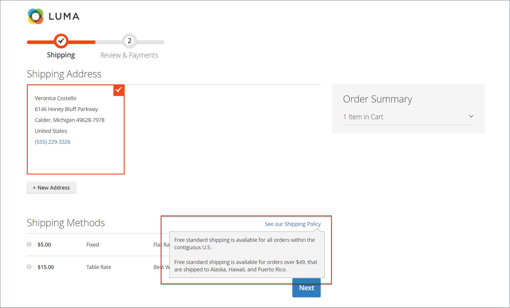

# 送貨設定

出貨組態會建立所有出貨的原點、您的出貨政策，以及將出貨處理至多個地址。

## 原點

原點用於計算從您的商店或倉儲出貨的費用，也可以決定已售產品的稅率。 計算[EU稅捐](international-tax-guidelines.md#eu-tax-configuration)時，請確定每個商店檢視的[預設稅捐目的地計算](../configuration-reference/sales/tax.md)與出貨設定原點相對應。

{width="600" zoomable="yes"}

1. 在&#x200B;_管理員_&#x200B;側邊欄上，移至&#x200B;**[!UICONTROL Stores]** > _[!UICONTROL Settings]_>**[!UICONTROL Configuration]**。

1. 在左側面板中，展開&#x200B;**[!UICONTROL Sales]**&#x200B;並選擇&#x200B;**[!UICONTROL Shipping Settings]**。

1. 展開 **[!UICONTROL Origin]**&#x200B;區段並完成下列專案：

   - [!UICONTROL Country]
   - [!UICONTROL Region / State]
   - [!UICONTROL ZIP / Postal Code]
   - [!UICONTROL City]
   - [!UICONTROL Street Address] （如有需要，請加入第2行）

1. 按一下&#x200B;**[!UICONTROL Save Config]**。

## 送貨原則

出貨政策應說明貴公司的商業規則和出貨准則。 例如，如果您有觸發免運費的價格規則，則可以說明出貨政策中的條款。

結帳期間的{width="700" zoomable="yes"}

若要在結帳時顯示您的送貨政策，請完成設定中的「送貨政策引數」。 當客戶在結帳期間按一下&#x200B;_檢視我們的送貨政策_&#x200B;時，文字就會顯示。

1. 在&#x200B;_管理員_&#x200B;側邊欄上，移至&#x200B;**[!UICONTROL Stores]** > _[!UICONTROL Settings]_>**[!UICONTROL Configuration]**。

1. 在左側面板中，展開&#x200B;**[!UICONTROL Sales]**&#x200B;並選擇&#x200B;**[!UICONTROL Shipping Settings]**。

1. 展開擴充選擇器&#x200B;**[!UICONTROL Shipping Policy Parameters]**。

1. 將&#x200B;**[!UICONTROL Apply Custom Shipping Policy]**&#x200B;設為`Yes`。

1. 在文字方塊中貼上或輸入您的&#x200B;**[!UICONTROL Shipping Policy]**。

   >[!NOTE]
   >
   >如果您使用文書處理器來撰寫文字，請確定將檔案儲存為.txt檔案，以移除文字中的任何控制字元。 然後，將文字複製並貼到「出貨政策」文字方塊中。

   {width="600" zoomable="yes"}

1. 按一下&#x200B;**[!UICONTROL Save Config]**。

## 多個地址

多個地址出貨選項可讓客戶在結帳時將訂單出貨至多個地址，並決定訂單可出貨的地址數目上限。

1. 在&#x200B;_管理員_&#x200B;側邊欄上，移至&#x200B;**[!UICONTROL Stores]** > _[!UICONTROL Settings]_>**[!UICONTROL Configuration]**。

1. 在左側面板中，展開&#x200B;**[!UICONTROL Sales]**&#x200B;並選擇&#x200B;**[!UICONTROL Multishipping Settings]**。

1. 展開擴充選擇器&#x200B;**[!UICONTROL Options]**。

   {width="600" zoomable="yes"}

1. 將&#x200B;**[!UICONTROL Allow Shipping to Multiple Addresses]**&#x200B;設為`Yes`。

1. 輸入&#x200B;**[!UICONTROL Maximum Qty Allowed for Shipping to Multiple Addresses]**。

1. 按一下&#x200B;**[!UICONTROL Save Config]**。

>[!NOTE]
>
> (Adobe Commerce B2B)對於具有多個送貨地址的訂單，在結帳期間無法使用[帳戶付款](../b2b/enable-basic-features.md#configure-payment-on-account)付款方式（即使已啟用）。

## 電子郵件出貨追蹤URL

僅[!BADGE SaaS]{type=Positive url="https://experienceleague.adobe.com/en/docs/commerce/user-guides/product-solutions" tooltip="僅適用於Adobe Commerce as a Cloud Service專案(Adobe管理的SaaS基礎結構)。"}

[!BADGE 沙箱]{type=Caution tooltip="列出的專案目前僅在沙箱環境中可用。 Adobe會先在沙箱環境中推出新版本，讓您在生產環境推出此版本之前有時間測試即將進行的變更。"}

依預設，購物者電子郵件中傳送的運送追蹤號碼是純文字。 您可以啟用自訂追蹤URL功能，將這些追蹤數字轉換為可點按的連結。 此功能可讓您定義範本，以追蹤各種貨運業者的URL。 每個範本都包含追蹤網站的完整URL和追蹤號碼的預留位置。 Commerce會以電子郵件中的實際追蹤號碼取代預留位置。

支援下列貨運業者：

- 美國郵政服務(USPS)
- 聯合包裹服務(UPS)
- 聯邦快遞(FedEx)
- DHL Express (DHL)

若要啟用或編輯自訂追蹤URL：

1. 在&#x200B;_管理員_&#x200B;側邊欄上，移至&#x200B;**[!UICONTROL Stores]** > _[!UICONTROL Settings]_>**[!UICONTROL Configuration]**。

1. 在左側面板中，展開&#x200B;**[!UICONTROL Sales]**&#x200B;並選擇&#x200B;**[!UICONTROL Shipping Settings]**。

1. 展開擴充選擇器&#x200B;**[!UICONTROL Shipment Tracking URLs]**。

1. 將&#x200B;**[!UICONTROL Enable Custom Tracking URLs]**&#x200B;設為`Yes`。

1. 為每個支援的電信業者提供預設的URL範本。 如果您需要變更這些值，請在對應欄位中輸入新的URL範本。 使用`{{tracking_number}}`作為實際追蹤號碼的預留位置。 例如，如果UPS將其URL變更為`https://www.ups.com/newtracker?tracknumber`，新的追蹤URL範本可能會如下所示：

   ```text
   https://www.ups.com/newtracker?tracknumber={{tracking_number}}
   ```

1. 按一下&#x200B;**[!UICONTROL Save Config]**。
