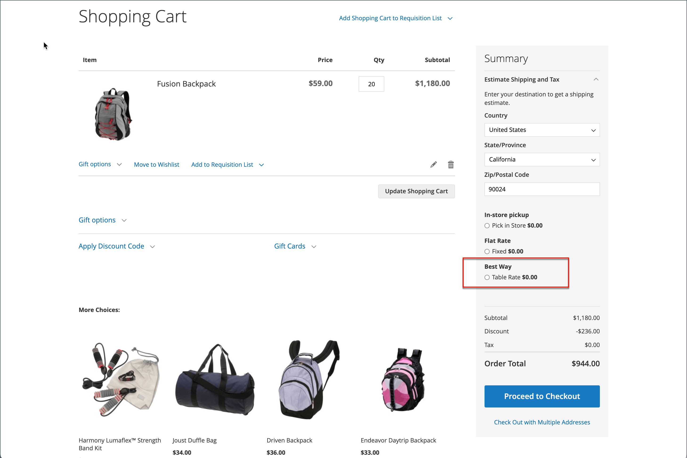
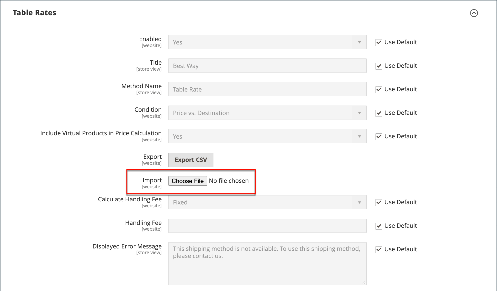

# 表格費率運送

_table rate_&#x200B;送貨方法參考資料表，以根據條件組合計算送貨費率，包括：

- 權重與目的地
- 價格v.目的地
- 專案數對目的地

舉例來說，如果您的倉儲位於洛杉磯，則運送至聖地亞哥的成本會比運送至佛蒙特州來得低。 您可以使用表格運費將節省金額傳遞給客戶。

用來計算表格比率的資料會在試算表中準備並匯入您的存放區。 當客戶請求報價時，結果會顯示在購物車的送貨預估區段中。

>[!NOTE]
>
>一次只能啟用一組表格速率資料。

購物車訂單摘要中的{width="700" zoomable="yes"}

## 步驟1：完成預設設定

第一步是完成表格費率的預設設定。 您可以在不變更設定範圍的情況下完成此步驟。

1. 在&#x200B;_管理員_&#x200B;側邊欄上，移至&#x200B;**[!UICONTROL Stores]** > _[!UICONTROL Settings]_>**[!UICONTROL Configuration]**。

1. 在左側面板的&#x200B;_[!UICONTROL Sales]_&#x200B;區段中，選擇&#x200B;**[!UICONTROL Delivery Methods]**。

1. 展開擴充選擇器&#x200B;**[!UICONTROL Table Rates]**。

   >[!NOTE]
   >
   >如有必要，請先清除&#x200B;**[!UICONTROL Use system value]**&#x200B;核取方塊以變更下列設定，如所述。

   {width="600" zoomable="yes"}

1. 將&#x200B;**[!UICONTROL Enabled]**&#x200B;設為`Yes`。

1. 輸入您要在結帳時於表格費率區段顯示的&#x200B;**[!UICONTROL Title]**。

   預設標題為`Best Way`。

1. 輸入您要在購物車的計算費率旁邊顯示為標籤的&#x200B;**[!UICONTROL Method Name]**。

1. 將&#x200B;**[!UICONTROL Condition]**&#x200B;設為下列其中一種計算方法：

   - `Weight v. Destination`
   - `Price v. Destination`
   - `Number of Items v. Destination`

1. 對於包含虛擬產品的訂單，如果您想要在計算中包含虛擬產品，請將&#x200B;**[!UICONTROL Include Virtual Products in Price Calculation]**&#x200B;設為`Yes`。

   >[!NOTE]
   >
   >由於虛擬產品（例如服務）沒有權重，因此無法變更以「權重v.目的地」條件為基礎的計算結果。 不過，虛擬產品可能會變更以「價格v.目的地」或「料號v.目的地」條件為基準的計算結果。

1. 根據您的要求設定手續費選項。

   處理費是選擇性的，且顯示為額外費用，會加到運費中。 如果要包含手續費，請執行下列步驟：

   - 設定&#x200B;**[!UICONTROL Calculate Handling Fee]**：

      - `Fixed`
      - `Percent`

   - 根據用來計算費用的方法，輸入&#x200B;**[!UICONTROL Handling Fee]**&#x200B;費率。

     例如，如果費用是以固定費用為基礎，則以小數點輸入金額，例如`4.90`。 不過，如果處理費是以訂單的百分比為基準，請以百分比輸入金額。 例如，如果您要收取訂單的6%費用，請輸入值為`.06`。

1. 如有需要，請變更&#x200B;**[!UICONTROL Displayed Error Message]**。

   此文字方塊已預設預設預設預設訊息，但您可以輸入其他訊息，在此傳送方式無法使用時顯示。

1. 設定&#x200B;**[!UICONTROL Ship to Applicable Countries]**：

   - `All Allowed Countries` — 來自您商店組態中指定的所有[國家/地區](../getting-started/store-details.md#country-options)的客戶都可以使用這個傳遞方法。
   - `Specific Countries` — 選擇此選項時，會顯示&#x200B;_[!UICONTROL Ship to Specific Countries]_&#x200B;清單。 選取清單中可使用此傳遞方法的每個國家/地區。

1. 如果要一直顯示表格費率，請將&#x200B;**[!UICONTROL Show Method if Not Applicable]**&#x200B;設為`Yes`

1. 針對&#x200B;**[!UICONTROL Sort Order]**，請輸入數字，以決定結帳期間列出其他傳遞方式時，表格費率送貨的顯示順序。

   `0` =第一，`1` =第二，`2` =第三，依此類推。

1. 按一下&#x200B;**[!UICONTROL Save Config]**。

## 步驟2：準備表格速率資料

1. 在左上角，將&#x200B;**[!UICONTROL Store View]**&#x200B;設定為`Main Website`，或設定套用的任何其他網站。

   >[!NOTE]
   >
   >如有必要，請先取消選取&#x200B;**[!UICONTROL Use system value]**&#x200B;核取方塊以變更下列設定，如所述。

1. 視需要變更&#x200B;**[!UICONTROL Condition]**。

1. 按一下&#x200B;**[!UICONTROL Export CSV]**。

   {width="700" zoomable="yes"}

1. 將`tablerates.csv`檔案儲存至您的系統。

1. 在試算表應用程式中開啟檔案。

1. 使用適當的出貨計算條件值完成表格。

   - 使用星號(*)當作萬用字元，代表任何類別中的所有可能值。
   - _[!UICONTROL Country]_&#x200B;資料行必須包含每個資料列的[有效的三字元代碼](https://en.wikipedia.org/wiki/ISO_3166-1_alpha-3)。
   - 依&#x200B;_[!UICONTROL Region/State]_&#x200B;排序資料，讓特定位置位於清單頂端，而萬用字元位置位於底部。 此方法會先處理具有絕對值的規則，稍後再處理萬用字元值。
   - 不支援郵遞區號範圍。 使用星號(*)可允許地區/州內的所有程式碼，或在&#x200B;_[!UICONTROL Zip/Postal Code]_&#x200B;欄中指定特定位置的單一程式碼。
   - _[!UICONTROL Weight (and above)]_&#x200B;欄中的值最多可以有四位小數（例如`2.5075`）。 在資料中使用更多小數位數，會導致匯入失敗。

   {width="500"}

1. 儲存`tablerates.csv`檔案。

## 步驟3：匯入表格比率資料

1. 返回您存放區設定的&#x200B;**[!UICONTROL Table Rates]**&#x200B;區段。

1. 在左上角，將&#x200B;**[!UICONTROL Store View]**&#x200B;設定為使用此方法的網站。

1. 針對&#x200B;**[!UICONTROL Import]**，按一下&#x200B;**[!UICONTROL Choose File]**&#x200B;並選取您已完成的`tablerates.csv`檔案以匯入費率。

   {width="600" zoomable="yes"}

1. 按一下&#x200B;**[!UICONTROL Save Config]**。

## 步驟4：驗證費率

為確保表格費率資料正確無誤，請使用數個不同的地址進行付款處理，以確保運費與處理費率計算正確。

### 範例1：價格與目的地

此範例使用「價格v.目的地」條件，根據美國大陸、阿拉斯加和夏威夷的訂單小計金額，建立一組三種不同的運費。 星號(*)是代表所有值的萬用字元。

| 國家 | 地區/州 | 郵遞區號 | 訂單小計（及以上） | 送貨價格 |
|--- |--- |--- |--- |--- |
| 美國 | 您好 | * | 100 | 10 |
| 美國 | 您好 | * | 50 | 15 |
| 美國 | 您好 | * | 0 | 20 |
| 美國 | AK | * | 100 | 10 |
| 美國 | AK | * | 50 | 15 |
| 美國 | AK | * | 0 | 20 |
| 美國 | * | * | 100 | 5 |
| 美國 | * | * | 50 | 10 |
| 美國 | * | * | 0 | 15 |

{style="table-layout:auto"}

### 範例2：權重與目的地

此範例使用「重量v.目的地」條件，根據訂單重量建立不同的出貨率。

| 國家 | 地區/州 | 郵遞區號 | 重量（及以上） | 送貨價格 |
|--- |--- |--- |--- |--- |
| AUS | NT | * | 9 | 39.95 |
| AUS | NT | * | 0 | 19.95 |
| AUS | VIC | * | 9 | 19.95 |
| AUS | VIC | * | 0 | 5.95 |
| AUS | WA | * | 9 | 39.95 |
| AUS | WA | * | 0 | 19.95 |
| AUS | * | * | 9 | 29.95 |
| AUS | * | * | 0 | 9.95 |

{style="table-layout:auto"}

### 範例3：限制免費送貨至美國大陸

1. 建立`tablerates.csv`檔案，其中包含您願意提供免費運送的所有州目的地。

1. 使用下列設定完成表格速率設定：

   | 設定 | 值 |
   |----------|-------|
   | [!UICONTROL Condition] | `Price v. Destination` |
   | [!UICONTROL Method Name] | `Free Shipping` |
   | [!UICONTROL Ship to Applicable Countries] | `Specific Countries` |
   | [!UICONTROL Ship to Specific Countries] | `Select only United States` |
   | [!UICONTROL Show method if not applicable] | `No` |

   {style="table-layout:auto"}

1. 在左上角，將&#x200B;**[!UICONTROL Store View]**&#x200B;設定為`Main Website`，或設定套用的任何其他網站。

1. 針對&#x200B;**[!UICONTROL Import]**，按一下&#x200B;**[!UICONTROL Choose File]**&#x200B;並選取您已完成的`tablerates.csv`檔案以匯入費率。
