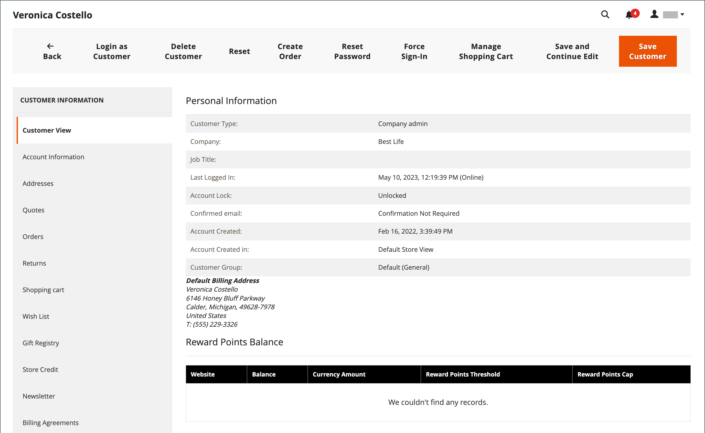

# 管理購物車

{{ee-feature}}

若要開始輔助購物工作階段，客戶必須從店面登入其帳戶才能取得資訊。 如果客戶沒有帳戶，您可以[建立帳戶](../customers/account-create.md)。

{width="600" zoomable="yes"}

## 動作控制

| 選項 | 說明 |
|--- |--- |
| [!UICONTROL Remove] | 從目前的購物車移除專案 |
| [!UICONTROL Move to Wish List] | 將專案移至選取的客戶願望清單 |

{style="table-layout:auto"}

## 控制按鈕

| 按鈕 | 說明 |
|--- |--- |
| [!UICONTROL Clear my shopping cart] | 清除所有產品中的目前購物車。 |
| [!UICONTROL Update Items and Quantities|]在&#x200B;**[!UICONTROL Qty]**&#x200B;欄位中輸入所需數量，並更新購物車中的專案數量。 |
| [!UICONTROL Add selections to my cart] | 將所有區段的產品新增至購物車。 |

{style="table-layout:auto"}

## 驗證客戶是否已登入

1. 在&#x200B;_管理員_&#x200B;側邊欄上，移至&#x200B;**[!UICONTROL Customers]** > **[!UICONTROL Now Online]**。

   所有商店訪客和登入客戶都會出現在清單中。

   {width="700" zoomable="yes"}

## 優惠方案輔助購物

1. 在&#x200B;_管理員_&#x200B;側邊欄上，移至&#x200B;**[!UICONTROL Customers]** > **[!UICONTROL All Customers]**。

1. 在清單中，以編輯模式開啟客戶記錄。

   >[!TIP]
   >
   >若要快速找到客戶記錄，請使用[篩選器](../getting-started/admin-grid-controls.md)控制項。

   在&#x200B;_[!UICONTROL Personal Information]_下的客戶設定檔中，_[!UICONTROL Last Logged In]_&#x200B;日期和時間顯示客戶已上線。

   {width="600" zoomable="yes"}

1. 若要進入輔助購物模式，請按一下頂端按鈕列中的&#x200B;**[!UICONTROL Manage Shopping Cart]**。

   {width="600" zoomable="yes"}

## 依屬性將產品新增至購物車

1. 展開&#x200B;**[!UICONTROL Products]**&#x200B;區段的。

1. 使用每一欄頂端的任一篩選器來尋找產品。

1. 按一下&#x200B;**[!UICONTROL Search]**。

1. 根據產品型別，使用下列其中一個步驟：

### 新增簡單產品

1. 按一下您要訂購的產品。

   此動作選取記錄並將&#x200B;**[!UICONTROL Quantity]**&#x200B;設定為預設值`1`。

1. 如有必要，請更新訂購數量。

1. 在格線左上方，按一下&#x200B;**[!UICONTROL Add selections to my cart]**。

   {width="600" zoomable="yes"}

   條列專案會新增至頁面頂端的購物車。

   {width="600" zoomable="yes"}

### 新增產品與設定

加入購物車前必須設定三種產品型別： `Bundle Product`、`Configurable Product`和`Grouped Product`。

1. 在格線中，按一下產品名稱旁的&#x200B;**[!UICONTROL Configure]**。

   {width="600" zoomable="yes"}

1. 在&#x200B;_關聯產品_&#x200B;對話方塊中，選擇每個產品選項來說明要訂購的專案，輸入&#x200B;**[!UICONTROL Quantity]**，然後按一下&#x200B;**[!UICONTROL OK]**。

   以核取記號選取產品，且訂購數量會顯示在格線中。

1. 若要將產品加入購物車，請按一下&#x200B;**[!UICONTROL Add selections to my cart]**。

   購物車中{width="600" zoomable="yes"}

1. 視需要更新購物車中的產品選項：

   - 按一下&#x200B;**[!UICONTROL Configure]**。

   - 更新選項，然後按一下&#x200B;**[!UICONTROL OK]**。

## 依SKU新增產品

1. 展開&#x200B;**[!UICONTROL Add to Shopping Cart by SKU]**&#x200B;區段的。

1. **[!UICONTROL SKU]**&#x200B;個別新增產品，或上傳CSV檔案新增產品。

### 依SKU個別新增專案

1. 輸入要訂購的專案的&#x200B;**[!UICONTROL SKU]**&#x200B;與&#x200B;**[!UICONTROL Qty]**。

1. 若要訂購其他產品，請按一下&#x200B;**[!UICONTROL Add another]**。

   {width="600" zoomable="yes"}

1. 按一下&#x200B;**[!UICONTROL Add selections to my cart]**。

1. 如果專案是可設定的產品，請在提示時選擇產品選項，然後按一下&#x200B;**[!UICONTROL Add to Shopping Cart]**。

### 透過上傳CSV檔案來新增產品

1. 準備包含要新增至購物車的專案的[csv檔案](../systems/data-csv.md)。

   檔案只能包含兩個資料行，標題中必須有`sku`和`qty`。

1. 上傳準備的檔案：

   - 按一下&#x200B;**[!UICONTROL Choose File]**。

   - 選取要從目錄中上傳的檔案。

## 轉移專案

您可以從客戶的願望清單以及最近檢視、比較或訂購的專案，將專案轉移至購物車。 每個區段中的專案數會顯示在區段標題後面的括弧中。

1. 展開下列其中一個區段：

   - [!UICONTROL Wish List]
   - [!UICONTROL Products in the Comparison List]
   - [!UICONTROL Recently Compared Products]
   - [!UICONTROL Recently Viewed Products]
   - [!UICONTROL Last Ordered Items]

1. 在方格中，選取要訂購的每個產品，並輸入&#x200B;**[!UICONTROL Quantity]**。

1. 若要輸入可設定產品的選項，請按一下&#x200B;**[!UICONTROL Configure]**&#x200B;並視需要設定產品選項。

1. 按一下&#x200B;**[!UICONTROL Add selections to my cart]**。

1. 套用一或多個優惠券代碼（若有）：

   - 針對&#x200B;**[!UICONTROL Apply Coupon Code]**，請輸入有效的抵用券代碼。

   - 按一下&#x200B;_套用_ （  ）箭頭。

1. 視需要調整訂購數量：

   - 在要調整之產品的&#x200B;**[!UICONTROL Qty]**&#x200B;欄中，輸入正確的金額。

   - 按一下&#x200B;**[!UICONTROL Update Items and Quantities]**。

## 建立訂單

1. 按一下&#x200B;**[!UICONTROL Create Order]**。

   _[!UICONTROL Create New Order]_頁面顯示購物車中的專案，然後是送貨和付款資訊。

1. 填寫運送與付款資訊。

1. 按一下&#x200B;**[!UICONTROL Submit Order]**。

若要深入瞭解，請參閱[建立訂單](customer-account-create-order.md)。
