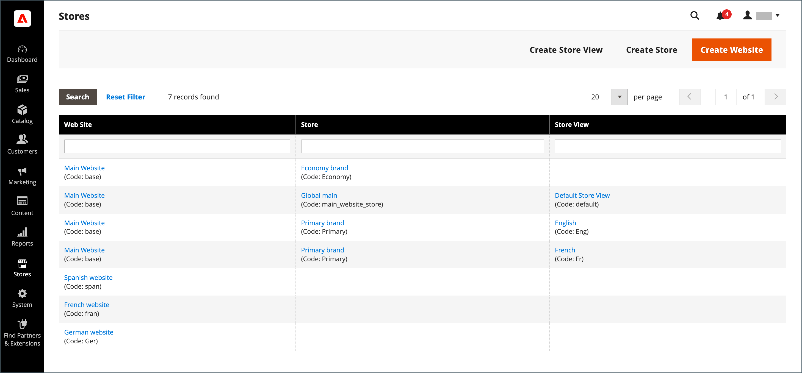
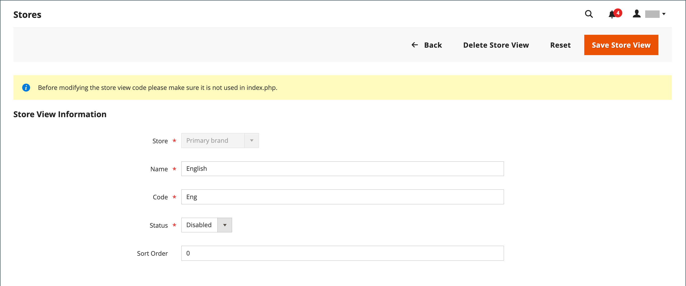

# 存放區檢視

存放區檢視通常用於讓存放區可在不同的地區設定中使用。 購物者可使用商店標頭中的語言選擇器來變更商店檢視。

{width="550"}

## 新增商店檢視

1. 在 _管理員_ 側欄，前往 **[!UICONTROL Stores]** > _[!UICONTROL Settings]_>**[!UICONTROL All Stores]**.

   {width="700" zoomable="yes"}

1. 按一下 **[!UICONTROL Create Store View]**.

   {width="600" zoomable="yes"}

1. 設定 **[!UICONTROL Store]** 至此檢視的父項存放區。

1. 輸入 **[!UICONTROL Name]** 以檢視此商店。

   此名稱會顯示在存放區標頭的語言選擇器中。 例如： `Spanish`.

1. 的 **[!UICONTROL Code]**，輸入可識別檢視的程式碼（以小寫字元表示）。

   例如： `spanish`.

1. 若要啟動檢視，請設定 **[!UICONTROL Status]** 至 `Enabled`.

1. （選擇性）輸入 **[!UICONTROL Sort Order]** 用於決定此檢視與其他檢視一起列出的順序的編號。

1. 按一下 **[!UICONTROL Save Store View]**.

## 編輯商店檢視

由於檢視名稱會出現在語言選擇器中，您最終可能會想要將預設檢視的名稱變更為更具描述性的名稱。 此 _名稱_ 欄位只是標籤，可以輕鬆變更。

如果您的Adobe Commerce或Magento Open Source安裝具有多站台或多重存放區設定，請勿變更存放區代碼欄位，除非確認值未在 `index.php` 檔案。 如果您無法存取伺服器來檢查檔案，請向開發人員尋求協助。

| 欄位 | 原始值 | 已更新值 |
| ----- | -------------- | ------------- |
| [!UICONTROL Name] | `Default Store View` | `English` |
| [!UICONTROL Code] | `default` | `english` |

{style="table-layout:auto"}

1. 在 _管理員_ 側欄，前往 **[!UICONTROL Stores]** >  _[!UICONTROL Settings]_>**[!UICONTROL All Stores]**.

1. 在 _[!UICONTROL Store View]_欄中，按一下要編輯的檢視名稱。

   編輯預設檢視時， _[!UICONTROL Store]_和_[!UICONTROL Status]_ 欄位無法使用。

   {width="600" zoomable="yes"}

1. 視需要更新下列欄位：

   - **[!UICONTROL Store]** （僅限非預設檢視）
   - **[!UICONTROL Name]**
   - **[!UICONTROL Code]** (僅在不用於 `index.php`)
   - **[!UICONTROL Status]** （僅限非預設檢視）
   - **[!UICONTROL Sort Order]**

1. 按一下 **[!UICONTROL Save Store View]**.
