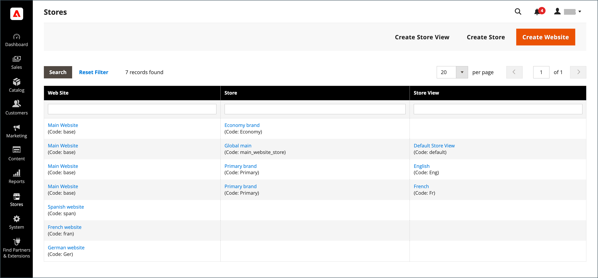

# 存放區檢視

存放區檢視通常用於讓存放區可在不同的地區設定中使用。 購物者可使用商店標頭中的語言選擇器來變更商店檢視。

{width="550"}

## 新增商店檢視

1. 在&#x200B;_管理員_&#x200B;側邊欄上，移至&#x200B;**[!UICONTROL Stores]** > _[!UICONTROL Settings]_>**[!UICONTROL All Stores]**。

   {width="700" zoomable="yes"}

1. 按一下&#x200B;**[!UICONTROL Create Store View]**。

   {width="600" zoomable="yes"}

1. 將&#x200B;**[!UICONTROL Store]**&#x200B;設定為此檢視的父儲存區。

1. 輸入此存放區檢視的&#x200B;**[!UICONTROL Name]**。

   此名稱會顯示在存放區標頭的語言選擇器中。 例如： `Spanish`。

1. 針對&#x200B;**[!UICONTROL Code]**，輸入識別檢視的代碼（以小寫字元表示）。

   例如： `spanish`。

1. 若要啟用檢視，請將&#x200B;**[!UICONTROL Status]**&#x200B;設為`Enabled`。

1. （選擇性）輸入&#x200B;**[!UICONTROL Sort Order]**&#x200B;數字，以決定此檢視與其他檢視一起列出的順序。

1. 按一下&#x200B;**[!UICONTROL Save Store View]**。

## 編輯商店檢視

由於檢視名稱會出現在語言選擇器中，您最終可能會想要將預設檢視的名稱變更為更具描述性的名稱。 _Name_&#x200B;欄位只是標籤，可以輕易變更。

如果您的Adobe Commerce或Magento Open Source安裝具有多站台或多重存放區設定，請勿在未驗證`index.php`檔案中未參考值的情況下變更存放區代碼欄位。 如果您無法存取伺服器來檢查檔案，請向開發人員尋求協助。

| 欄位 | 原始值 | 已更新值 |
| ----- | -------------- | ------------- |
| [!UICONTROL Name] | `Default Store View` | `English` |
| [!UICONTROL Code] | `default` | `english` |

{style="table-layout:auto"}

1. 在&#x200B;_管理員_&#x200B;側邊欄上，移至&#x200B;**[!UICONTROL Stores]** > _[!UICONTROL Settings]_>**[!UICONTROL All Stores]**。

1. 在網格的&#x200B;_[!UICONTROL Store View]_欄中，按一下您要編輯的檢視表名稱。

   編輯預設檢視時，_[!UICONTROL Store]_和_[!UICONTROL Status]_&#x200B;欄位無法使用。

   {width="600" zoomable="yes"}

1. 視需要更新下列欄位：

   - **[!UICONTROL Store]** （僅限非預設檢視）
   - **[!UICONTROL Name]**
   - **[!UICONTROL Code]** （只有未在`index.php`中使用時）
   - **[!UICONTROL Status]** （僅限非預設檢視）
   - **[!UICONTROL Sort Order]**

1. 按一下&#x200B;**[!UICONTROL Save Store View]**。
