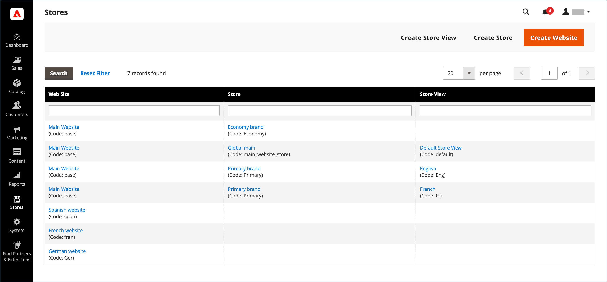
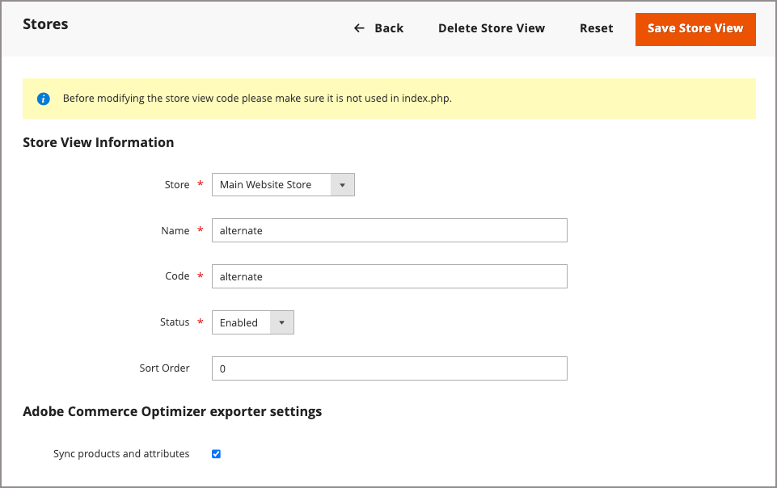

# 存放區檢視

存放區檢視通常用於讓存放區可在不同的地區設定中使用。 購物者可使用商店標頭中的語言選擇器來變更商店檢視。

{width="550"}

## [!DNL Adobe Commerce Optimizer]同步處理狀態 {#optimizer-sync-status}

如果已為網站或商店檢視安裝並啟用[!DNL Adobe Commerce Optimizer Connector]，則[!UICONTROL All Stores]格線會顯示同步狀態指示器。 如果已安裝[!DNL Adobe Commerce Optimizer Connector for B2B]，資料也會同步處理可用的B2B共用目錄。 請參閱[管理目錄檢視](../b2b/catalog-views-manage.md)。

| 欄 | 指標 | 說明 |
| ----- | ----- | ----- |
| [!UICONTROL Web Site] | [!UICONTROL Price sync enabled for Commerce Optimizer] | 此網站的價格和價格簿已同步處理至[!DNL Adobe Commerce Optimizer]。 |
| [!UICONTROL Store View] | [!UICONTROL Product sync enabled for Commerce Optimizer] | 此商店檢視的產品和屬性已同步至[!DNL Adobe Commerce Optimizer]。 |

{width="700" zoomable="yes"}

若要啟用或停用同步化，請在您[建立網站](stores.md#step-1-create-a-website)或[新增商店檢視](#add-a-store-view)時，或是更新現有網站或商店檢視時，編輯&#x200B;**[!UICONTROL Adobe Commerce Optimizer exporter settings]**。

## 新增商店檢視

1. 在&#x200B;_管理員_&#x200B;側邊欄上，移至&#x200B;**[!UICONTROL Stores]** > _[!UICONTROL Settings]_>**[!UICONTROL All Stores]**。

   {width="700" zoomable="yes"}

1. 按一下&#x200B;**[!UICONTROL Create Store View]**。

   {width="600" zoomable="yes"}

1. 將&#x200B;**[!UICONTROL Store]**&#x200B;設定為此檢視的父儲存區。

1. 輸入此存放區檢視的&#x200B;**[!UICONTROL Name]**。

   此名稱會顯示在存放區標頭的語言選擇器中。 例如： `Spanish`。

1. 針對&#x200B;**[!UICONTROL Code]**，輸入識別檢視的代碼（以小寫字元表示）。

   例如： `spanish`。

1. 若要啟用檢視，請將&#x200B;**[!UICONTROL Status]**&#x200B;設為`Enabled`。

1. （選擇性）輸入&#x200B;**[!UICONTROL Sort Order]**&#x200B;數字，以決定此檢視與其他檢視一起列出的順序。

1. （選擇性）如果已安裝[!DNL Adobe Commerce Optimizer Connector]，請在&#x200B;**[!UICONTROL Adobe Commerce Optimizer exporter settings]**&#x200B;區段中選取&#x200B;**[!UICONTROL Sync products and attributes]**，將此市集檢視的產品和屬性同步至[!DNL Adobe Commerce Optimizer]。 如果已安裝[!DNL Adobe Commerce Optimizer Connector for B2B]，此設定也會將B2B共用目錄資料同步至[!DNL Adobe Commerce Optimizer]。 請參閱[管理目錄檢視](../b2b/catalog-views-manage.md)。

   {width="600" zoomable="yes"}

   在初始同步後變更此設定會觸發完全重新索引。 請參閱&#x200B;*Commerce聯結器指南*&#x200B;中的[自訂Adobe Commerce Optimizer範圍匯出設定](https://experienceleague.adobe.com/en/docs/commerce/aco-optimizer-connector/get-started#customize-the-commerce-scopes-export-configuration)。

1. 按一下&#x200B;**[!UICONTROL Save Store View]**。

## 編輯商店檢視

由於檢視名稱會出現在語言選擇器中，您最終可能會想要將預設檢視的名稱變更為更具描述性的名稱。 _Name_&#x200B;欄位只是標籤，可以輕易變更。

如果您的Adobe Commerce或Magento Open Source安裝具有多站台或多重存放區設定，請勿在未驗證`index.php`檔案中未參考值的情況下變更存放區代碼欄位。 如果您無法存取伺服器來檢查檔案，請向開發人員尋求協助。

| 欄位 | 原始值 | 已更新值 |
| ----- | -------------- | ------------- |
| [!UICONTROL Name] | `Default Store View` | `English` |
| [!UICONTROL Code] | `default` | `english` |

{style="table-layout:auto"}

1. 在&#x200B;_管理員_&#x200B;側邊欄上，移至&#x200B;**[!UICONTROL Stores]** > _[!UICONTROL Settings]_>**[!UICONTROL All Stores]**。

1. 在網格的&#x200B;_[!UICONTROL Store View]_&#x200B;欄中，按一下您要編輯的檢視表名稱。

   編輯預設檢視時，_[!UICONTROL Store]_&#x200B;和_[!UICONTROL Status]_&#x200B;欄位無法使用。

   {width="600" zoomable="yes"}

1. 視需要更新下列欄位：

   - **[!UICONTROL Store]** （僅限非預設檢視）
   - **[!UICONTROL Name]**
   - **[!UICONTROL Code]** （只有未在`index.php`中使用時）
   - **[!UICONTROL Status]** （僅限非預設檢視）
   - **[!UICONTROL Sort Order]**
   - **[!UICONTROL Sync products and attributes]** （僅當已安裝[!DNL Adobe Commerce Optimizer Connector]時）

   {width="600" zoomable="yes"}

1. 按一下&#x200B;**[!UICONTROL Save Store View]**。
