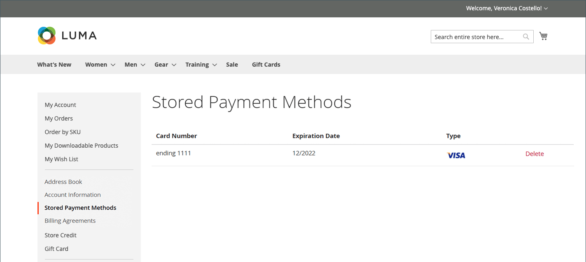

# 儲存的付款方法

可存取安全儲存庫以儲存付款資訊的客戶，無需每次輸入信用卡資訊，即可快速完成結帳。 如果已啟用[立即購買](checkout-instant-purchase.md)，客戶可以略過兩步驟結帳程式，從產品頁面下訂單。

需要支援安全儲存庫的付款方法，例如[Braintree](braintree.md)。 當在付款方式設定中啟用安全儲存庫時，客戶可在結帳期間選擇將其信用卡資訊儲存為儲存的付款方式。 客戶可以從其帳戶儀表板管理儲存的付款方法。

{width="700" zoomable="yes"}

## 在結帳時新增儲存的付款方法

1. 客戶從店面前往產品的詳細資訊頁面。

1. 將產品新增至購物車。

1. 前往結帳頁面。

1. 完成&#x200B;_送貨_&#x200B;步驟。

1. 選取&#x200B;**[!UICONTROL Braintree Credit Card]**&#x200B;付款方式。

1. 填入信用卡資料。

1. 選取&#x200B;**[!UICONTROL Save for later use]**&#x200B;核取方塊。

1. 按一下&#x200B;**[!UICONTROL Place Order]**。

然後，儲存的付款方式會顯示在客戶儀表板的&#x200B;_[!UICONTROL Stored Payment Methods]_索引標籤中。

## 刪除儲存的付款方法

客戶無法編輯任何先前新增、儲存的付款方法，只能將其刪除。 此動作無法復原。

1. 在其帳戶的側邊欄中，客戶選取&#x200B;**[!UICONTROL Stored Payment Methods]**。

1. 搜尋要刪除的付款方式專案。

1. 按一下&#x200B;**[!UICONTROL Delete]**。

1. 若要確認動作，請按一下&#x200B;**[!UICONTROL OK]**。
