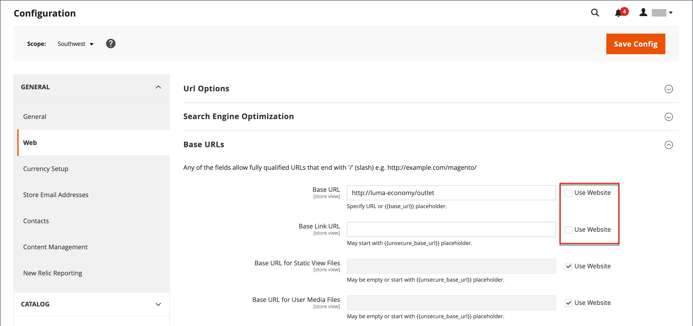

# 存放區和網站結構

安裝Adobe Commerce或Magento Open Source時，會建立包含主要網站、商店和商店檢視的階層。 您可以視需要建立其他網站、商店和商店檢視。 例如，除了您的主要網站之外，您可能有其他網站具有不同的網域。 在每個網站內，您可以有多個商店，而在每個商店內，有不同的商店檢視。 許多安裝專案都有一個網站和一個商店，但透過多個商店檢視支援不同語言。

開始之前，請預先規劃您的存放區目錄階層，因為它會在整個設定中被參照。 每個商店可以有單獨的[根類別](../catalog/category-root.md)，因此每個商店可以有完全不同的主功能表選項集。

{width="550"}

## 新增存放區

在單一安裝的Adobe Commerce或Magento Open Source中，可能有多個共用管理員的存放區。 位於相同網站下的存放區具有相同的IP位址和網域、使用相同的安全性憑證，並共用單一結帳程式。

請務必瞭解存放區使用相同的程式碼並共用管理員。 每個商店可以有單獨的目錄，或者商店可以共用目錄。 每個商店可以有單獨的[根類別](../catalog/category-root.md)，因此每個商店可以有不同的主功能表。 商店也可以有不同的品牌、簡報和內容。 開始之前，請先花點時間規劃您的商店階層，考慮未來的成長，因為此階層會用於整個設定。

{width="550"}

以下是如何為多個存放區設定URL的一些範例：

| URL | 說明 |
| --- | ----------- |
| `yourdomain.com/store1` `yourdomain.com/store2` | 每個商店都有不同的路徑，但共用一個網域。 |
| `store1.yourdomain.com` `store2.yourdomain.com` | 每個存放區有主要網域的不同子網域。 |

Adobe Commerce的多重存放區安裝必須從管理員設定，也必須從伺服器的命令列設定。 Adobe Commerce [設定指南](https://experienceleague.adobe.com/docs/commerce-operations/configuration-guide/multi-sites/ms-overview.html?lang=zh-Hant)提供設定伺服器環境的詳細指示。

### 步驟1：選擇商店網域

第一步是選擇要如何放置存放區。 這些商店應該共用一個網域、每個都有子網域，還是有截然不同的網域？ 針對每個商店，執行下列任一項作業：

- 若要將存放區置於主網域下方一個層級，您不必執行任何動作。
- 設定主要網域的子網域。
- 設定不同的主要網域。

### 步驟2：建立存放區

1. 在&#x200B;_管理員_&#x200B;側邊欄上，移至&#x200B;**[!UICONTROL Stores]** > _[!UICONTROL Settings]_>**[!UICONTROL All Stores]**。

1. 按一下&#x200B;**[!UICONTROL Create Store]**&#x200B;並設定新存放區的選項：

   - **[!UICONTROL Web Site]** — 選擇要作為新商店之父級的網站。 如果安裝只有一個網站，請接受預設值(`Main Website`)。

   - **[!UICONTROL Name]** — 輸入新存放區的名稱。 此名稱僅供內部參考。

   - **[!UICONTROL Code]** — 輸入小寫字元的程式碼以識別存放區。 例如： `mainstore`。

   - **[!UICONTROL Root Category]** — 設定為[根類別](../catalog/category-root.md)，定義新存放區之主功能表的類別結構。 如果您已建立商店的特定根類別，請選取該類別。 否則，請選取`Default Category`。 您可以稍後再來並更新設定。

   {width="600" zoomable="yes"}

1. 按一下&#x200B;**[!UICONTROL Save Store]**。

### 步驟3：建立預設存放區檢視

1. 按一下&#x200B;**[!UICONTROL Create Store View]**&#x200B;並設定存放區檢視選項：

   - **[!UICONTROL Store]** — 設為您建立的新商店。

   - **[!UICONTROL Name]** — 輸入檢視的名稱。 例如，`English`。

   - **[!UICONTROL Code]** — 以小寫字元輸入檢視的程式碼。

   - **[!UICONTROL Status]** — 設定為`Enabled`。

   - **[!UICONTROL Sort Order]** — 輸入數字，以決定與其他商店一起列示時的商店位置。

1. 按一下&#x200B;**[!UICONTROL Save Store View]**。

   如果您以編輯模式開啟商店，您會看到它現在有預設檢視。

   {width="600" zoomable="yes"}

### 步驟4：設定商店URL

1. 在&#x200B;_管理員_&#x200B;側邊欄中，按一下&#x200B;**[!UICONTROL Stores]** > _[!UICONTROL Settings]_>**[!UICONTROL Configuration]**。

1. 在左側面板的&#x200B;_[!UICONTROL General]_&#x200B;下，選擇&#x200B;**[!UICONTROL Web]**。

1. 在左上角，將&#x200B;**[!UICONTROL Store View]**&#x200B;設定為您為新商店建立的檢視。

1. 當提示確認[範圍](../getting-started/websites-stores-views.md#scope-settings)切換時，請按一下&#x200B;**[!UICONTROL OK]**。

   {width="600" zoomable="yes"}

1. 展開 **[!UICONTROL Base URLs]**&#x200B;區段，然後輸入商店的基本URL。

   如有需要，請清除&#x200B;**[!UICONTROL Use system value]**&#x200B;核取方塊以變更設定。

   {width="600" zoomable="yes"}

1. 展開 **[!UICONTROL Secure Base URLs]**&#x200B;區段，如果您要設定存放區[安全URL](store-urls.md)，請重複上一步驟。

1. 按一下&#x200B;**[!UICONTROL Save Config]**。

### 步驟5：設定伺服器

若要設定伺服器以支援多個網站，請參閱&#x200B;_設定指南_&#x200B;中的[多個網站或商店](https://experienceleague.adobe.com/docs/commerce-operations/configuration-guide/multi-sites/ms-overview.html?lang=zh-Hant)。

如需設定網頁伺服器的說明，請參閱下列資源：

- [使用NGNX設定多個網站](https://experienceleague.adobe.com/docs/commerce-operations/configuration-guide/multi-sites/ms-nginx.html?lang=zh-Hant)
- [使用Apache設定多個網站](https://experienceleague.adobe.com/docs/commerce-operations/configuration-guide/multi-sites/ms-apache.html?lang=zh-Hant)

若為雲端基礎結構上的Adobe Commerce，請參閱[設定多個網站或商店](https://experienceleague.adobe.com/docs/commerce-cloud-service/user-guide/configure-store/multiple-sites.html?lang=zh-Hant)。

## 新增網站

您可從單一Adobe Commerce或使用相同網域或不同網域的Magento Open Source安裝來設定多個網站。 根據預設，位於相同網站下的存放區具有相同的IP位址和網域、使用相同的安全性憑證，以及共用單一結帳程式。 如果您希望每個存放區在自己的網域下都有專屬的結帳程式，每個存放區都必須有不同的IP位址和個別的安全性憑證。

Adobe Commerce或Magento Open Source的多網站安裝必須從管理員設定，也從伺服器的命令列設定。 Commerce [設定指南](https://experienceleague.adobe.com/docs/commerce-operations/configuration-guide/multi-sites/ms-overview.html?lang=zh-Hant)提供設定伺服器環境的詳細指示。

{width="550"}

### 步驟1：建立網站

1. 在&#x200B;_管理員_&#x200B;側邊欄上，移至&#x200B;**[!UICONTROL Stores]** > _[!UICONTROL Settings]_>**[!UICONTROL All Stores]**。

1. 按一下右上角的&#x200B;**[!UICONTROL Create Website]**。

1. 設定&#x200B;**[!UICONTROL Web Site Information]**&#x200B;選項：

   {width="600" zoomable="yes"}

   - **[!UICONTROL Name]** — 輸入新網站的網域。 例如，`domain.com`。

   - **[!UICONTROL Code]** — 輸入伺服器上用來指向網域的程式碼。

     程式碼必須以小寫(a-z)字母開頭，並且可以包含字母(a-z)、數字(0-9)和底線(_)符號的任何組合。

   - **[!UICONTROL Sort Order]** — _（選擇性）_&#x200B;輸入數字，以決定此網站與其他網站一起列出的順序。 若要讓此網站出現在清單頂端，請輸入零(`0`)。

1. 按一下&#x200B;**[!UICONTROL Save Web Site]**。

1. 設定新網站所需的每個[商店](#add-stores)和[商店檢視](store-views.md)。

   您接著可以在編輯模式中開啟網站，以設定預設商店。

### 步驟2：設定商店URL

若要設定[存放區URL](store-urls.md)，請遵循指示。

### 步驟3：設定伺服器

若要設定伺服器以支援多個網站，請參閱&#x200B;_設定指南_&#x200B;中的[多個網站或商店](https://experienceleague.adobe.com/docs/commerce-operations/configuration-guide/multi-sites/ms-overview.html?lang=zh-Hant)。

如需設定Web伺服器的說明，請參閱下列教學課程：

- [使用NGNX設定多個網站](https://experienceleague.adobe.com/docs/commerce-operations/configuration-guide/multi-sites/ms-nginx.html?lang=zh-Hant)
- [使用Apache設定多個網站](https://experienceleague.adobe.com/docs/commerce-operations/configuration-guide/multi-sites/ms-apache.html?lang=zh-Hant)

若為雲端基礎結構上的Adobe Commerce，請參閱[設定多個網站或商店](https://experienceleague.adobe.com/docs/commerce-cloud-service/user-guide/configure-store/multiple-sites.html?lang=zh-Hant)。
