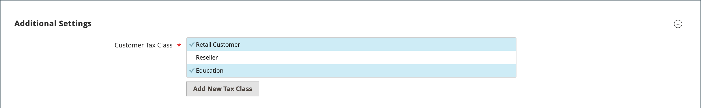

# 稅捐類別

稅捐類別可指定給客戶、產品和出貨。 Commerce會分析每個客戶的購物車，並根據客戶類別、購物車中產品的類別以及地區計算適當的稅捐。 地區由客戶的送貨地址、帳單地址或送貨來源所決定。 新的稅捐類別可在下列情況下建立： [稅捐規則](tax-rules.md) 已定義。

- **客戶**  — 您可以視需要建立儘可能多的客戶稅捐類別，並將它們指定至 [客戶群組](../customers/customer-groups.md). 例如，在某些管轄區，批發交易不徵稅，但零售交易徵稅。 您可以將「批發客戶」群組的成員與「批發」稅捐類別建立關聯。

- **產品**  — 計算時會使用產品類別，以決定購物車中套用的正確稅率。 當您建立產品時，產品會指定給特定的稅捐類別。 例如，食物可能不徵稅，或按不同的稅率徵稅。

- **送貨**  — 若您的商店對送貨收取額外的稅費，您應指定送貨的特定產品稅捐類別。 然後在設定中，將其指定為用於出貨的稅捐類別。

## 設定稅捐類別

用於出貨的稅捐類別，以及預設的稅捐類別 [產品和客戶](#add-a-product-tax-class) 設定於 _[!UICONTROL Sales]_設定。

1. 在 _管理員_ 側欄，前往 **[!UICONTROL Stores]** > _[!UICONTROL Settings]_>**[!UICONTROL Configuration]**.

1. 在左側面板中，展開 **[!UICONTROL Sales]** 並選擇 **[!UICONTROL Tax]**.

1. 展開  此 **[!UICONTROL Tax Classes]** 區段。

   {width="600" zoomable="yes"}

1. 選擇下列各項的稅捐類別：

   - **[!UICONTROL Set Tax Class for Shipping]**
   - **[!UICONTROL Tax Class for Gift Options]**
   - **[!UICONTROL Default Tax Class for Product]**
   - **[!UICONTROL Default Tax Class for Customer]**

1. 完成後，按一下 **[!UICONTROL Save Config]**.

## 新增稅捐類別

您可以輕鬆新增客戶與產品的稅捐類別，然後將其指派給個別客戶與產品，並用於稅捐規則。

1. 在 _管理員_ 側欄，前往 **[!UICONTROL Stores]** > _[!UICONTROL Taxes]_>**[!UICONTROL Tax Rules]**.

1. 按一下 **[!UICONTROL Add New Tax Rule]**.

1. 展開  此 **[!UICONTROL Additional Settings]** 區段。

   {width="600" zoomable="yes"}

1. 在 _客戶稅捐類別_，按一下 **[!UICONTROL Add New Tax Class]**.

1. 輸入 **[!UICONTROL Name]** 在文字方塊中新稅捐類別的ID。

   {width="600" zoomable="yes"}

1. 若要將新類別新增至可用客戶稅捐類別清單，請按一下核取記號。

   {width="600" zoomable="yes"}

## 新增產品稅捐類別

1. 在 _產品稅捐類別_，按一下 **[!UICONTROL Add New Tax Class]**.

1. 輸入 **[!UICONTROL Name]** 在文字方塊中新稅捐類別的ID。

1. 若要將新類別新增至可用產品稅捐類別清單，請按一下核取記號。

1. 完成後，按一下 **[!UICONTROL Back]** ，以返回 _稅捐規則_ 格線。

## 預設稅捐目的地

預設的稅捐目的地設定會決定用來作為稅捐計算基礎的國家、州、郵遞區號或郵遞區號。

**_若要設定計算的預設稅捐目的地，請執行下列步驟：_**

1. 在 _管理員_ 側欄，前往 **[!UICONTROL Stores]** > _[!UICONTROL Settings]_>**[!UICONTROL Configuration]**.

1. 在左側面板中，展開 **[!UICONTROL Sales]** 並選擇 **[!UICONTROL Tax]**.

1. 展開  此 **[!UICONTROL Default Tax Destination Calculation]** 區段。

   {width="600" zoomable="yes"}

1. 設定 **[!UICONTROL Default Country]** 稅捐計算所依據的國家/地區。

1. 設定 **[!UICONTROL Default State]** 至作為稅捐計算基礎的州或省。

1. 設定 **[!UICONTROL Default Post Code]** 郵遞區號做為當地稅捐計算基礎的編號。

1. 完成後，按一下 **[!UICONTROL Save Config]**.
