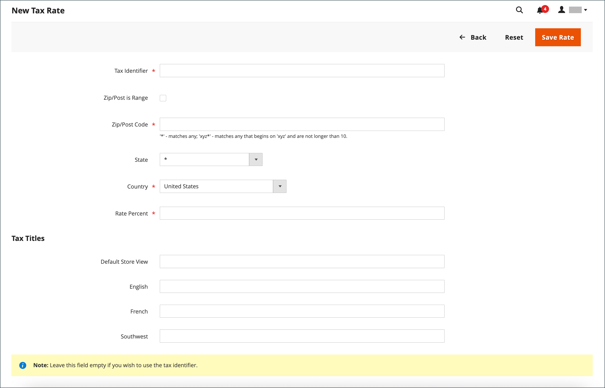

# 稅捐區與稅率

稅率通常適用於在特定地理區域內發生的交易。 使用&#x200B;_稅捐區與稅率_&#x200B;工具，針對您收稅與匯款的每個地理區域指定稅率。 因為每個稅捐區和稅率都有唯一識別碼，所以您可以針對特定地理區域使用多種稅率（例如不徵收食物或藥品稅捐但會徵收其他專案稅捐的區域）。

根據商店地址計算商店稅金。 在客戶完成訂單資訊之後，計算訂單的實際客戶稅捐。 Commerce接著會根據商店的稅務設定來計算稅捐。

{width="600" zoomable="yes"}

## 定義新的稅率

1. 在&#x200B;_管理員_&#x200B;側邊欄上，移至&#x200B;**[!UICONTROL Stores]** > _[!UICONTROL Taxes]_>**[!UICONTROL Tax Zones and Rates]**。

1. 按一下右上角的&#x200B;**[!UICONTROL Add New Tax Rate]**。

   {width="600" zoomable="yes"}

1. 輸入&#x200B;**[!UICONTROL Tax Identifier]**。

1. 若要將稅率套用至單一郵遞區號，請輸入&#x200B;**[!UICONTROL Zip/Post Code]**&#x200B;的代碼。

   星號萬用字元(`*`)可用來比對程式碼中最多十個字元。 例如，`90*`代表從90000到90999的所有郵遞區號。

1. 若要將稅率套用至某個郵遞區號範圍，請執行下列步驟：

   - 選取&#x200B;**[!UICONTROL Zip/Post is Range]**&#x200B;核取方塊，並輸入&#x200B;**[!UICONTROL Range From]**&#x200B;和&#x200B;**[!UICONTROL Range To]**&#x200B;的第一個和最後一個郵遞區號來定義範圍。

     {width="600" zoomable="yes"}

   - 選擇適用稅率的&#x200B;**[!UICONTROL State]**。

   - 選擇適用稅率的&#x200B;**[!UICONTROL Country]**。

   - 輸入用於稅率計算的&#x200B;**[!UICONTROL Rate Percent]**。

1. 如果您有多個商店，您可以為每個商店檢視設定&#x200B;**[!UICONTROL Tax Titles]**。

   >[!NOTE]
   >
   >如果您要使用稅捐識別碼，請將此欄位留空。

1. 完成時，按一下&#x200B;**[!UICONTROL Save Rate]**。

## 編輯現有稅率

1. 在&#x200B;_管理員_&#x200B;側邊欄上，移至&#x200B;**[!UICONTROL Stores]** > _[!UICONTROL Taxes]_>**[!UICONTROL Tax Zones and Rates]**。

1. 在&#x200B;_[!UICONTROL Tax Zones and Rates]_格線中尋找稅率，並以編輯模式開啟記錄。

   如果清單中有許多費率，請使用[篩選器控制項](../getting-started/admin-grid-controls.md)來尋找您需要的費率。

1. 對&#x200B;**[!UICONTROL Tax Rate Information]**&#x200B;進行必要的變更。

1. 視需要更新&#x200B;**[!UICONTROL Tax Titles]**。

1. 完成時，按一下&#x200B;**[!UICONTROL Save Rate]**。

## 刪除稅率

1. 在&#x200B;_管理員_&#x200B;側邊欄上，移至&#x200B;**[!UICONTROL Stores]** > _[!UICONTROL Taxes]_>**[!UICONTROL Tax Zones and Rates]**。

1. 尋找要刪除的稅率，並在編輯模式中開啟。

1. 在功能表列中，按一下&#x200B;**[!UICONTROL Delete Rate]**。

1. 若要確認動作，請按一下&#x200B;**[!UICONTROL OK]**。
