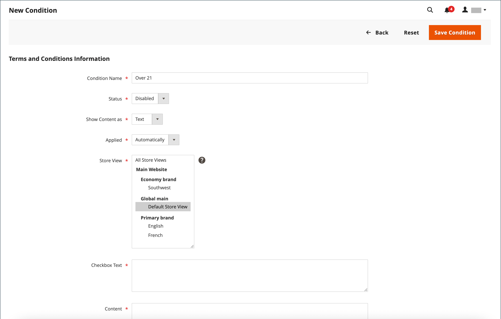

# 結帳的條款與條件

手動時 _條款與條件_ 功能已啟用，客戶必須在購買完成前同意銷售條款與條件。 銷售條款與條件通常包含法律可能要求有關B2C或B2B網站的披露資訊，並概述買賣雙方的權利。 「條款與條件」訊息會顯示在付款資訊之後，緊接在 _下單_ 按鈕。

{width="700" zoomable="yes"}

## 步驟1：啟用結帳的條款與條件

1. 在 _管理員_ 側欄，前往 **[!UICONTROL Stores]** > _[!UICONTROL Settings]_>**[!UICONTROL Configuration]**.

1. 在左側面板中，展開 **[!UICONTROL Sales]** 並選擇 **[!UICONTROL Checkout]**.

1. 展開  此 **[!UICONTROL Checkout Options]** 區段。

   {width="600" zoomable="yes"}

1. 確認 **[!UICONTROL Enable Onepage Checkout]** 設為 `Yes`.

1. 設定 **[!UICONTROL Enable Terms and Conditions]** 至 `Yes`.

1. 按一下 **[!UICONTROL Save Config]**.

## 步驟2：新增您自己的條款與條件資訊

1. 在 _管理員_ 側欄，前往 **[!UICONTROL Stores]** > _[!UICONTROL Settings]_>**[!UICONTROL Terms and Conditions]**.

   {width="600" zoomable="yes"}

1. 在右上角，按一下 **[!UICONTROL Add New Condition]**.

1. 輸入 **[!UICONTROL Condition Name]** 以供內部參考。

   {width="600" zoomable="yes"}

1. 設定 **[!UICONTROL Status]** 至 `Enabled`.

1. 設定 **[!UICONTROL Applied]** 變更為下列其中一項：

   - `Automatically`  — 結帳時自動接受條件。
   - `Manually`  — 客戶必須手動接受條件才能下訂單。

1. 設定 **[!UICONTROL Show Content as]** 變更為下列其中一項：

   - `Text`  — 以未格式化的文字顯示條款與條件內容。
   - `HTML`  — 將內容顯示為可以格式化的HTML。

1. 選取每一個 **[!UICONTROL Store View]** 您希望使用這些條款與條件的位置。

1. 向下捲動並填入要顯示的資訊：

   - 輸入 **[!UICONTROL Checkbox Text]** 要做為條款與條件連結的文字。 例如， `I understand and accept the terms and conditions of the sale`.

   - 在 **[!UICONTROL Content]** 方塊中，輸入銷售條款與條件的全文。

1. （選擇性）輸入 **[!UICONTROL Content Height (css)]** 以畫素為單位，以決定出庫期間條款與條件陳述式出現的文字方塊高度。

   例如，若要讓文字方塊在96 dpi顯示器上變高1英吋，請輸入 `96`. 如果內容延伸超過方塊的高度，則會出現卷軸。

1. 按一下 **[!UICONTROL Save Condition]**.
