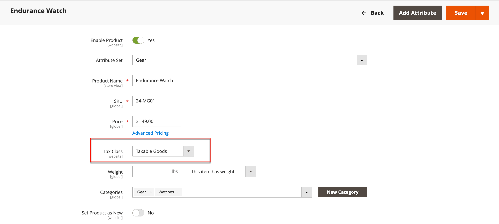

# 增值稅(VAT)

有些國家/地區的商品和服務會收取增值稅或VAT。 根據製造或配銷程式、原物料或您銷售給客戶的服務的階段，可能有不同的VAT稅率。 您可以套用多個VAT稅率以正確計算到期稅捐。

Commerce可設定為根據商家或客戶地址（如果兩者位於同一個國家）收取增值稅。 VAT計算通常是以出貨目的地（而非其原點）為基礎。 在大多數案例中，根據客戶送貨地址計算VAT的組態設定便已足夠。

## 範例情境

- 對於在某個歐盟國家（地區）向另一個歐盟國家（地區）的私人個人供應貨品的VAT註冊業務，VAT會根據商家地點計算為「遠距銷售」。

- 若在荷蘭的商店購買商品，而商店的發貨地址為英國，則需支付英國VAT稅率。

- 針對 [可下載的產品](../catalog/product-create-downloadable.md)，或 _數位商品_，VAT稅率是根據出貨目的地，而非商家地點。 另請參閱 [數位商品的供應地點](taxes.md#place-of-supply-for-digital-goods-eu).

>[!TIP]
>
>有些跨境與B2B出貨的稅捐需求較為複雜。 若要擴充Commerce安裝的原生功能，請考慮從以下新增稅務管理解決方案： [Marketplace](https://marketplace.magento.com/extensions/accounting-finance/taxes.html).

## 設定VAT

下列指示包含範例程式，可針對零售客戶的銷售在英國設定20%的加值稅。 針對其他稅率和國家，請遵循一般程式，但輸入與國家、VAT稅率、客戶型態等相對應的特定資訊。

>[!NOTE]
>
>繼續進行之前，請務必找出哪些規則與法規適用於您區域的VAT。

在某些企業對企業交易中，不會評定VAT。 商務可以驗證客戶的VAT ID，以確保已正確評定（或未評定） VAT。 另請參閱 [VAT ID驗證](#vat-id-validation).

### 步驟1：設定客戶稅捐類別

建立稅捐規則的處理從新增稅率開始。

1. 在 _管理員_ 側欄，前往 **[!UICONTROL Stores]** > _[!UICONTROL Taxes]_>**[!UICONTROL Tax Zones and Rates]**.

   {width="600" zoomable="yes"}

1. 確定有適合與VAT搭配使用的客戶稅捐類別。

   在此範例中，確定有一個客戶稅捐類別名為 _零售客戶_. 如果此稅捐類別不存在，請按一下 **[!UICONTROL Add New Tax Rate]**.

1. 輸入 **[!UICONTROL Tax Identifier]** 新稅捐類別時。

   所有稅率都顯示在 _稅率_ 中的欄位 _稅捐規則資訊_ 建立稅捐規則時。

1. 若要設定郵遞區號範圍（從/至），請選取 **[!UICONTROL Zip/Post is Range]** 核取方塊。

1. 選擇 **[!UICONTROL Country]** 適用稅率的位置。

1. 輸入 **[!UICONTROL Rate Percent]** 用於購買時計算稅率的金額。

1. 完成後，按一下 **[!UICONTROL Save Rate]**.

根據已提交的稅率，您可以建立後續的稅捐規則。 若沒有稅率，就不可能建立稅捐規則。

### 步驟2：設定產品稅捐類別

1. 在 _管理員_ 側欄，前往 **[!UICONTROL Stores]** >  _[!UICONTROL Taxes]_>**[!UICONTROL Tax Rules]**.

1. 按一下 **[!UICONTROL Add New Tax Rule]**.

1. 展開  此 **[!UICONTROL Additional Settings]** 區段。

   {width="600" zoomable="yes"}

1. 在 _產品稅捐類別_，按一下 **[!UICONTROL Add New Tax Class]**.

1. 若要將新類別新增至可用產品稅捐類別清單，並建立三個新類別，請輸入 **[!UICONTROL Name]** ，然後按一下核取記號：

   - `VAT Standard`
   - `VAT Reduced`
   - `VAT Zero`

1. 按一下 **[!UICONTROL Save Class]** 針對您新增的每個新類別。

1. 按一下 **[!UICONTROL Save Rule]**.

### 步驟3：設定稅捐區與稅率

1. 在 _管理員_ 側欄，前往 **[!UICONTROL Stores]** >  _[!UICONTROL Taxes]_>**[!UICONTROL Tax Zones and Rates]**.

   在此範例中，您可以移除美國稅率，或維持原狀。

1. 按一下 **[!UICONTROL Add New Tax Rate]**.

   {width="600" zoomable="yes"}

1. 新匯率的定義如下：

   **VAT標準**

   - 稅捐識別碼： `VAT Standard`
   - 國家/地區： `United Kingdom`
   - 費率百分比： `20.00`

   **VAT減少**

   - 稅捐識別碼： `VAT Reduced`
   - 國家/地區： `United Kingdom`
   - 費率百分比： `5.00`

1. 按一下 **[!UICONTROL Save Rate]** 每個費率的。

### 步驟4：設定稅捐規則

稅捐規則是客戶稅捐類別、產品稅捐類別與稅率的組合。

1. 在 _管理員_ 側欄，前往 **[!UICONTROL Stores]** > _[!UICONTROL Taxes]_>**[!UICONTROL Tax Rules]**.

1. 新增稅捐規則，如下所示：

   **VAT標準**

   - 名稱： `VAT Standard`
   - 客戶稅捐類別： `Retail Customer`
   - 產品稅捐類別： `VAT Standard`
   - 稅率： `VAT Standard Rate`

   **Vat減少**

   - 名稱： `VAT Reduced`
   - 客戶稅捐類別： `Retail Customer`
   - 產品稅捐類別： `VAT Reduced`
   - 稅率： `VAT Reduced Rate`

1. 按一下 **[!UICONTROL Save Rule]** 每個費率的。

### 步驟5：將稅捐類別套用至產品

1. 在 _管理員_ 側欄，前往 **[!UICONTROL Catalog]** > **[!UICONTROL Manage Products]**.

1. 在編輯模式中開啟目錄中的產品。

1. 在 _一般_ 頁面，尋找 **[!UICONTROL Tax Class]** 選項並選取 **[!UICONTROL VAT Class]** 適用於產品的屬性。

1. 完成後，按一下 **[!UICONTROL Save]**.

   {width="600" zoomable="yes"}

## 欄位說明

### 存放區資訊

Commerce會使用以下專案 [存放區資訊組態設定](../configuration-reference/general/general.md#store-information) 以根據特約商店資訊計算VAT。

**[!UICONTROL VAT Number]**  — 指定給商戶的增值稅編號。

**[!UICONTROL Validate VAT Number]** - [VAT驗證](#vat-id-validation) 確認VAT編號與 [歐洲委員會](https://ec.europa.eu/taxation_customs/vies/) 資料庫。

### 客戶資訊

Commerce使用下列欄位根據以下專案計算VAT： [客戶資訊](../customers/account-dashboard-account-information.md))。

#### 帳戶資訊

**[!UICONTROL Tax/VAT Number]**  — 如果適用，是指派給客戶的稅捐編號或增值稅編號。

#### 地址

**[!UICONTROL VAT Number]**  — 適用的話，與客戶的特定帳單或送貨地址相關聯的增值稅編號。 針對 [數位商品](taxes.md#place-of-supply-for-digital-goods-eu))在歐盟內，VAT的金額會根據運送目的地。

### 客戶帳戶

Commerce會使用以下專案 [客戶組態設定](../customers/account-options-new.md) 以計算加值稅。

**[!UICONTROL Show VAT Number on Storefront]**  — 決定「客戶VAT編號」欄位是否包含在客戶帳戶可用的「通訊錄」中。

**[!UICONTROL Default Value for Disable Automatic Group Changes Based on VAT ID]** - VAT ID是用於「VAT驗證」時客戶「VAT編號」的內部識別碼。 在VAT驗證期間，商務會確認號碼符合 [歐洲委員會](https://ec.europa.eu/taxation_customs/vies/) 資料庫。 您可以根據驗證結果，自動將客戶指派給四個預設客戶群組的其中之一。

## VAT ID驗證

_VAT ID驗證_ 根據商家與客戶地區設定，自動計算在歐盟(EU)內發生的B2B交易所需稅捐。 Commerce會使用的 [歐洲委員會][1] 伺服器。

>[!NOTE]
>
>VAT相關稅捐規則不會影響其他稅捐規則，也不會阻止其他稅捐規則的套用。 在指定時間只能套用一個稅捐規則。

- 如果商家與客戶在相同的歐盟國家/地區，則需繳納VAT。
- 如果商家與客戶位於不同的歐盟國家，且雙方均為歐盟註冊的商業實體，則不會徵收VAT。

商店管理員會建立多個預設客戶群組，這些客戶群組可在帳戶建立、地址建立或更新以及結帳期間自動指派給客戶。 因此，國家（國內）內部及歐盟內部銷售會使用不同的稅捐規則。

>[!IMPORTANT]
>
>如果您銷售不需要送貨的虛擬或可下載產品，則應該使用客戶所在地點國家/地區的VAT稅率，進行工會內部和國內銷售。 針對與虛擬產品對應的產品稅捐類別，建立其他個別稅捐規則。

### 客戶註冊工作流程

如果已啟用「VAT識別碼驗證」，則在註冊之後，建議各客戶輸入VAT識別碼。 不過，只有已註冊VAT客戶的購物者才應填入此欄位。

客戶指定VAT編號與其他位址列位，並選擇儲存之後，系統會儲存地址並傳送VAT ID驗證請求給歐盟委員會伺服器。 根據驗證結果，會將其中一個預設群組指派給客戶。 如果客戶或管理員變更預設地址的VAT ID，或變更整個預設地址，則可以變更此群組。 有時候，在單頁出庫期間可以暫時變更群組（模擬群組變更）。

如果已啟用，您可以勾選「 」上的「 」核取方塊，覆寫個別客戶的「VAT ID驗證」。 _[!UICONTROL Customer Information]_頁面。

### 簽出工作流程

若在結帳時執行了客戶的VAT驗證，則VAT請求識別碼和VAT請求日期會儲存在訂單的「備註歷史記錄」區段中。

與VAT ID驗證及結帳期間客戶群組變更相關的系統行為，取決於「驗證每一筆交易」及「停用自動群組變更」設定的設定方式。 本節說明如何實作前端出庫的「VAT ID驗證」功能。

如果客戶使用Google Express Checkout、PayPal Express Checkout或其他外部簽出方法，則簽出會在外部付款閘道完全執行。 對於此情境， _驗證每個交易_ 無法套用設定，且客戶群組在結帳期間無法變更。

{width="550" zoomable="yes"}

### 設定VAT ID驗證

若要設定VAT識別碼驗證，您必須先設定所需的客戶群組，並建立相關的稅捐類別、稅率及規則。 然後，啟用該存放區的VAT ID驗證，並完成設定。

下列範例顯示稅捐類別與稅率如何用於「VAT識別碼驗證」。 複查範例，然後遵循設定商店所需稅捐類別與規則的指示。

#### 範例：VAT ID驗證所需的最低稅捐規則

| 稅捐規則#1 |  |
|--- |--- |
| 客戶稅捐類別 | 客戶稅捐類別必須包括：  適用於國內客戶的類別。  類別，適用於具有錯誤格式化VAT ID的客戶。 VAT ID驗證失敗之客戶的類別。 |
| 產品稅捐類別 | 產品稅捐類別必須包含所有型別之產品的類別，但套裝和虛擬除外。 |
| 稅率 | 稅率必須包含貿易商所在國家/地區的增值稅稅率。 |

{style="table-layout:auto"}

| 稅捐規則#2 |   |
|--- |--- |
| 客戶稅捐類別 | 適用於工會內部客戶的類別。 |
| 產品稅捐類別 | 所有型別（虛擬除外）產品的類別。 |
| 稅率 | 所有歐盟國家/地區（商戶所在國家/地區除外）的VAT稅率。 目前此比率為0%。 |

{style="table-layout:auto"}

| 稅捐規則#3 | （虛擬及可下載產品的必要專案） |
|--- |--- |
| 客戶稅捐類別 | 客戶稅捐類別必須包括：  國內客戶的類別  具有無效VAT ID之客戶的類別A針對其VAT ID驗證失敗之客戶的類別 |
| 產品稅捐類別 | 虛擬產品的類別。 |
| 稅率 | 貿易商所在國家/地區的增值稅稅率。 |

{style="table-layout:auto"}

| 稅捐規則#4 | （虛擬及可下載產品的必要專案） |
|--- |--- |
| 客戶稅捐類別 | 適用於工會內部客戶的類別。 |
| 產品稅捐類別 | 虛擬產品的類別。 |
| 稅率 | 所有歐盟國家/地區（商戶所在國家/地區除外）的VAT稅率。 目前此比率為0%。 |

{style="table-layout:auto"}

#### 步驟1：建立VAT相關的客戶群組

「VAT ID驗證」會根據VAT ID驗證結果，自動將四個預設客戶群組之一指定給客戶：

- 國內
- 歐盟內部
- VAT ID無效
- 驗證錯誤

您可以建立VAT ID驗證的客戶群組，或使用現有群組（如果它們符合您的商業邏輯）。 在設定「VAT識別碼驗證」時，您必須將每個已建立的客戶群組指派為具有適當VAT識別碼驗證結果之客戶的預設值。

#### 步驟2：建立VAT相關類別、稅率和規則

每個稅捐規則是由三個實體所定義：

- 客戶稅捐類別
- 產品稅捐類別
- 稅率

建立 [稅捐規則](tax-rules.md) 以有效使用VAT ID驗證。

- 稅捐規則包含稅率與 [稅捐類別](tax-class.md).
- 稅捐類別指定至 [客戶群組](../customers/customer-groups.md).

#### 步驟3：啟用並設定VAT ID驗證

1. 在 _管理員_ 側欄，前往 **[!UICONTROL Stores]** > _[!UICONTROL Settings]_>**[!UICONTROL Configuration]**.

1. 如有必要，請設定 **[!UICONTROL Store View]** 用於設定。

1. 在左側面板中，展開 **[!UICONTROL Customers]** 並選擇 **[!UICONTROL Customer Configuration]**.

1. 展開  此 **[!UICONTROL Create New Account Options]** 區段。

   在下列範例中，與「VAT驗證」無關的一般客戶設定為維度。

   {width="600" zoomable="yes"}

1. 設定 **[!UICONTROL Enable Automatic Assignment to Customer Group]** 至 `Yes` 並視需要填入下列欄位。

   - **[!UICONTROL Default Group]**
   - **[!UICONTROL Default Value for Disable Automatic Group Changes Based on VAT ID]**
   - **[!UICONTROL Show VAT Number on Storefront]**

1. 完成後，按一下 **[!UICONTROL Save Config]**.

#### 步驟4：設定您的VAT ID與地點國別

1. 在左側面板中，展開 **[!UICONTROL General]** 並選擇 **[!UICONTROL General]** 底下。

1. 展開  此 **[!UICONTROL Store Information]** 區段。

   {width="600" zoomable="yes"}

1. 選取您的 **[!UICONTROL Country]**.

1. 輸入您的 **[!UICONTROL VAT Number]** 並按一下 **[!UICONTROL Validate VAT Number]**.

   結果會立即顯示。

1. 完成後，按一下 **[!UICONTROL Save Config]**.

#### 步驟5：驗證歐盟成員國清單

1. 在中繼續 _一般_ 設定頁面，展開  此 **[!UICONTROL Countries Options]** 區段。

   {width="600" zoomable="yes"}

1. 在 **[!UICONTROL European Union Countries]** 清單中，確認已選取歐盟的每個成員國。

   若要變更預設設定，請清除 **使用系統值** 核取方塊。 按住Ctrl鍵(PC)或Command鍵(Mac)，然後按一下要新增或移除的每個國家/地區。

1. 完成後，按一下 **[!UICONTROL Save Config]**.

[1]: https://ec.europa.eu/taxation_customs/vies/
