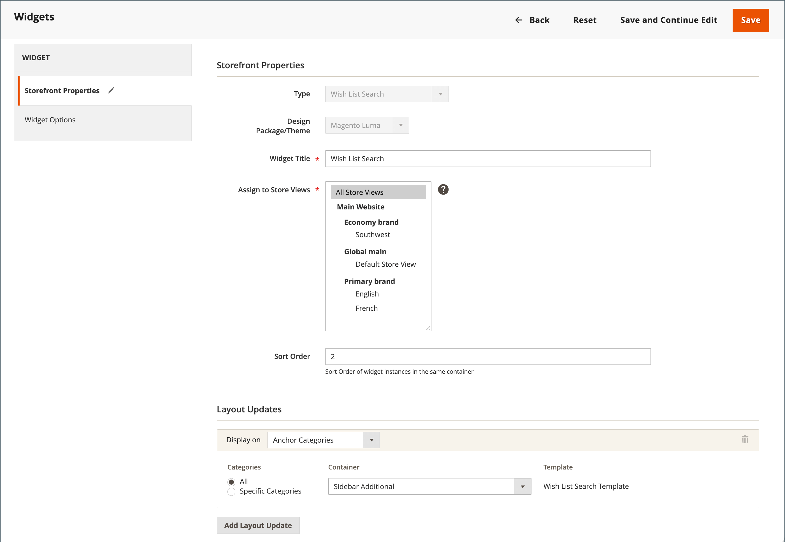

# 設定希望清單

希望清單設定可啟用希望清單，並決定分享希望清單時所使用的電子郵件範本和電子郵件訊息的寄件者。

## 啟用希望清單功能

1. 在&#x200B;_管理員_&#x200B;側邊欄上，移至&#x200B;**[!UICONTROL Stores]** > _[!UICONTROL Settings]_>**[!UICONTROL Configuration]**。

1. 在左側面板中，展開&#x200B;**[!UICONTROL Customers]**&#x200B;並選擇&#x200B;**[!UICONTROL Wish List]**。

1. 展開 **[!UICONTROL General Options]**&#x200B;區段，然後執行下列動作：

   {width="600" zoomable="yes"}

   - 將&#x200B;**[!UICONTROL Enabled]**&#x200B;切換為`Yes`，這會啟用存放區的願望清單模組。

   -  (僅限Adobe Commerce)將&#x200B;**[!UICONTROL Enable Multiple Wish Lists]**&#x200B;切換為`Yes`，讓客戶可建立和維護多個願望清單。

   -  (僅限Adobe Commerce)若要限制客戶可與其帳戶相關聯的願望清單數量，請輸入&#x200B;**[!UICONTROL Number of Multiple Wish Lists]**&#x200B;的值。

   - 將&#x200B;**[!UICONTROL Show in Sidebar]**&#x200B;切換為`Yes`，在側欄中顯示希望清單。

1. 展開 **[!UICONTROL Share Options]**&#x200B;區段，然後執行下列動作：

   {width="600" zoomable="yes"}

   - 將&#x200B;**[!UICONTROL Email Sender]**&#x200B;設定為應該顯示為郵件寄件者的商店連絡人。 選項：一般連絡人、銷售代表、客戶支援、自訂電子郵件。

   - 設定當客戶共用希望清單時要使用的&#x200B;**[!UICONTROL Email Template]**。

   - 若要限制客戶可傳送的電子郵件總數，請輸入&#x200B;**[!UICONTROL Max Emails Allowed to be Sent]**&#x200B;值。 預設值為10，而允許的最大值為10,000。

   - 若要限制訊息的大小，請輸入&#x200B;**[!UICONTROL Email Text Length Limit]**&#x200B;的值。 預設值為255。

1. 展開 **[!UICONTROL My Wish List Link]**&#x200B;區段，並將&#x200B;**[!UICONTROL Display Wish List Summary]**&#x200B;設定為下列其中一項：

   - `Display number of items in wish list`
   - `Display item quantities`

   {width="600" zoomable="yes"}

1. 完成時，按一下&#x200B;**[!UICONTROL Save Config]**。

## 新增希望清單搜尋

 (僅限Adobe Commerce)

使用希望清單搜尋[Widget](../content-design/widgets.md)可以找到任何公開的希望清單。 此Widget可讓客戶依希望清單擁有者的名稱或電子郵件地址進行搜尋。 商店客戶可以找到屬於其他客戶的願望清單、檢視他們並向他們訂購產品，或將產品新增到他們自己的願望清單中。 如果其他客戶從公開願望清單中購買了一個專案，則該專案不會從原始願望清單中移除。 _願望清單搜尋_ Widget可新增至您商店的任何頁面，方便客戶尋找朋友和家人的願望清單。

{width="700" zoomable="yes"}

1. 在&#x200B;_管理員_&#x200B;側邊欄上，移至&#x200B;**[!UICONTROL Content]** > _[!UICONTROL Elements]_>**[!UICONTROL Widgets]**。

1. 按一下右上角的&#x200B;**[!UICONTROL Add Widget]**。

1. 在&#x200B;_[!UICONTROL Settings]_索引標籤中，執行下列動作：

   - 將&#x200B;**[!UICONTROL Type]**&#x200B;設為`Wish List Search`。

   - 將&#x200B;**[!UICONTROL Design Theme]**&#x200B;設定為新增希望清單之存放區的主題。

   - 按一下&#x200B;**[!UICONTROL Continue]**。

1. 完成&#x200B;_[!UICONTROL Storefront Properties]_：

   - 輸入&#x200B;**[!UICONTROL Widget Title]**。

   - 將&#x200B;**[!UICONTROL Assign to Store Views]**&#x200B;設定為要使用Widget的檢視或網站。

   - 對於&#x200B;**[!UICONTROL Sort Order]**，請輸入數字以決定介面工具集在其容器中的位置。

     `0` =第一個（預設）、`1` =第二個、`2` =第三個，依此類推。

1. 在&#x200B;_[!UICONTROL Layout Updates]_區段中，按一下&#x200B;**[!UICONTROL Add Layout Update]**並將&#x200B;**[!UICONTROL Display on]**設定為下列其中一項：

   - _[!UICONTROL Categories]_

      - `Anchor Categories`
      - `Non-Anchor Categories`

   - _[!UICONTROL Products]_

      - `All Product Type`
      - `Simple Product`
      - `Virtual Product`
      - `Bundle Product`
      - `Configurable Product`
      - `Downloadable Product`
      - `Gift Card`
      - `Grouped Product`

   - _[!UICONTROL Generic Page]_

      - `All Pages`
      - `Specified Page`
      - `Page Layouts`

1. 在&#x200B;**[!UICONTROL Container]**&#x200B;清單中，選擇要置入的頁面配置區域。

   {width="700" zoomable="yes"}

1. 在左側面板中選擇&#x200B;**[!UICONTROL Widget Options]**。

1. 將&#x200B;**[!UICONTROL Quick Search Form Types]**&#x200B;設定為下列其中一項：

   - `All Forms` — 客戶可依所有可用引數搜尋。
   - `Owner Name` — 客戶可以依擁有者名稱搜尋希望清單。
   - `Owner Email` — 客戶可以依擁有者電子郵件地址來搜尋希望清單。

   >[!NOTE]
   >
   >送貨地址不包含在希望清單中。

1. 依照標準[指示](../content-design/widget-create.md)，視需要設定任何剩餘的Widget屬性。

1. 完成時，按一下&#x200B;**[!UICONTROL Save]**。

1. 出現提示時，請重新整理所有無效的快取。
