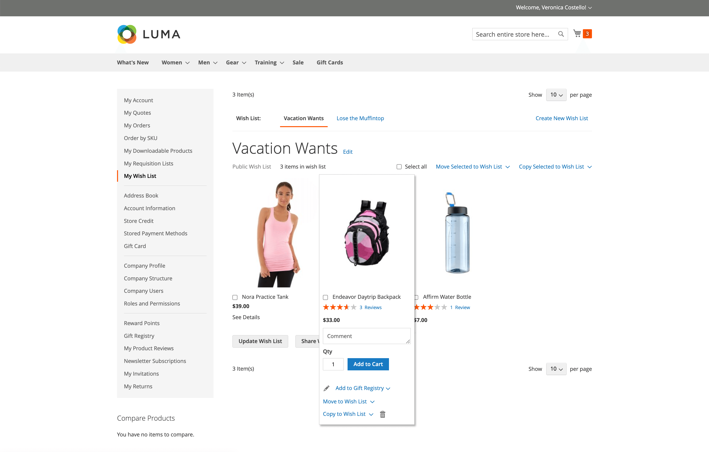
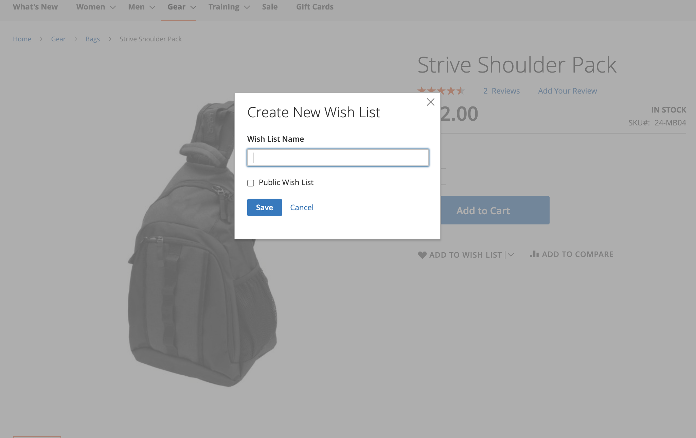

# 希望清單店面體驗

願望清單是客戶召回他們喜歡但未準備好購買的產品的一種便利方式。 希望清單中的專案可與他人共用或新增至購物車。 如果客戶有多個願望清單，則目前願望清單的名稱會顯示在頁面頂端。 客戶可以從其帳戶控制面板管理其願望清單。 商店管理員也可協助客戶透過管理員管理其願望清單。

{width="700" zoomable="yes"}

 Adobe Commerce支援每個客戶帳戶使用多個願望清單。

Magento Open Source程式碼基底支援每個客戶帳戶使用單一希望清單。

## 建立希望清單

 (僅限Adobe Commerce)

在店面，客戶可以從他們的帳戶儀表板、產品頁面、目錄頁面和購物車建立願望清單。

### 方法1：來自客戶帳戶

1. 在其帳戶儀表板的側邊欄中，客戶選擇&#x200B;**[!UICONTROL My Wish List]**。

1. 在右上角，按一下&#x200B;**[!UICONTROL Create New Wish List]**。

1. 輸入希望清單名稱。

1. 若要允許其他人檢視他們的願望清單，請選取&#x200B;**[!UICONTROL Public Wish List]**&#x200B;核取方塊。

   >[!NOTE]
   >
   >`Public`與`Private`個願望清單的主要差異在於，私人願望清單不是可透過願望清單[搜尋](wishlist-configuration.md#add-wish-list-search)。

1. 完成時，按一下&#x200B;**[!UICONTROL Save]**。

   {width="700" zoomable="yes"}

### 方法2：從目錄頁面

1. 從店面，客戶進入目錄頁面，其中包含他們要新增到願望清單中的產品。

1. 將滑鼠停留在產品上。

1. 客戶按一下&#x200B;_新增至希望清單_&#x200B;圖示旁的箭頭，並選取&#x200B;**[!UICONTROL Create New Wish List]**。

1. 輸入希望清單名稱。

1. 若要允許其他人檢視他們的願望清單，請選取&#x200B;**[!UICONTROL Public Wish List]**&#x200B;核取方塊。

1. 完成後，按一下&#x200B;**[!UICONTROL Save]**。

### 方法3：從產品詳細資料頁面

1. 從店面，客戶前往他們要新增到願望清單中的產品的詳細資訊頁面。

1. 按一下&#x200B;**[!UICONTROL Add to Wish List]**&#x200B;旁的箭頭，然後選擇&#x200B;**[!UICONTROL Create New Wish List]**。

1. 進入&#x200B;**[!UICONTROL Wish List Name]**。

1. 若要允許其他人檢視他們的願望清單，請選取&#x200B;**[!UICONTROL Public Wish List]**&#x200B;核取方塊。

1. 完成後，按一下&#x200B;**[!UICONTROL Save]**。

   {width="700" zoomable="yes"}

### 方法4：從購物車

1. 客戶開啟&#x200B;**[!UICONTROL Shopping Cart]**&#x200B;頁面。

1. 在專案底下，按一下&#x200B;**[!UICONTROL Move to Wishlist]**&#x200B;旁的箭頭，然後選擇&#x200B;**[!UICONTROL Create New Wish List]**。

1. 進入&#x200B;**[!UICONTROL Wish List Name]**。

1. 若要允許其他人檢視他們的願望清單，請選取&#x200B;**[!UICONTROL Public Wish List]**&#x200B;核取方塊。

1. 完成後，按一下&#x200B;**[!UICONTROL Save]**。

{width="700" zoomable="yes"}

## 更新產品清單

1. 從希望清單中，客戶指向產品以顯示選項。

1. 若要新增產品的&#x200B;**[!UICONTROL Comment]**，請在價格下方的方塊中輸入文字。

   {width="700" zoomable="yes"}

1. 若要變更產品選項選擇，請按一下&#x200B;**[!UICONTROL Edit]**&#x200B;並執行下列動作：

   - 更新產品詳細資料頁面上的選項。
   - 按一下&#x200B;**[!UICONTROL Update Wish List]**。

## 將願望清單產品新增到購物車

1. 在希望清單中，客戶指向您要新增的產品。

1. 更新&#x200B;**[!UICONTROL Qty]**&#x200B;並視需要編輯其他選項。

1. 按一下&#x200B;**[!UICONTROL Add to Cart]**。

## 共用希望清單

1. 客戶按一下&#x200B;**[!UICONTROL Share Wishlist]**。

1. 輸入每個要接收願望清單之人員的電子郵件地址，以逗號分隔。

1. 新增要包含在電子郵件中的&#x200B;**[!UICONTROL Message]**。

1. 按一下&#x200B;**[!UICONTROL Share Wish List]**。

   {width="700" zoomable="yes"}

   訊息是從您的主要[商店連絡人](../getting-started/store-details.md#store-email-addresses)傳送，並包含每個產品的縮圖影像，以及您商店的連結。

   {width="500" zoomable="yes"}

## 編輯希望清單

客戶可以從其帳戶儀表板以多種方式修改其願望清單。

### 將專案移至其他清單

 (僅限Adobe Commerce)

1. 客戶會選取每個要移動專案的核取方塊。

1. 按一下&#x200B;**[!UICONTROL Move Selected to Wish List]**&#x200B;並執行下列任一項作業：

   - 選擇現有的希望清單。
   - 按一下&#x200B;**[!UICONTROL Create New Wish List]**。

### 將專案複製到其他清單

 (僅限Adobe Commerce)

1. 選取每個要移動專案的核取方塊。

1. 按一下&#x200B;**[!UICONTROL Copy Selected to Wish List]**&#x200B;並執行下列任一項作業：

   - 選擇現有的希望清單。
   - 按一下&#x200B;**[!UICONTROL Create New Wish List]**。

## 刪除希望清單

 (僅限Adobe Commerce)

1. 客戶開啟要刪除的願望清單。

1. 按一下&#x200B;**[!UICONTROL Delete Wish List]**。

1. 提示確認時，按一下&#x200B;**[!UICONTROL OK]**。

>[!IMPORTANT]
>
>此動作無法復原。

## 將願望清單專案轉移到購物車

若要將所有希望清單專案轉送到購物車，客戶按一下&#x200B;**[!UICONTROL Add All to Cart]**。

若要新增單一料號，客戶會執行下列作業：

1. 將滑鼠指標暫留在專案上，並輸入他們想要加入購物車的&#x200B;**[!UICONTROL Qty]**。

1. 按一下&#x200B;**[!UICONTROL Add to Cart]**。

## 尋找客戶的願望清單

如果您的商店頁面中包含[願望清單搜尋Widget](wishlist-configuration.md#add-wish-list-search)，客戶可依願望清單擁有者的名稱或電子郵件地址進行搜尋。

1. 客戶從願望清單搜尋Widget中選取搜尋選項。

1. 輸入希望清單擁有者的名稱或電子郵件地址，然後按一下&#x200B;**[!UICONTROL Search]**。

   _願望清單搜尋_&#x200B;頁面隨即開啟，任何相符的願望清單都會顯示在搜尋結果區段中。

   >[!NOTE]
   >
   >搜尋結果中只會顯示公開的願望清單，客戶的私人願望清單不會公開顯示。

1. 若要檢視希望清單專案的清單，請按一下&#x200B;**[!UICONTROL View]**。

   系統會針對每個希望清單顯示擁有者名稱和上次更新的日期。

1. 若要將產品加入購物車，客戶會選取產品下方的核取方塊，然後按一下&#x200B;**[!UICONTROL Add to Cart]**。

   您也可以將您喜歡的其他客戶願望清單專案新增至您自己的願望清單。
