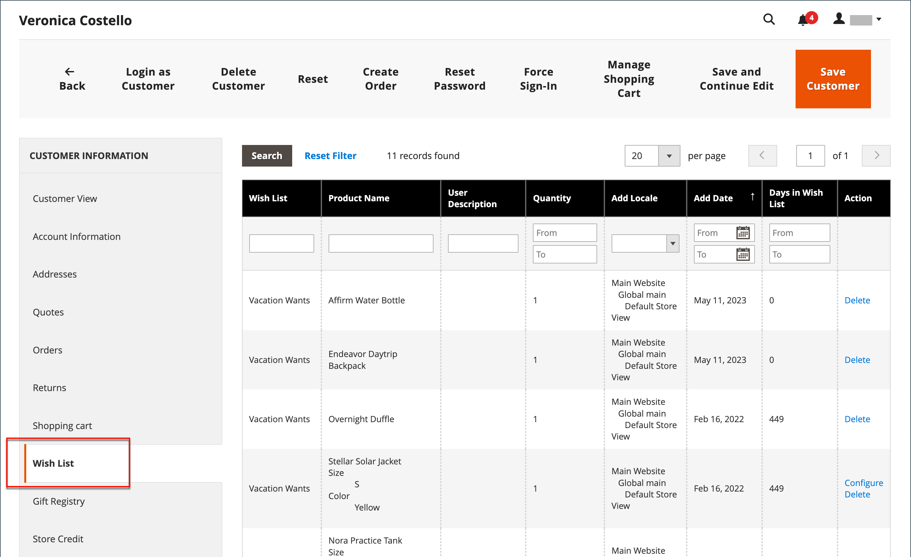

# 希望清單

願望清單是註冊客戶可與好友分享或儲存以便稍後轉移到購物車的產品清單。 啟用願望清單後，「加入願望清單」連結會出現在商店中每個產品的類別和產品頁面上。 視主題而定，它可能是文字連結或圖形影像。

 Adobe Commerce支援為每個客戶帳戶使用多個願望清單。

 Magento Open Source支援為每個客戶帳戶使用單一願望清單。

共用的願望清單是從商店電子郵件地址傳送，但訊息內文包含來自客戶的個人化附註。 您可以自訂在共用希望清單時使用的電子郵件範本，並選擇顯示為寄件者的商店聯絡人。

可以從的儀表板更新願望清單 [客戶帳戶](../customers/account-dashboard.md). 客戶或商店管理員可以在願望清單和購物車之間新增或傳輸專案。

{width="700" zoomable="yes"}

將具有多個選項的產品加入希望清單時，客戶選取的任何選項都會包含在希望清單專案說明中。 例如，如果客戶以三種不同顏色加入同一雙鞋子，每雙鞋子都會顯示為個別的願望清單專案。 但是，如果客戶將相同產品多次新增至希望清單，產品只會出現一次，但會從產品頁面選取數量。

## 希望清單協助管理員

客戶可以 [管理他們的願望清單](wishlist-storefront.md) 登入他們在店面的帳戶。 身為商店管理員，您也可以從管理員管理客戶願望清單。

**_若要從管理員更新希望清單專案：_**

1. 在 _管理員_ 側欄，前往 **[!UICONTROL Customers]** > **[!UICONTROL All Customers]**.

1. 在清單中尋找客戶，然後按一下 **[!UICONTROL Edit]** 在 _[!UICONTROL Action]_欄。

1. 在左側面板中，選擇 **[!UICONTROL Wish List]** 並在清單中尋找要編輯的專案。

   為產品選取的任何選項都會顯示在產品名稱下方。

   {width="600" zoomable="yes"}

1. 若要編輯產品選項，請執行下列動作：

   - 在 **[!UICONTROL Action]** 欄，按一下 **[!UICONTROL Configure]**.

   - 在產品頁面上，更新選項和 **[!UICONTROL Quantity]** 視需要。

   - 按一下 **[!UICONTROL OK]**.

1. 完成後，按一下 **[!UICONTROL Save Customer]** 或 **[!UICONTROL Save and Continue Edit]**.
