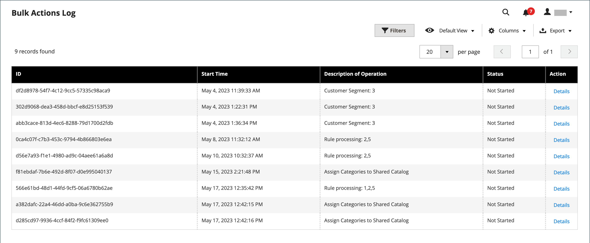

# 大量動作

{{ee-feature}}

大量動作記錄會記錄背景執行的非同步大量操作的詳細資訊，例如匯入/匯出或將[自訂價格](../b2b/catalog-shared-manage.md#update-custom-pricing)指派給[共用目錄](../b2b/catalog-shared.md)中的多個產品。

{width="600" zoomable="yes"}

## 設定大量動作

1. 在&#x200B;_管理員_&#x200B;側邊欄上，移至&#x200B;**[!UICONTROL Stores]** > _[!UICONTROL Settings]_>**[!UICONTROL Configuration]**。

1. 在左側面板中，展開&#x200B;**[!UICONTROL Advanced]**&#x200B;並選擇&#x200B;**[!UICONTROL System]**。

1. 展開 **[!UICONTROL Bulk Actions]**&#x200B;區段並設定記錄儲存選項：

   **[!UICONTROL Days Saved in Log]** — 輸入大量動作儲存在記錄檔中的天數。

   {width="600" zoomable="yes"}

   如需組態設定的詳細清單，請參閱&#x200B;_組態參考_&#x200B;中的&#x200B;[_大量動作_](../configuration-reference/advanced/system.md)。

1. 完成時，按一下&#x200B;**[!UICONTROL Save Config]**。

## 檢視大量動作

1. 在&#x200B;_管理員_&#x200B;側邊欄上，移至&#x200B;**[!UICONTROL System]** > _[!UICONTROL Actions Logs]_>**[!UICONTROL Bulk Actions]**。

1. 在記錄中找到所需的動作。

1. 在&#x200B;_[!UICONTROL Action]_欄中按一下&#x200B;**[!UICONTROL Details]**。
