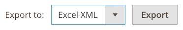

# 動作記錄報告

{{ee-feature}}

此 _動作記錄檔_ 報表會顯示所有已啟用記錄功能的管理員動作的詳細記錄。 每個記錄都加蓋時間戳記，並記錄使用者的IP位址和名稱。 記錄詳細資訊包括管理員使用者資料以及在動作期間完成的相關變更。

您要在報告中顯示的動作必須在以下位置啟用： [管理員動作記錄](action-log.md) 商店設定的畫面。 如果勾選（啟用）動作型別，這些型別的管理員動作會顯示在「動作記錄檔」報表中。

您可以使用每欄中的選項來篩選報表。 您可以設定單一篩選選項，或設定多個欄的篩選選項，以縮小報告範圍並列出特定動作。 您也可以匯出CSV或Excel XML格式的報表資料。

「動作記錄檔」報表包含下列資訊：

- **[!UICONTROL Time]**  — 動作發生的日期和時間
- **[!UICONTROL Action Group]**  — 顯示動作型別，與上啟用的動作相關 _管理員動作記錄_ 商店設定中的畫面
- **[!UICONTROL Action]**  — 顯示已記錄的動作
- **[!UICONTROL IP Address]**  — 顯示執行動作之電腦的IP位址
- **[!UICONTROL Username]**  — 顯示執行動作之使用者的登入ID
- **[!UICONTROL Result]**  — 顯示使用者動作成功或失敗
- **[!UICONTROL Full Action Name]**  — 顯示後端動作名稱
- **[!UICONTROL Details]**  — 顯示後端動作類別
- **[!UICONTROL Full Details]**  — 顯示管理動作的所有記錄詳細資料

## 檢視動作記錄報告

1. 在 _管理員_ 側欄，前往 **[!UICONTROL System]** > _[!UICONTROL Actions Logs]_>**[!UICONTROL Report]**.

   {width="600" zoomable="yes"}

1. 若要檢視所列出管理動作的完整詳細資料，請按一下 **[!UICONTROL View]**.

   {width="600" zoomable="yes"}

## 篩選動作記錄檔報表

您可以定義篩選選項欄位，然後按一下 **[!UICONTROL Search]** 以縮小顯示的動作。

若要清除篩選選項並返回完整報表，請按一下 **[!UICONTROL Reset Filter]**.

{width="600" zoomable="yes"}

| 欄位 | 說明 |
|--- |--- |
| [!UICONTROL Time] | 在 **[!UICONTROL From]**，按一下以從動態行事曆中選取日期，以定義篩選的開始日期。 在 **[!UICONTROL To]**，按一下以選取日期，定義篩選的結束日期。 |
| [!UICONTROL Action Group] | 選擇動作群組。 |
| [!UICONTROL Action] | 選擇動作。 |
| [!UICONTROL IP Address] | 輸入用於動作之電腦的IP位址。 |
| [!UICONTROL Username] | 選擇使用者名稱。 預設為 `All Users`. |
| [!UICONTROL Result] | 選擇「成功」或「失敗」。 |
| [!UICONTROL Full Action Name] | 在欄位中輸入要比對的搜尋文字。 |
| [!UICONTROL Details] | 在欄位中輸入要比對的搜尋文字。 |

{style="table-layout:auto"}

## 匯出動作記錄報告

1. 的 **[!UICONTROL Export to]**，選擇匯出格式：

   - `CSV`  — 包含純文字資料的逗號分隔值檔案
   - `Excel XML`  — 以XML為基礎的試算表資料格式

1. 按一下 **[!UICONTROL Export]**.

   產生的檔案會自動儲存到您指定的資料夾以供下載。

   {width="200"}
