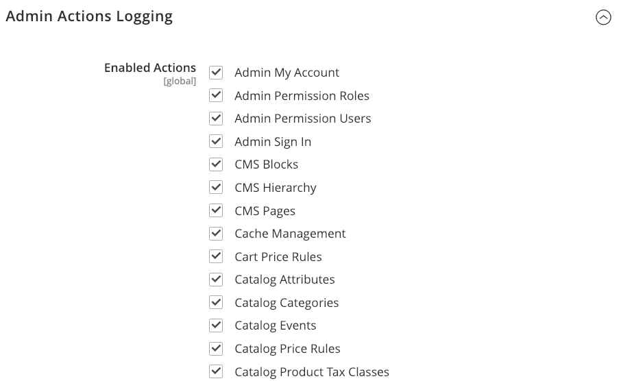

# 動作記錄

{{ee-feature}}

動作記錄檔功能會記錄（記錄）在您商店中工作的管理員使用者所進行的每次變更。 這可讓您追蹤對存放區進行的所有變更。 追蹤這些變更，以及為使用者設定[管理員許可權](permissions.md)，有助於保護您的存放區免受不必要的變更。

對於大多數Admin動作，記錄的資訊包括動作、使用者名稱、動作成功或失敗，以及受動作影響的物件ID。 也會記錄IP位址和日期。

依預設，會啟用並記錄所有管理動作。 若要設定管理員動作記錄，請檢閱選項並選取或清除每個動作型別的核取方塊。 Adobe Commerce僅記錄勾選型別。

檢視[動作記錄報告](action-log-report.md)，以檢閱記錄的管理動作和詳細資料。

{width="600" zoomable="yes"}

如需組態設定的詳細清單，請參閱&#x200B;_組態參考_&#x200B;中的[管理動作記錄檔封存](../configuration-reference/advanced/system.md)。

## 設定管理員記錄動作

1. 在&#x200B;_管理員_&#x200B;側邊欄上，移至&#x200B;**[!UICONTROL Stores]** > _[!UICONTROL Settings]_>**[!UICONTROL Configuration]**。

1. 在左側面板中，展開&#x200B;**[!UICONTROL Advanced]**&#x200B;並選擇&#x200B;**[!UICONTROL Admin]**。

1. 展開 **[!UICONTROL Admin Actions Logging]**&#x200B;區段，並對每個動作執行下列動作：

   - 若要為動作啟用管理員記錄，請選取核取方塊。
   - 若要停用動作的「管理員記錄」，請清除核取方塊。

1. 完成時，按一下&#x200B;**[!UICONTROL Save Config]**。

## 封存管理動作記錄

管理員動作記錄檔可以封存任何天數。 指定期間後也可刪除封存。

1. 在左側面板中，展開&#x200B;**[!UICONTROL Advanced]**&#x200B;並選擇&#x200B;**[!UICONTROL System]**。

1. 展開&#x200B;**[!UICONTROL Admin Action Log Archiving]**&#x200B;並設定選項：

   - **[!UICONTROL Logs Entry Lifetime, Days]** — 設定要保留封存記錄檔的天數。
   - **[!UICONTROL Log Archiving Frequency]** — 設定建立封存的頻率。

1. 完成時，按一下&#x200B;**[!UICONTROL Save Config]**。
