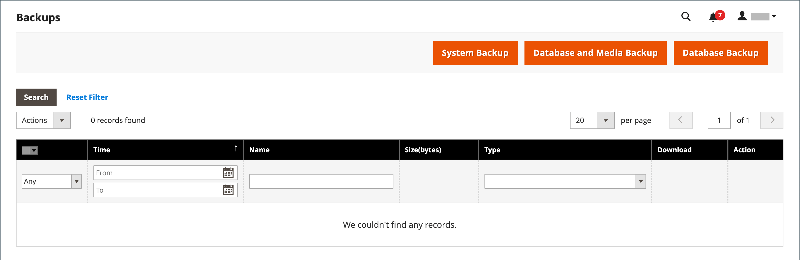

# 系統備份

Adobe Commerce和Magento Open Source可讓您備份系統的不同部分（例如檔案系統、資料庫和媒體檔案），並自動回覆。 每個備份的記錄會顯示在&#x200B;_備份_&#x200B;頁面的網格中。 從清單中刪除記錄也會刪除已封存的檔案。 資料庫備份檔案會使用GZ格式壓縮。 對於系統備份、資料庫和媒體備份，會使用TGZ格式。 您應先限制對備份工具的存取權，並在安裝擴充功能和更新之前進行備份，此為最佳作法。

- **限制對備份工具的存取。**&#x200B;可藉由為備份和復原資源設定[使用者角色](permissions-user-roles.md)來限制對備份和復原管理工具的存取。 若要限制存取，請取消選取對應的核取方塊。 若要授與回覆資源的存取權，您也必須授與備份資源的存取權。

- **安裝擴充功能與更新之前請先備份。**&#x200B;安裝擴充功能或更新前，請一律執行備份。

{{$include /help/_includes/backups-note.md}}

## 啟用及排程備份

1. 在&#x200B;_管理員_&#x200B;側邊欄上，移至&#x200B;**[!UICONTROL Stores]** > _[!UICONTROL Settings]_>**[!UICONTROL Configuration]**。

1. 在左側面板中，展開&#x200B;**[!UICONTROL Advanced]**&#x200B;並選擇&#x200B;**[!UICONTROL System]**。

1. 展開擴充選擇器&#x200B;**[!UICONTROL Backup Settings]**。

1. 將&#x200B;**[!UICONTROL Enabled Schedule Backup]**&#x200B;設為`Yes`。

1. 若要排程自動召喚，請設定排程選項：

   - 將&#x200B;**[!UICONTROL Enabled Schedule Backup]**&#x200B;設為`Yes`。
   - 將&#x200B;**[!UICONTROL Scheduled Backup Type]**&#x200B;設定為以排定的間隔執行的備份型別。
   - 將&#x200B;**[!UICONTROL Start Time]**&#x200B;設定為執行備份作業的時間。
   - 將&#x200B;**[!UICONTROL Frequency]**&#x200B;設為`Daily`、`Weekly`或`Monthly`。
   - 將&#x200B;**[!UICONTROL Maintenance Mode]**&#x200B;設為`Yes`。

   {width="600" zoomable="yes"}

1. 完成時，按一下&#x200B;**[!UICONTROL Save Config]**。

## 建立備份

1. 在&#x200B;_管理員_&#x200B;側邊欄上，移至&#x200B;**[!UICONTROL System]** > _[!UICONTROL Tools]_>**[!UICONTROL Backups]**。

1. 在右上角，按一下您要建立的備份型別：

   - **[!UICONTROL System Backup]** — 建立資料庫和檔案系統的完整備份。 在此過程中，您可以選擇將媒體資料夾包含在備份中。

   - **[!UICONTROL Database and Media Backup]** — 建立資料庫和媒體資料夾的備份。

   - **[!UICONTROL Database Backup]** — 建立資料庫的備份。

   {width="600" zoomable="yes"}

1. 若要在備份期間將存放區置於維護模式，請選取核取方塊。

   備份完成後，維護模式會自動關閉。

1. 若要進行系統備份，請選取&#x200B;**[!UICONTROL Include Media folder to System Backup]**&#x200B;核取方塊以包含媒體資料夾。

1. 出現提示時，請確認動作。

<!-- Last updated from includes: 2023-02-22 09:59:54 -->
