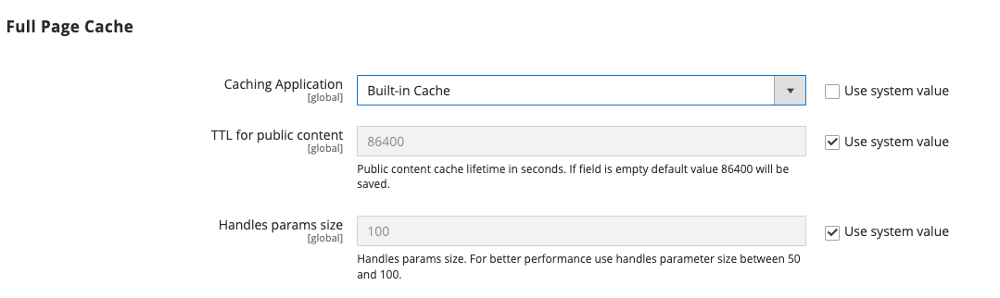

# 快取管理

Adobe Commerce和Magento Open Source快取管理系統可讓您輕鬆改善網站的效能。 每當快取需要重新整理時，就會顯示通知，其中包含 [!UICONTROL Cache Management] 頁面以完成重新整理。

{width="500"}

此 _[!UICONTROL Cache Management]_頁面會顯示每個主要快取的狀態及其關聯的標籤。 右上角的大按鈕可用來清除快取，或是包含所有快取儲存體。 在頁面底部，額外的按鈕可讓您清除目錄產品影像快取和JavaScript/CSS快取。

>[!IMPORTANT]
>
>變更目錄實體時，可能會影響其他頁面，並同時讓多個快取失效。 當您檢閱快取管理頁面時，可能會看到需要重新整理的無效專案 _**未直接編輯**_. 例如，當您編輯目錄中指派給任何類別的任何產品，或變更任何相關的產品規則時，就會發生此失效。

清除快取後，請一律重新整理瀏覽器，以確保您可以看到最新的檔案。 清除Commerce快取不會清除您的網頁瀏覽器快取。 您可能需要清除瀏覽器快取才能檢視更新的內容。

有關Adobe Commerce快取的其他技術資訊，請參閱 [快取概述](https://developer.adobe.com/commerce/frontend-core/guide/caching/){：target=&quot;_blank&quot;}於 _Commerce前端開發指南_.

存取 _[!UICONTROL Cache Management]_執行下列任一項作業來建立頁面：

- 按一下 **[!UICONTROL Cache Management]** 工作區上方訊息中的連結。
- 在 _管理員_ 側欄，前往 **[!UICONTROL System]** > _[!UICONTROL Tools]_>**[!UICONTROL Cache Management]**.

{width="700" zoomable="yes"}

## 快取的最佳作法

在Commerce中，重新索引和快取具有不同的目的。 [索引](index-management.md) 追蹤資料庫資訊，以提升搜尋效能、加快儲存前端的資料擷取速度等等。 快取儲存已載入的資料、影像、格式等，以提高載入和存取店面的效能。

- 安裝擴充功能/模組後，請務必清除快取。 您可以安裝一或多個擴充功能，然後清除快取。
- 安裝Commerce後排清快取。 若是全新安裝，您也應該重新編列索引。
- 從開放原始碼或商務的一個版本升級至另一個版本後，請排清快取。
- 排清快取時，請考慮快取型別，並排程在非尖峰期進行排清。 例如，挑選有少數客戶使用網站的時間，例如深夜或清晨。 在需求尖峰期間清除快取型別可能會增加管理員的負載，並導致網站停止運作，直到作業完成。
- 時間 [重新索引](index-management.md)，您不需要排清快取。

## 快取管理角色資源

您可以依角色將特定快取維護動作的存取權指派給使用者，包括檢視、切換和排清快取的選項。 Adobe建議僅對管理員層級的使用者啟用排清動作。 存取所有快取管理功能可能會影響店面的效能。

{width="600" zoomable="yes"}

如需有關指派資源以授予管理員使用者帳戶存取權的資訊，請參閱 [角色資源](permissions-user-roles.md#role-resources). 下列資源可控制對快取管理工具的存取：

- [!UICONTROL Clean Cache Actions]

   - [!UICONTROL Flush Cache Storage]
   - [!UICONTROL Flush Magento Cache]

- [!UICONTROL Cache Type Management]

   - [!UICONTROL Toggle Cache Type]
   - [!UICONTROL Refresh Cache Type]

- [!UICONTROL Additional Cache Management]

   - [!UICONTROL Catalog Images Cache]
   - [!UICONTROL Flush Js/Css]
   - [!UICONTROL Flush Static Files]

## 重新整理特定快取

1. 對於每個要重新整理的快取，請選取該列開頭的核取方塊。

1. 設定 **[!UICONTROL Actions]** 至 `Refresh` 並按一下 **[!UICONTROL Submit]**.

## 執行大量動作重新整理

1. 若要選取一組快取，請設定 **[!UICONTROL Mass Actions]** 變更為下列其中一項：

   - `Select All`
   - `Select Visible`

1. 選取每個要重新整理之快取的核取方塊。

1. 設定 **[!UICONTROL Actions]** 至 `Refresh` 並按一下 **[!UICONTROL Submit]**.

## 排清產品影像快取

1. 在 _[!UICONTROL Additional Cache Management]_，按一下&#x200B;**[!UICONTROL Flush Catalog Images Cache]**以清除預先產生的產品影像檔案。

   此 `Image cache was cleaned` 訊息會顯示在工作區頂端。

1. 清除瀏覽器的快取。

## 排清JavaScript/CSS快取

1. 在 _[!UICONTROL Additional Cache Management]_，按一下以清除已合併至單一檔案的Javascript和CSS檔案&#x200B;**[!UICONTROL Flush JavaScript/CSS Cache]**.

   此 `The JavaScript/CSS cache has been cleaned` 訊息會顯示在工作區頂端。

1. 清除瀏覽器的快取。

## 使用命令列排清

有權存取Commerce應用程式伺服器的系統管理員和開發人員也可以使用Commerce CLI從命令列管理快取和快取設定。 另請參閱 [管理快取](https://experienceleague.adobe.com/en/docs/commerce-operations/configuration-guide/cli/manage-cache#clean-and-flush-cache-types){：target=&quot;_blank&quot;}於 _設定指南_.

## 控制項

| 控制 | 說明 |
|---------------------------|------------------------------------------------------------------------------------------------------------------------------------------------------------------------------------------------------------------------------------------------------------------------------------------------------------------------------------------------------------|
| [!UICONTROL Mass Actions] | 選取多個快取的核取方塊。 選項：  **[!UICONTROL Select All]**— 選取所有快取的核取方塊。 **&#x200B;取消全選&#x200B;**— 清除所有快取的核取方塊。 **[!UICONTROL Select Visible]**  — 選取所有可見快取的核取方塊。  **[!UICONTROL Unselect Visible]**— 清除所有可見快取的核取方塊。 |
| [!UICONTROL Actions] | 決定要套用至所有所選快取的動作。 選項：  **[!UICONTROL Enable]**— 啟用所有選取的快取。 **[!UICONTROL Disable]**  — 停用所有選取的快取。  **[!UICONTROL Refresh]**— 重新整理所有選取的快取。 |
| [!UICONTROL Submit] | 將動作套用至所有選取的快取。 |

{style="table-layout:auto"}

### 按鈕

| 按鈕 | 說明 |
|-----------------------------------------|----------------------------------------------------------------------------------------------------------------------------------------------------------------------------------------------------------------------------------------|
| [!UICONTROL Flush Magento Cache] | 移除預設Commerce快取中的所有專案(`var/cache`)，根據他們相關聯的Commerce標籤。 |
| [!UICONTROL Flush Cache Storage] | 不論Commerce標籤為何，都會從快取中移除所有專案。 如果您的系統使用替代快取位置，則其他應用程式使用的任何快取檔案都會在程式中移除。 |
| [!UICONTROL Flush Catalog Images Cache] | 移除所有儲存在中的自動調整大小和加水印的目錄影像 `media/catalog/product/cache`. 如果最近上傳的影像未反映在目錄中，請嘗試清除目錄並重新整理瀏覽器。 |
| [!UICONTROL Flush JavaScript/CSS Cache] | 從快取中移除合併的JavaScript和CSS檔案復本。 如果樣式表或JavaScript的最近變更未反映在存放區中，請嘗試排清JavaScript/CSS快取並重新整理瀏覽器。 |
| [!UICONTROL Flush Static Files Cache] | 移除已預先處理的檢視檔案和靜態檔案。 |

{style="table-layout:auto"}

### 快取

此 [!UICONTROL Cache Management] 頁面會列出您可從管理員管理的快取型別及其目前狀態。 本節說明Adobe Commerce支援的預設快取型別。 此 _快取標籤_ 和 _快取ID_ 欄說明Commerce應用程式程式碼中使用的值：

- `cache_type_id` 會定義快取型別的唯一識別碼。

- `%CACHE_TYPE_TAG%` 定義快取型別範圍設定中使用的唯一標籤。

開發人員和系統整合經銷商在自訂或與Adobe Commerce整合時(例如使用GraphQL API開發整合)，可使用這些值來設定和管理快取。 此 `cache type id` 也可用於使用Commerce CLI從應用程式伺服器命令列進行快取管理。 例如， ` bin/magento cache:status config` 顯示組態快取的目前狀態。

>[!NOTE]
>
>開發人員和系統整合經銷商可以自訂和擴充Commerce快取管理系統，以支援自訂模組和整合。 如需詳細資訊，請參閱 [設定快取](https://experienceleague.adobe.com/en/docs/commerce-operations/configuration-guide/cache/caching-overview) 在 _Adobe Commerce設定指南_.

<!-- prettier-ignore -->

#### 快取清單詳細資料

| 快取 | 說明 | 快取標籤 | 快取ID |
|-------|------------|----------|----------|
| [!UICONTROL Configuration] | Commerce會從所有模組收集XML設定、將其合併，並將合併的結果儲存至快取。 **[!UICONTROL System]**-  `config.xml`，`local.xml` **[!UICONTROL Module]** - `config.xml`  此快取也包含儲存在檔案系統和資料庫中的存放區特定設定。 修改組態檔後，請清除或排清此快取型別。 | `CONFIG` | `config` |
| [!UICONTROL Layouts] | 編譯的頁面配置，也就是來自所有元件的配置元件。 在修改版面配置檔案後，清除或排清此快取型別。 | `LAYOUT_GENERAL_CACHE_TAG` | `layout` |
| [!UICONTROL Blocks HTML output] | 每個區塊的頁面片段HTML。 修改檢視圖層後，請清除或排清此快取型別。 | `BLOCK_HTML` | `block_html` |
| [!UICONTROL Collections Data] | 儲存資料庫查詢結果的集合資料檔案。 如有必要，Commerce會自動清理此快取，但第三方開發人員可以將任何資料放入快取的任何區段中。 如果您的自訂模組使用邏輯而導致Commerce無法清除的快取專案，請清除或清除此快取型別。 | `COLLECTION_DATA` | `collections` |
| [!UICONTROL Reflections] | 清除API介面反射資料，這些資料通常會在執行階段產生。 | `REFLECTION` | `reflection` |
| `Database DDL operations` | 資料庫結構描述。 如有必要，Commerce會自動清理此快取，但第三方開發人員可以將任何資料放入快取的任何區段中。 在自訂變更資料庫結構描述後，清除或排清此快取型別。 （換言之，這些是Commerce本身不提供的更新。） 自動更新資料庫架構的一種方法是使用magento設定:db-schema:upgrade命令。 | `DB_DDL` | `db_ddl` |
| [!UICONTROL Compiled Config] | 程式碼編譯的結果。 | `COMPILED_CONFIG` | `compiled_config` |
| [!UICONTROL Webhooks Response Cache] | 快取對webhook請求的回應。 如需詳細資訊，請參閱 [Webhooks指南](https://developer.adobe.com/commerce/extensibility/webhooks/release-notes/#enhancements-2) （位於Commerce開發人員檔案中）。 | `WEBHOOKS_RESPONSE` | `webhooks_response` |
| [!UICONTROL EAV types and attributes] | 快取實體型別宣告以取得與實體屬性值(EAV)屬性相關的中繼資料。 屬性包括存放區標籤、相關PHP程式碼的連結、屬性呈現、搜尋設定等。 您通常不需要清除或排清此快取型別。 | `EAV` | `eav` |
| [!UICONTROL Customer Notification] | 顯示在使用者介面中的臨時通知。 | `CUSTOMER_NOTIFICATION` | `customer_notification` |
| [!UICONTROL GraphQL Query Resolver Results] | 快取客戶、CMS頁面、CMS區塊和產品媒體收藏集實體的GraphQL查詢解析器的結果。 讓此快取保持啟用，以改善GraphQL效能。 | `GRAPHQL_QUERY_RESOLVER_RESULT` | `graphql_query_resolver_result` |
| [!UICONTROL Integrations Configuration] | 整合設定檔。 變更或新增整合後，請清除或排清此快取。 | `INTEGRATION` | `config_integration` |
| [!UICONTROL Integrations API Configuration] | 已編譯的整合API設定以進行存放區整合。 | `INTEGRATION_API_CONFIG` | `config_integration_api` |
| [!UICONTROL Admin UI SDK Cache] | 將自訂內容快取給管理員。 另請參閱 [管理員設定和測試](https://developer.adobe.com/commerce/extensibility/admin-ui-sdk/configuration/) 在 _管理UI SDK指南_. | `ADMIN_UI_SDK` | `admin_ui_sdk` |
| [!UICONTROL Page Cache] | 全頁快取。 | `FPC` | `full_page` |
| [!UICONTROL Target Rule] | 目標規則索引 | `TARGET_RULE` | `target_rule` |
| [!UICONTROL Web Services Configuration] | 快取Web API結構。 | `WEBSERVICE` | `config_webservice` |
| [!UICONTROL Translations] | 翻譯檔案。 | `TRANSLATE` | `translate` |

{style="table-layout:auto"}

## 全頁快取

Adobe Commerce和Magento Open Source會使用伺服器上的全頁快取，快速顯示類別、產品和CMS頁面。 全頁快取可改善回應時間並降低伺服器負載。 若沒有快取，每個頁面可能需要執行程式碼區塊，並從資料庫擷取資訊。 不過，啟用全頁快取後，可以直接從快取讀取完全產生的頁面。

>[!NOTE]
>
>建議您 [清漆快取](https://varnish-cache.org/){：target=&quot;_blank&quot;}僅用於生產環境。

快取內容可用於處理類似造訪型別的請求。 因此，向臨時訪客顯示的頁面可能會與客戶顯示的頁面不同。 就快取目的而言，每次造訪都是下列三種型別之一：

- `Non-sessioned`  — 在非工作階段瀏覽期間，購物者會檢視頁面，但不會與商店互動。 系統會快取每個已檢視頁面的內容，並將內容提供給其他無工作階段的購物者。
- `Sessioned`  — 在工作階段瀏覽期間，會為與商店互動的購物者指派工作階段ID。 互動包括比較產品或新增產品至購物車等活動。 在工作階段期間產生的快取頁面僅供該購物者在工作階段期間使用。
- `Customer`  — 客戶工作階段是為使用註冊帳戶登入和購物的客戶所建立。 在會議期間，系統會根據指派的客戶群組，向客戶顯示特殊優惠、促銷和價格。

如需技術資訊，請參閱 [設定及使用清漆](https://experienceleague.adobe.com/docs/commerce-operations/configuration-guide/cache/varnish/config-varnish.html){：target=&quot;_blank&quot;}和 [Commerce頁面和預設快取使用Redis](https://experienceleague.adobe.com/docs/commerce-operations/configuration-guide/cache/redis/redis-pg-cache.html){：target=&quot;_blank&quot;}於 _設定指南_.

**_若要設定整頁快取：_**

1. 在 _管理員_ 側欄，前往 **[!UICONTROL Stores]** > _[!UICONTROL Settings]_>**[!UICONTROL Configuration]**.

1. 在左側面板中，展開 **[!UICONTROL Advanced]** 並選擇 **[!UICONTROL System]**.

1. 展開  此 **[!UICONTROL Full Page Cache]** 區段。

   {width="600" zoomable="yes"}

1. 設定 **[!UICONTROL Caching Application]** 變更為下列其中一項：

   - `Built-in Application`
   - `Varnish Caching`

1. 若要設定頁面快取的逾時，請輸入 **[!UICONTROL TTL for public content]**. (預設值為 `86400`)

1. 若要指定 [配置控點](https://developer.adobe.com/commerce/frontend-core/guide/layouts/#layout-handles) 處理 [`{BASE-URL}/page_cache/block/esi`](https://experienceleague.adobe.com/docs/commerce-operations/configuration-guide/cache/use-varnish-esi.html) HTTP端點，輸入 **[!UICONTROL Handles param size]**. 限制大小可以改善安全性和效能。 (預設值為 `100`)

1. 如果使用清漆，請完成 **[!UICONTROL Varnish Configuration]** 區段如下所示：

   - **[!UICONTROL Access list]**  — 輸入可以清除Varnish設定以產生設定檔的IP位址。 請使用逗號分隔多個專案。 預設值為 `localhost`.

   - **[!UICONTROL Backend host]**  — 輸入產生設定檔的後端主機的IP位址。 預設值為 `localhost`.

   - **[!UICONTROL Backend port]**  — 識別用來產生設定檔案的後端連線埠。 預設值為： `8080`.

   - **[!UICONTROL Grace period]**  — 指定用來作為產生設定檔之寬限期的秒數。 另請參閱 [進階清漆組態](https://experienceleague.adobe.com/docs/commerce-operations/configuration-guide/cache/config-varnish-advanced.html) 在 _設定指南_.

   - 將組態匯出為 `varnish.vcl` 檔案中，按一下您使用之清漆版本的按鈕。

   {width="600" zoomable="yes"}

1. 完成後，按一下 **[!UICONTROL Save Config]**.
