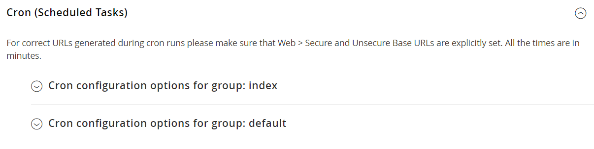

# Cron （排程工作）

Adobe Commerce和Magento Open Source會定期執行指令碼，依排程執行一些作業。 您可以從管理員控制Commerce cron工作的執行和排程。 根據Cron排程執行的存放區作業包含但不限於：

- [電子郵件](email-communications.md)
- [目錄價格規則](../merchandising-promotions/price-rules-catalog.md)
- [電子報](../merchandising-promotions/newsletters.md)
- [XML Sitemap產生](../merchandising-promotions/sitemap-xml.md)
- [貨幣匯率更新](../stores-purchase/currency-update.md)
- [Inventory management](../inventory-management/introduction.md)

>[!IMPORTANT]
>
>Commerce服務必須安裝在crontab中，以確保核心元件和部分協力廠商擴充功能如預期般運作。 如需將服務安裝到crontab的詳細資訊，請參閱&#x200B;_安裝指南_[&#128279;](https://experienceleague.adobe.com/docs/commerce-operations/installation-guide/next-steps/configuration.html)中的指示。

此外，您可以將下列設定為根據cron排程執行：

- 訂購系統格線更新與重新索引
- 待處理付款期限

請確定存放區的[基底URL](../stores-purchase/store-urls.md)已正確設定，以便cron作業期間產生的URL正確無誤。 如需雲端基礎結構上的Adobe Commerce，請參閱&#x200B;_雲端基礎結構上的Commerce指南_&#x200B;中的[設定cron工作](https://experienceleague.adobe.com/docs/commerce-cloud-service/user-guide/configure/app/properties/crons-property.html)。 若為內部部署，請參閱&#x200B;_設定指南_&#x200B;中的[設定並執行控制項](https://experienceleague.adobe.com/docs/commerce-operations/configuration-guide/cli/configure-cron-jobs.html)。

## 設定cron

1. 在&#x200B;_管理員_&#x200B;側邊欄上，移至&#x200B;**[!UICONTROL Stores]** > _[!UICONTROL Settings]_>**[!UICONTROL Configuration]**。

1. 在左側面板中，展開&#x200B;**[!UICONTROL Advanced]**&#x200B;並選擇&#x200B;**[!UICONTROL System]**。

1. 展開&#x200B;**[!UICONTROL Cron]**&#x200B;區段的。

   {width="600" zoomable="yes"}

1. 完成&#x200B;**[!UICONTROL Index]**&#x200B;與&#x200B;**[!UICONTROL Default]**&#x200B;群組的下列設定。

   每個區段中的設定都相同。

   - **[!UICONTROL Generate Schedules Every]** — 定義產生排程的頻率（分鐘）。 排程儲存在資料庫中。
   - **[!UICONTROL Schedule Ahead for]** — 定義預先排程cron工作的時間（以分鐘為單位）。 例如，如果此設定設為`10`且cron執行，則會將cron工作排程在接下來的10分鐘內。
   - **[!UICONTROL Missed if not Run Within]** — 定義用來判斷錯過工作的時間（分鐘）。 如果cron工作未在其排定的時間執行，且經過指定的時間，則無法執行，且其狀態設定為`Missed`。
   - **[!UICONTROL History Cleanup Every]** — 定義從資料庫中清除已結束工作歷史記錄的時間（以分鐘為單位）。
   - **[!UICONTROL Success History Lifetime]** — 定義具有`Successful`狀態的cron工作歷史記錄保留在資料庫中的時間長度（以分鐘為單位）。
   - **[!UICONTROL Failure History Lifetime]** — 定義具有`Error`狀態的cron工作歷史記錄保留在資料庫中的時間長度（以分鐘為單位）。
   - **[!UICONTROL Use Separate Process]** — 定義是否所有來自群組的cron工作都在單獨的系統處理序中執行。 選項： `Yes` / `No`

   {width="600" zoomable="yes"}

1. 完成時，按一下&#x200B;**[!UICONTROL Save Config]**。
