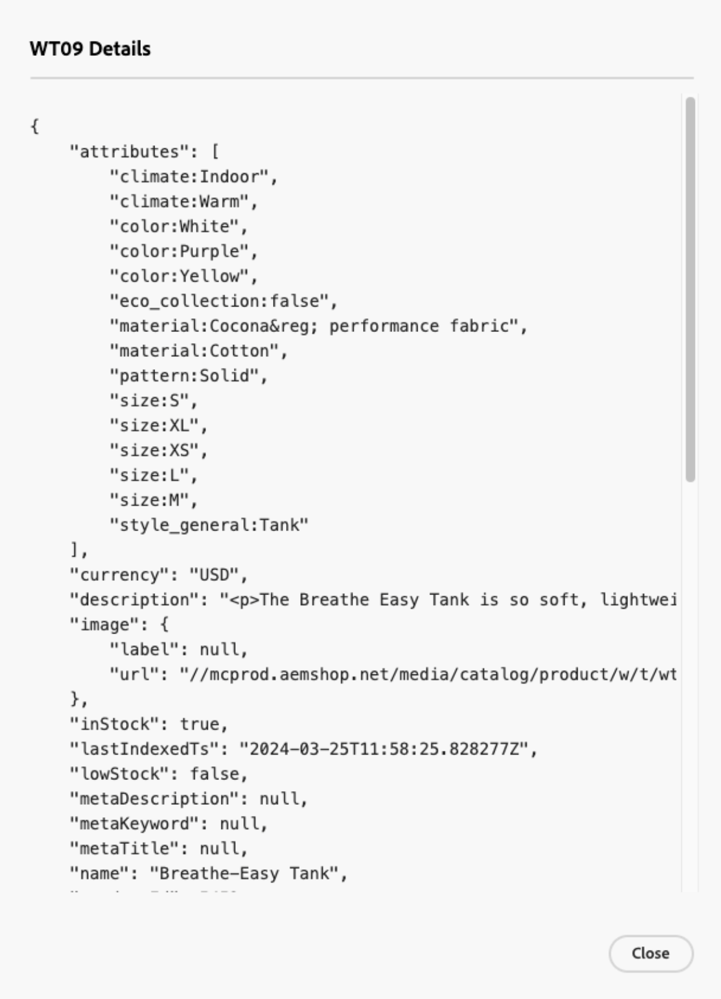

# 資料管理控制面板

資料管理儀表板提供從Commerce資料庫傳輸到Commerce SaaS服務之產品資料的同步狀態概觀。 使用者可以方便地監視產品同步狀態，並從統一的儀表板起始資料重新同步。 此功能可為您的店面提供寶貴的產品資料可用性深入分析，確保可及時向購物者顯示。

## 對象

所有使用[[!DNL Product Recommendations v6.0.0]](https://experienceleague.adobe.com/en/docs/commerce/product-recommendations/guide-overview)、[[!DNL Live Search v4.1.0]](https://experienceleague.adobe.com/en/docs/commerce/live-search/guide-overview)或[[!DNL Catalog Service v1.17]](https://experienceleague.adobe.com/en/docs/commerce/catalog-service/guide-overview)且使用中授權的Commerce商家，都可以免費使用資料管理儀表板。

資料管理儀表板位於&#x200B;*系統* >資料傳輸> *資料管理儀表板*。

儀表板包含下列欄位：

| 欄位 | 說明 |
|--- |--- |
| 範圍 | 同步資料的特定網站。 |
| [!DNL Product Recommendations] | 顯示[!DNL Product Recommendations]的同步處理狀態、已同步的產品數目，以及[可顯示](https://experienceleague.adobe.com/en/docs/commerce-admin/config/catalog/inventory#stock-options)已同步產品的表格。 |
| [!DNL Live Search] | 顯示[!DNL Live Search]的同步處理狀態、已同步的產品數目，以及[可顯示](https://experienceleague.adobe.com/en/docs/commerce-admin/config/catalog/inventory#stock-options)已同步產品的表格。 |
| [!DNL Catalog Service] | 顯示[!DNL Catalog Service]的同步狀態、已同步的產品數目以及已同步產品的表格。 |
| 設定 | 開啟對話方塊，您可以[手動重新同步目錄資料](#resync-catalog-data)。 |
| 同步狀態 | 顯示過去三小時內已從Commerce資料庫傳輸至任何SaaS服務的產品數量。 如果您不經常更新目錄，此值通常為零。 如果同步正在進行中，請按一下&#x200B;**[!UICONTROL Refresh]**&#x200B;以取得更新的計數。 |
| 產品計數 | 反映服務可用的目錄產品總數。 [!DNL Product Recommendations]和[!DNL Live Search]儀表板顯示&#x200B;_可顯示_&#x200B;產品的總數。 [!DNL Catalog Service]無法依可顯示內容篩選產品，因此如果您同時安裝[!DNL Catalog Service]和[!DNL Live Search]或[!DNL Product Recommendations]，兩個儀表板可能會顯示兩個不同的產品計數值。 |
| 同步的產品 | 提供有關核心Commerce索引中產品的詳細資訊。 根據預設，此表格會依「上次更新」排序。 若要尋找特定產品，請使用&#x200B;**[!UICONTROL Search by SKU]**&#x200B;欄位。 若要控制要顯示哪些欄，請按一下表格右側的&#x200B;**[!UICONTROL Customize Table]**。 |

## 使用資料管理儀表板

當您更新Commerce資料庫中的產品時，產品資料會根據您的系統組態傳輸至SaaS服務。 啟動同步處理時，**產品計數**&#x200B;表示傳送至SaaS服務的產品數目。

>[!IMPORTANT]
>
>完成同步所需的時間會因目錄大小和更新資料的數量而異。

當處理的產品數目與更新的產品數目相符時，表示同步已完成。

>[!NOTE]
>
>Adobe也提供命令列介面和系統記錄檔，供開發人員和系統整合經銷商用來管理和追蹤同步作業，以及Commerce SaaS服務的疑難排解錯誤。 如需詳細資訊，請參閱[SaaS資料匯出指南](https://experienceleague.adobe.com/en/docs/commerce/saas-data-export/overview)。

### 同步的產品清單

若要檢視同步產品的詳細資訊，請按一下表格中的產品。

### 重新同步目錄資料

若要確保您的Commerce SaaS服務一律包含最新產品資訊，您應[實作同步目錄資料的排程](https://experienceleague.adobe.com/en/docs/commerce-operations/configuration-guide/cli/manage-indexers#reindex)。

雖然您可以[手動啟動](#manually-resync-catalog)從Commerce資料庫重新同步到SaaS服務的目錄資料，但不建議使用，因為這會增加硬體資源的負載。 但是，在下列情況下可能需要手動重新同步目錄：

- 每當對產品目錄進行重大變更時（例如新增產品、更新產品詳細資料或修改類別）

- 如果您發現商店正面顯示產品資料時發生任何差異或效能問題

- 在對Commerce資料庫和SaaS服務之間的整合進行任何更新或變更後

- 部署影響產品資料管理或同步程式的自訂專案或設定時

遵守這些指引，並視需要主動重新同步目錄資料，就能在Adobe Commerce生態系統中維持資料的一致性、正確性和可靠性。

#### 手動重新同步目錄

如果您需要重新同步目錄資料，請按一下頁面右側的&#x200B;**[!UICONTROL Settings]**&#x200B;以顯示對話方塊，您可在其中啟動重新同步。 重新同步目錄資料會強制服務從Commerce資料庫重新擷取資料至SaaS服務。

