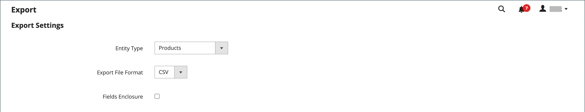

# 匯出資料

熟悉資料庫結構的最佳方式是匯出資料，並在試算表中將其開啟。 熟悉此程式後，您就可以用它當作管理大量資訊的有效方式。

特殊字元（例如等號、大於和小於符號、單引號和雙引號、反斜線、垂直線和&amp;符號）可能會在資料傳輸期間造成問題。 為確保這類特殊字元能正確解譯，可將它們標示為 _逸出序列_. 例如，如果資料包含文字字串，例如 `code="str"`， `code="str2"`，將文字括在雙引號中可確保原始雙引號被視為資料的一部分： `"code="str""`. 當系統遇到雙引號集合時，它知道雙引號外部集合正在封入實際資料。

資料匯出是非同步操作，會在背景執行，因此您可以在管理員中繼續工作，而不需要等候操作完成。 當工作完成時，系統會顯示訊息。

## 匯出條件

匯出篩選器用於根據屬性值指定您要在匯出檔案中的資料。 此外，您可以指定要將哪些屬性資料包括在匯出中或從中排除。

{width="600" zoomable="yes"}

### 匯出篩選器

您可以使用篩選器來判斷匯出檔案中包含哪些SKU。 例如，如果您在「製造國家/地區」篩選器中輸入值，則匯出的CSV檔案只會包含在該國家/地區製造的產品。

篩選型別會對應至資料型別。 對於日期欄位，您可以從「行事曆」選擇日期 . 另請參閱 [屬性輸入型別](../catalog/attributes-input-types.md) 以取得詳細資訊。

日期的格式由 [地區設定](../getting-started/store-details.md#locale-options).

若要僅包含具有特定值（例如SKU）的記錄，請在「篩選」欄位中輸入值。 有些欄位（例如「價格」、「重量」及「將產品設為「新增」）具有起始/終止值範圍。

### 排除屬性

第一欄中的核取方塊用於從匯出檔案中排除屬性。 如果排除屬性，則會包含匯出資料中的關聯欄，但為空白。

| 排除 | 篩選 | 結果 |
|--- |--- |--- |
|  | 否 | 匯出的檔案包含所有現有記錄的每個屬性。 |
|  | 是 | 匯出檔案包含每個屬性，其中僅包含篩選允許的記錄。 |
|  | 否 | 匯出檔案不包含排除屬性的欄，但包含所有現有記錄。 |
|  | 是 | 匯出檔案不包含排除屬性的欄，僅包含篩選允許的記錄。 |

{style="table-layout:auto"}

## 匯出資料

1. 在 _管理員_ 側欄，前往 **[!UICONTROL System]** > _[!UICONTROL Data Transfer]_>**[!UICONTROL Export]**.

1. 在 _匯出設定_ 部分，設定 **[!UICONTROL Entity Type]** 變更為下列其中一項：

   - `Advanced Pricing`
   - `Products`
   - `Customer Finances`
   - `Customers Main File`
   - `Customer Addresses`
   - `Stock Sources`

   {width="600" zoomable="yes"}

1. 接受預設值 **[!UICONTROL Export File Format]** / CSV。

1. 如果您想要將資料中可能找到的任何特殊字元括為 _逸出序列_，選取 **[!UICONTROL Fields Enclosure]** 核取方塊。

1. 如有需要，請變更實體屬性的顯示。

   依預設，「實體屬性」段落會依字母順序列出所有可用的屬性。 您可使用標準 [清單控制項](../getting-started/admin-grid-controls.md) 以搜尋特定屬性並排序清單。 「搜尋和重設篩選」控制清單的顯示，但不會影響要包含在匯出檔案中的屬性選擇。

   {width="600" zoomable="yes"}

1. 若要根據屬性值篩選匯出的資料，請執行下列動作：

   - 若要僅匯出具有特定屬性值的記錄，請在 **[!UICONTROL Filter]** 欄。 以下範例僅匯出特定SKU。

   - 若要在匯出中省略屬性，請選取 **[!UICONTROL Exclude]** 核取方塊。 例如，只匯出 `sku` 和 `image` 欄中，選取其他所有屬性的核取方塊。 欄會顯示在匯出檔案中，但沒有任何值。

1. 向下捲動並按一下 **[!UICONTROL Continue]** 在頁面的右下角。

   工作完成後，會透過訊息佇列處理檔案（確認cron工作正在執行）。 匯出的檔案會儲存在 `var/export/ folder`. 如需訊息佇列的詳細資訊，請參閱 [管理訊息佇列](https://experienceleague.adobe.com/docs/commerce-operations/configuration-guide/message-queues/manage-message-queues.html) 在 _設定指南_.

   您可以將匯出的CSV檔案儲存或開啟為試算表，接著編輯資料並將其匯入回您的存放區。

   >[!NOTE]
   >
   >依預設，所有匯出的檔案都在 `<Magento-root-directory>/var/export` 資料夾。 如果已啟用遠端儲存模組，則所有匯出的檔案都會在 `<remote-storage-root-directory>/import_export/export` 資料夾。

## 疑難排解資源

如需疑難排解資料匯出問題的說明，請參閱下列Commerce支援知識庫文章：

- [匯出的產品.csv檔案不會出現](https://experienceleague.adobe.com/docs/commerce-knowledge-base/kb/troubleshooting/miscellaneous/exported-products-.csv-file-does-not-appear.html)
- [產品匯出檔案未顯示在管理員中](https://experienceleague.adobe.com/docs/commerce-knowledge-base/kb/support-tools/patches/v1-0-9/mdva-31168-magento-patch-product-export-file-does-not-show-in-admin.html)
- [以CSV格式匯出訂單時發生問題](https://experienceleague.adobe.com/docs/commerce-knowledge-base/kb/support-tools/patches/v1-0-8/mdva-31242-magento-patch-issue-in-exporting-orders-in-csv-format.html)
