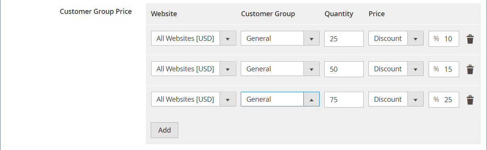

# 匯入層級價格

不是為每個產品手動輸入[層級價格](../catalog/product-price-tier.md)，而是更有效率[匯入](data-import.md)定價資料。 開始之前，請先建立匯出的層級價格資料範例檔案，以作為範本使用。

{width="700" zoomable="yes"}

## 步驟1：匯出層級價格資料

下列範例會匯出單一產品的層級定價資料。 然後，您可以使用匯出的資料作為大量匯入層級價格資料的範本。 若要進一步瞭解匯出進階價格資料，請參閱[進階價格資料](data-attributes-product.md#advanced-pricing-attributes)。

{width="600" zoomable="yes"}

1. 在&#x200B;_管理員_&#x200B;側邊欄上，移至&#x200B;**[!UICONTROL System]** > _[!UICONTROL Data Transfer]_>**[!UICONTROL Export]**。

1. 在&#x200B;_[!UICONTROL Export Settings]_&#x200B;底下，將&#x200B;**[!UICONTROL Entity Type]**&#x200B;設定為`Advanced Pricing`。

1. 在&#x200B;**[!UICONTROL Entity Attributes]**&#x200B;格線中，向下捲動至SKU屬性並執行下列動作：

   - 針對以折扣百分比為基礎的層級價格，輸入要匯出的每個產品的SKU，以逗號分隔。

     {width="600" zoomable="yes"}

   - 若為以固定金額為基準的層級價格，請輸入各產品的SKU。

   - 向下捲動並按一下&#x200B;**[!UICONTROL Continue]**。

1. 在網頁瀏覽器的下載位置找到匯出檔案，然後開啟檔案。

   {width="600" zoomable="yes"}

**_已匯出層級價格資料_**

匯出的資料中包含下列欄：

- `sku`
- `tier_price_website`
- `tier_price_customer_group`
- `tier_price_qty`
- `tier_price`
- `tier_price_value_type`

您可以使用匯出的資料作為匯入層級價格資料的範本。

## 步驟2：更新資料

1. 視需要更新每個產品的層級價格資料。

   任何沒有層級價格更新的產品都可以從CSV檔案中刪除。 不需要重新匯入未變更的產品。

1. **[!UICONTROL Save]**&#x200B;更新的CSV檔案。

>[!NOTE]
>
>匯入檔案的大小不能大於2 MB。

## 步驟3：匯入更新的資料

1. 在&#x200B;_管理員_&#x200B;側邊欄上，移至&#x200B;**[!UICONTROL System]** > _[!UICONTROL Data Transfer]_>**[!UICONTROL Import]**。

1. 在&#x200B;_匯入設定_&#x200B;下，將&#x200B;**[!UICONTROL Entity Type]**&#x200B;設定為`Advanced Pricing`。

1. 將&#x200B;**[!UICONTROL Import Behavior]**&#x200B;設為`Add/Update`。

1. 在&#x200B;**[!UICONTROL File to Import]**&#x200B;下，按一下&#x200B;**[!UICONTROL Choose File]**&#x200B;並選取您準備從目錄中匯入的檔案。

1. 按一下右上角的&#x200B;**[!UICONTROL Check Data]**。

1. 如果檔案有效，請按一下&#x200B;**[!UICONTROL Import]**。

   否則，請修正訊息中所列資料的每個問題，然後再次嘗試匯入檔案。
