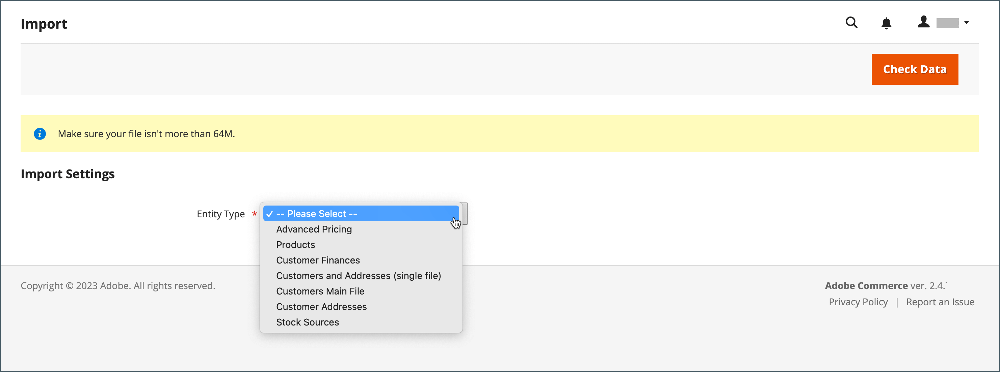

# 匯入資料

所有產品型別的資料都可匯入存放區。 此外，您可以匯入產品、進階定價資料、客戶資料、客戶地址資料和產品影像。 匯入支援下列作業：

- 新增/更新
- 取代
- 刪除

## 匯入准則

### 新實體

- 實體會以CSV檔案中指定的屬性值加入。
- 對於未設定預設值的必要屬性，如果沒有值或無效值，則無法匯入實體（對應的列）。
- 對於設定了預設值的必要屬性，如果沒有任何值或無效值，則會匯入實體（對應的一列或多列）並設定屬性的預設值。
- 如果複雜資料無效，則無法匯入實體（對應的列）。

### 現有實體

- 對於非複雜資料的屬性，來自匯入檔案的值（包括非必要屬性的空白值）會取代現有值。
- 如果必要屬性沒有值或存在無效值，則不會取代現有值。
- 如果實體的複雜資料無效，則無法匯入實體（對應的列或列），但在「匯入行為」下拉式選單中選取「刪除實體」時除外。

### 複雜資料

如果匯入檔案中指定的屬性存在，且其值衍生自已定義的值集，則適用下列情況：

- 如果值尚未包含在已定義的值集中，則可匯入列，並為屬性設定預設值（如果已定義）。
- 如果值已包含在定義的集中，則無法匯入對應的列。
- 如果匯入檔案指定的屬性名稱尚未在系統中定義，則不會建立該檔案，也不會匯入其值。

### 無效的檔案

- 如果所有列都無效，則無法匯入檔案。
- 匯入檔案中指定了不存在的服務資料或複雜的資料名稱，例如具有`_<non-existing name>`標題的資料行。

Adobe Commerce的匯入程式可能無法正確辨識使用位元組順序標籤(BOM)的UTF-8編碼檔案。 包含BOM的檔案可能會在匯入過程中導致問題或失敗。

## 匯入作業

| 作業 | 說明 |
| --------- | ----------- |
| 新增/更新 | 新產品資料會新增至資料庫中現有專案的現有產品資料中。 可更新`sku`以外的所有欄位。  匯入資料中指定的新稅捐類別會自動建立。  匯入檔案中指定的新產品類別會自動建立。  匯入檔案中指定的新SKU會自動建立&#x200B;  **_注意：_**對於產品，您可以透過匯入來更新除SKU以外的所有欄位。  **_重要：_**&#x200B;使用&#x200B;_新增/更新_&#x200B;匯入行為無法移除多個欄位值，例如網站或類別。 如果這些欄位未列在CSV檔案中，匯入後會保留在資料庫中。 |
| 取代 | 現有產品資料會被新資料取代。  **_重要：_**取代資料時請小心，因為現有產品資料已清除，而且系統中所有參考都會遺失。  如果匯入資料中的SKU符合現有實體的SKU，所有欄位（包括SKU）都會被刪除，並且會使用CSV資料建立新記錄。 如果CSV檔案參照的SKU不存在於資料庫中，則會發生錯誤。 您可以檢查資料以顯示錯誤。 |
| 刪除 | 匯入資料中存在於資料庫中的所有實體都會從資料庫中刪除。  Delete會忽略匯入資料中的所有欄，SKU除外。 您可以忽略資料中的所有其他屬性。  如果CSV檔案參照資料庫中不存在的SKU，就會發生錯誤。 您可以檢查資料以顯示錯誤。 |

{style="table-layout:auto"}

## 匯入程式

匯入檔案的大小是由伺服器上`php.ini`檔案中的設定所決定。 _匯入_&#x200B;頁面上的系統訊息指出目前的大小限制。 預設大小為2 MB。

特殊字元（例如等號、大於和小於符號、單引號和雙引號、反斜線、垂直線和&amp;符號）可能會在資料傳輸期間造成問題。 為確保正確解譯這類特殊字元，可將其標示為&#x200B;_逸出序列_。 例如，如果資料包含文字字串，例如`code="str"`、`code="str2"`，選擇以雙引號括住文字可確保原始雙引號會被視為資料的一部分。 當系統遇到雙引號集合時，它知道雙引號外部集合正在封入實際資料。

匯入產品資料時，新產品資料會新增到資料庫中現有的產品資料專案中。 SKU以外的所有欄位都可透過匯入進行更新。 所有現有產品資料都會取代為匯入的新資料。 取代資料時請小心。 所有現有的產品資料都會被清除，而且系統中的所有參照都會遺失。

{width="600" zoomable="yes"}

### 步驟1：準備資料

1. 在&#x200B;_管理員_&#x200B;側邊欄上，移至&#x200B;**[!UICONTROL System]** > _[!UICONTROL Data Transfer]_>**[!UICONTROL Import]**。

1. 在&#x200B;_匯入設定_&#x200B;下，將&#x200B;**[!UICONTROL Entity Type]**&#x200B;設定為下列其中一項：

   - `Advanced Pricing`
   - `Products`
   - `Customer Finances`
   - `Customers and Addresses`
   - `Customers Main File`
   - `Customer Addresses`
   - `Stock Sources`

1. 按一下&#x200B;**[!UICONTROL Download Sample File]**。

1. 在網頁瀏覽器的下載位置找到匯出檔案，然後開啟檔案。

   範例檔案包含具有產品型別預留位置資料的欄標題。

   {width="600" zoomable="yes"}

1. 檢查範例檔案的結構，並使用它來準備CSV匯入檔案，確保欄標題拼寫正確。

1. 確認匯入檔案的大小沒有超過訊息中所顯示的限制。

   {width="600"}

1. 如果匯入資料包含產品影像的路徑，請確定影像檔案已上傳至適當位置。

   Commerce伺服器上的預設位置為： `pub/media/import`。

   如果影像位於外部伺服器上，請確定您具有包含影像的目錄的完整URL。

### 步驟2：選擇匯入行為

{width="600" zoomable="yes"}

1. 將&#x200B;**[!UICONTROL Import Behavior]**&#x200B;設定為下列其中一項：

   - `Add/Update` （對於產品，您可以透過匯入來更新除SKU以外的所有欄位。）
   - `Replace`
   - `Delete`

1. 若要判斷匯入資料時遇到錯誤時會發生什麼情況，請選擇下列其中一項：

   - `Stop on Error`
   - `Skip error entries`

1. 針對&#x200B;**[!UICONTROL Allowed Errors Count]**，輸入在取消匯入之前可能發生的錯誤數目。

   預設值為10。

1. 接受&#x200B;**[!UICONTROL Field separator]**&#x200B;的逗號(`,`)預設值。

1. 接受&#x200B;**[!UICONTROL Multiple value separator]**&#x200B;的逗號(`,`)預設值。

   在CSV檔案中，逗號是預設分隔符號。 若要使用其他字元，請確定CSV檔案中的資料符合您指定的字元。

1. 接受&#x200B;**[!UICONTROL Empty attribute value constant]**&#x200B;的預設值`_EMPTY_VALUE_`。

1. 如果要將資料中可能找到的任何特殊字元括為&#x200B;_逸出序列_，請選取&#x200B;**[!UICONTROL Fields Enclosure]**&#x200B;核取方塊。

### 步驟3：識別匯入檔案

{width="600" zoomable="yes"}

1. 按一下&#x200B;**[!UICONTROL Choose File]**&#x200B;以選取要匯入的檔案。

1. 尋找您準備匯入的CSV檔案，然後按一下&#x200B;**[!UICONTROL Open]**。

1. 針對&#x200B;**[!UICONTROL Images File Directory]**，輸入Commerce伺服器上儲存已上傳影像之位置的相對路徑。

   例如： `product_images`。

   >[!NOTE]
   >
   >從Adobe Commerce和Magento Open Source`2.3.2`發行版本開始，_[!UICONTROL Images File Directory]_中指定的路徑會串連以匯入影像基底目錄： `<Magento-root-folder>/var/import/images`。 例如，將`product_images`檔案放在`<Magento-root-directory>/var/import/images/product_images`資料夾中。 可以在`\Magento\ImportExport\etc\config.xml`檔案中設定匯入影像基底目錄。 如果已啟用遠端儲存模組，請將檔案匯入至`<remote-storage-root-directory>/var/import/images/product_images`資料夾。

   若要進一步瞭解如何匯入產品影像，請參閱[匯入產品影像](data-import-product-images.md)。

### 步驟4：檢查匯入資料

1. 按一下右上角的&#x200B;**[!UICONTROL Check Data]**。

1. 請稍候片刻，等候驗證程式完成。

   如果匯入資料有效，會顯示下列訊息：

   {width="600"}

1. 如果檔案有效，請按一下&#x200B;**[!UICONTROL Import]**。

   否則，請修正訊息中所列資料的每個問題，然後再次嘗試匯入檔案。

1. 匯入程式會持續到資料結尾，除非發生錯誤。

   如果「驗證結果」中出現錯誤訊息，請更正資料中的問題並再次匯入檔案。

   {width="600"}

   當匯入完成時，會出現一則訊息。

## 匯入歷史記錄

Commerce會維護已匯入至您存放區的資料記錄，包括開始日期和時間、使用者、執行時間，以及匯入檔案的連結。 _執行時間_&#x200B;是匯入程式的期間。

**_若要檢視匯入歷程記錄：_**

在&#x200B;_管理員_&#x200B;側邊欄上，移至&#x200B;**[!UICONTROL System]** > _[!UICONTROL Data Transfer]_>**[!UICONTROL Import History]**。

{width="600" zoomable="yes"}

>[!NOTE]
>
>依預設，匯入歷史記錄檔案位於`<Magento-root-directory>/var/import_history`資料夾中。 如果已啟用遠端儲存模組，則匯入記錄檔案位於`<remote-storage-root-directory>/import_export/import_history`資料夾中。

| 欄位 | 說明 |
|--- |--- |
| [!UICONTROL ID] | 用於指定轉移的內部編號。 |
| [!UICONTROL Start Date & Time] | 進行轉移的特定日期和時間。 |
| [!UICONTROL User] | 進行轉移的客戶。 |
| [!UICONTROL Imported file] | 下載匯入檔案的連結。 |
| [!UICONTROL Error file] | 對應的錯誤檔案。 |
| [!UICONTROL Execution Time] | 匯入流程的時間間隔。 |
| [!UICONTROL Summary] | 建立、更新和刪除的專案數，或錯誤訊息。 |

{style="table-layout:auto"}

若要下載&#x200B;_匯入/錯誤_&#x200B;檔案，請按一下&#x200B;**[!UICONTROL Download]**。
