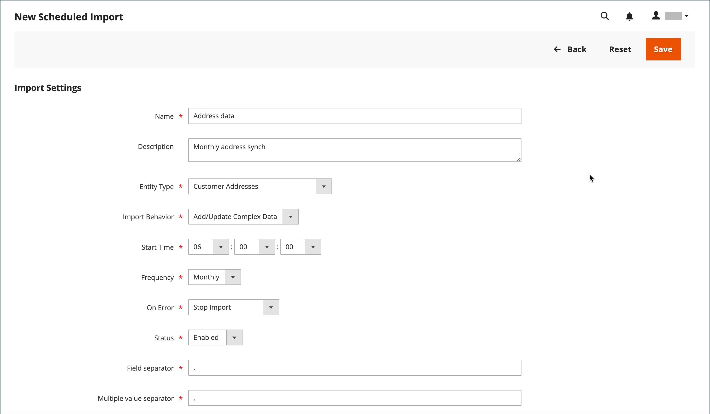
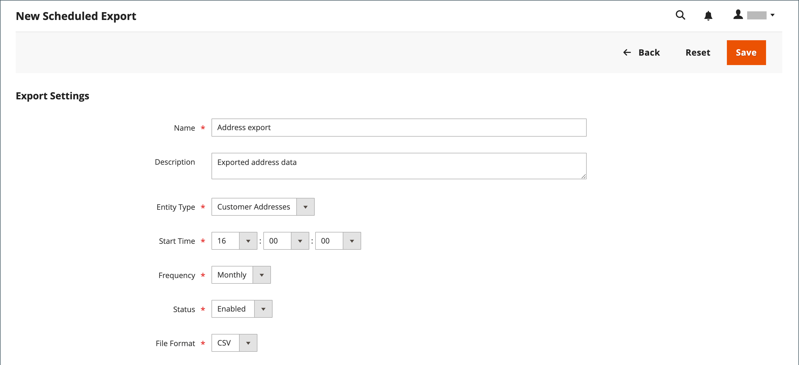

# 已排程的匯入和匯出

{{ee-feature}}

排程的匯入和匯出可以每日、每週或每月執行。 要匯入或匯出的檔案可以位於本機Adobe Commerce伺服器或遠端FTP伺服器上。 排定的匯入/匯出預設會實施，不需要額外的設定。 所有已排程的匯入和匯出都由Cron工作排程器管理。

## 存取排定的匯入/匯出

1. 在&#x200B;_管理員_&#x200B;側邊欄上，移至&#x200B;**[!UICONTROL System]** > _[!UICONTROL Data Transfer]_>**[!UICONTROL Scheduled Imports/Exports]**。

   {width="700" zoomable="yes"}

1. 若要建立新的排定匯入或匯出工作，請按一下適當的按鈕，然後依照排定工作型別的指示操作。

   - [新增排定的匯出](#schedule-an-export)
   - [新增排定的匯入](#schedule-an-import)

1. 儲存記錄時，工作會出現在&#x200B;_[!UICONTROL Scheduled Import/Export]_格線中。

   >[!NOTE]
   >
   >當您建立或更新排定的匯入/匯出時，會導致系統組態變更。 儲存後，請務必解決出現在管理頁面頂端的快取失效通知，並排清快取以套用新的或更新排程。

1. 在每個排定的工作之後，檔案的復本會放置在Adobe Commerce本機伺服器的`var/log/import_export`目錄中。

   每個操作的詳細資訊都不會寫入記錄中。 如果發生錯誤，則會傳送有關失敗的匯入/匯出工作的通知，並附上錯誤說明。

## 排程匯入

對於可用的匯入檔案格式和匯入圖元型別，排定的匯入程式與手動匯入程式類似：

- 匯入檔案應為.CSV格式
- 您可以匯入產品和客戶資料

使用已排程匯入的優點是，您可以在指定匯入引數後多次自動匯入資料檔案，並且僅排程一次。

每個匯入操作的詳細資訊不會寫入記錄檔，但是當發生失敗時，您會收到包含錯誤說明的&#x200B;_匯入失敗_&#x200B;電子郵件。 上次排程匯入工作的結果會顯示在「排定的匯入/匯出」頁面的「上次結果」欄中。

每次匯入作業後，匯入檔案的復本都會放置在部署Adobe Commerce或Magento Open Source之伺服器的`var/log/import_export`目錄中。 時間戳記、匯入實體（產品或客戶）的標籤以及操作型別（在此例中為「匯入」）會新增至匯入檔案名稱。

在每個排定的匯入工作之後，會自動執行重新索引作業。 從正面來看，說明和其他文字資訊的變更會在更新資料移至資料庫後反映出來，而價格的變更則只有在重新索引作業後才會反映出來。

### 步驟1：完成匯入設定

1. 在&#x200B;_管理員_&#x200B;側邊欄上，移至&#x200B;**[!UICONTROL System]** > _[!UICONTROL Data Transfer]_>**[!UICONTROL Scheduled Import/Export]**。

1. 按一下右上角的&#x200B;**[!UICONTROL Add Scheduled Import]**。

1. 設定排程與匯入選項：

   - **[!UICONTROL Name]** — 輸入排程匯入的名稱。

   - **[!UICONTROL Description]** — 輸入簡短說明，說明匯入的目的及使用方式。

   - **[!UICONTROL Entity Type]** — 設定為下列其中一項：

      - `Products`
      - `Advanced Pricing`
      - `Customers and Addresses (single file)`
      - `Customer Addresses`
      - `Customer Finances`
      - `Customers Main File`
      - `Stock Sources`

   - **[!UICONTROL Import Behavior]** — 設定為下列其中一項：

      - `Add/Update Complex Data` — 將新的複雜資料新增或更新至資料庫中現有專案的現有複雜資料。 這是預設值。
      - `Replace` — 覆寫資料庫中現有實體的現有複數。
      - `Delete Entities` — 刪除資料庫中的現有專案。
      - `Custom Action` — 自訂資料庫中的現有實體。

     >[!NOTE]
     >
     >對於&#x200B;_[!UICONTROL Advanced Pricing]_、_[!UICONTROL Products]_、_[!UICONTROL Customers and Addresses (single file)]_和_[!UICONTROL Stock Sources]_&#x200B;實體型別，會顯示這些匯入行為： `Add/Update`、`Replace`和`Delete`。 對於&#x200B;_客戶財務_、_客戶主要檔案_&#x200B;和&#x200B;_客戶與地址_&#x200B;實體型別，會顯示這些匯入行為： `Add/Update Complex Data`、`Delete Entities`和`Custom Action`。

   - **[!UICONTROL Start Time]** — 設定為排程開始匯入的小時、分鐘和秒。

   - **[!UICONTROL Frequency]** — 設定為下列其中一項： `Daily`、`Weekly`或`Monthly`

   - **[!UICONTROL On Error]** — 設定為下列其中一項： `Stop Import`或`Continue Processing`

   - **[!UICONTROL Status]** — 若要啟動排定的匯入，請設定為`Enabled`。

   - **[!UICONTROL Field Separator]** — 輸入用來分隔匯入檔案中欄位的字元。 預設字元為逗號。

   - **[!UICONTROL Multiple Value Separator]** — 輸入用來分隔欄位中多個值的字元。

   {width="600" zoomable="yes"}

### 步驟2：完成匯入檔案資訊

1. 將&#x200B;**[!UICONTROL Server Type]**&#x200B;設定為下列其中一項：

   - `Local Server` — 從安裝Adobe Commerce的相同伺服器匯入資料。
   - `Remote FTP` — 從遠端伺服器匯入資料。

   {width="600" zoomable="yes"}

   >[!NOTE]
   >
   >當遠端儲存模組啟用時，`Local Server`會自動切換至`Remote Storage`。

1. 輸入匯入檔案來源的&#x200B;**[!UICONTROL File Directory]**。

   - `Local Server` — 在Commerce安裝中輸入相對路徑。 例如，`var/import`。 如果已設定遠端儲存模組，請使用`import_export/import`。
   - `Remote FTP server` — 輸入遠端伺服器上匯入資料夾的完整URL和路徑。

1. 輸入要匯入的&#x200B;**[!UICONTROL File Name]**。

1. 針對&#x200B;**[!UICONTROL Images File Directory]**，輸入儲存產品影像的目錄路徑。

   在本機伺服器上，輸入相對路徑，例如： `var/import`。 在遠端儲存體上，輸入相對路徑，例如： `import_export/import`或`import_export/import/some/dir`。

### 步驟3：設定匯入失敗的電子郵件

{width="600" zoomable="yes"}

1. 設定&#x200B;**[!UICONTROL Failed Email Receiver]**&#x200B;給將在匯入期間發生錯誤時收到通知的商店連絡人。

1. 將&#x200B;**[!UICONTROL Failed Email Sender]**&#x200B;設為顯示為通知寄件者的商店連絡人。

1. 將&#x200B;**[!UICONTROL Failed Email Template]**&#x200B;設定為用於通知的範本。

1. 針對&#x200B;**[!UICONTROL Send Failed Email Copy To]**，輸入任何要接收通知復本的人的電子郵件地址。

   請使用逗號分隔多個電子郵件地址。

1. 將&#x200B;**[!UICONTROL Failed Email Copy Method]**&#x200B;設定為下列其中一項：

   - `Bcc` — 傳送失敗的匯入通知的盲目副本。 收件者的姓名和地址會包含在原始電子郵件散發中，但不會顯示在檢視畫面中。
   - `Separate Email` — 以個別電子郵件的形式傳送失敗匯入通知的復本。

1. 完成時，按一下&#x200B;**[!UICONTROL Save]**。

   新的排程匯入工作已新增至&#x200B;_[!UICONTROL Scheduled Import/Export]_頁面上的清單。 您可以從此頁面立即執行以進行測試和編輯。 在執行每個匯入工作之前，會驗證匯入檔案。

>[!NOTE]
>
>當您建立或更新排定的匯入/匯出時，會導致系統組態變更。 儲存後，請務必解決出現在管理頁面頂端的快取失效通知，並排清快取以套用新的或更新排程。

### 欄位說明

#### [!UICONTROL Import Settings]

| 欄位 | 說明 |
| ----- | ----------- | 
| [!UICONTROL Name] | 匯入的名稱。 協助您在已建立許多不同排程匯入時加以區分。 |
| [!UICONTROL Description] | （選擇性）您可以輸入說明。 |
| [!UICONTROL Entity Type] | 定義要匯入的資料。 |
| [!UICONTROL Import Behavior] | 定義當要匯入的實體存在於資料庫中時，如何處理複雜資料。 產品的複雜資料包括類別、網站、自訂選項、層級價格、相關產品、向上銷售、交叉銷售及相關產品資料。 客戶的複雜資料包括地址。 選項： **[!UICONTROL Add/Update Complex Data]**— 新的複雜資料會新增或更新到資料庫中現有專案的現有複雜資料。 這是預設值。 **[!UICONTROL Add/Update]** — 新資料已新增到資料庫中的現有專案。 產品可更新`sku`以外的所有欄位。 CSV檔案中未列出的任何多個欄位值（例如類別或網站），在匯入後都會保留在資料庫中。 **[!UICONTROL Replace]**— 已取代現有實體的現有複雜資料。 **[!UICONTROL Delete Entities]** — 如果匯入的實體存在於資料庫中，則會從資料庫中刪除它們。 **[!UICONTROL Custom Action]**— 在匯入過程中已自訂現有的複雜實體。 |
| [!UICONTROL Start Time] | 設定匯入的開始小時、分鐘和秒。 |
| [!UICONTROL Frequency] | 定義匯入的執行頻率。 選項： `Daily` / `Weekly` / `Monthly` |
| [!UICONTROL On Error] | 定義在檔案驗證期間發現錯誤時的系統行為。 選項： **停止匯入** — 如果在驗證期間發現任何錯誤，將不會匯入檔案。 這是預設值。 **繼續處理** — 如果在驗證期間發現錯誤，但可以匯入，則會匯入檔案。 |
| [!UICONTROL Status] | 匯入預設為啟用。 您可以將[狀態]設定為`Disabled`來暫停它。 |
| [!UICONTROL Field Separator] | 決定用來分隔欄位的字元。 預設值： `,` （逗號） |
| [!UICONTROL Multiple Value Separator] | 決定用來分隔欄位中多個值的字元。 預設值： `,` （逗號） |

{style="table-layout:auto"}

#### [!UICONTROL Import File Information]

| 欄位 | 說明 |
| ----- | ----------- | 
| [!UICONTROL Server Type] | 您可以從部署Commerce的相同伺服器上的檔案匯入（選取「`Local Server`」），或從遠端FTP伺服器（選取「`Remote FTP`」）。 如果您選取&#x200B;_[!UICONTROL Remote FTP]_，會出現認證和檔案傳輸設定的其他選項。 如果已啟用遠端儲存模組，`Local Server`型別會自動切換為`Remote Storage`。 |
| [!UICONTROL File Directory] | 指定匯入檔案所在的目錄。 如果伺服器型別設定為&#x200B;_[!UICONTROL Local Server]_，請指定相對於Commerce安裝目錄的路徑。 例如： `var/import`或遠端儲存的`import_export/import`。 |
| [!UICONTROL File Name] | 指定匯入檔案的名稱。 |
| [!UICONTROL Images File Directory] | 輸入儲存產品影像的目錄路徑。 對於本機伺服器，請輸入相對路徑。 例如： `var/import`或遠端儲存的`import_export/import`。 |

{style="table-layout:auto"}

#### [!UICONTROL Import Failed Emails]

| 欄位 | 說明 |
| ----- | ----------- | 
| [!UICONTROL Failed Email Receiver] | 指定當匯入失敗時，要傳送電子郵件通知（匯入失敗的電子郵件）的電子郵件地址。 |
| [!UICONTROL Failed Email Sender] | 指定用來作為匯入失敗電子郵件寄件者的電子郵件地址。 |
| [!UICONTROL Failed Email Template] | 選取匯入失敗電子郵件的範本。 依預設，只有「匯入失敗」(Import Failed) （從地區設定的預設範本）選項可用。 可在&#x200B;_[!UICONTROL System]_>_[!UICONTROL Transactional Emails]_&#x200B;下建立自訂範本。 |
| [!UICONTROL Send Failed Email Copy To] | 匯入失敗電子郵件的副本所要傳送的電子郵件地址。 |
| [!UICONTROL Send Failed Email Copy Method] | 選取匯入失敗電子郵件的副本傳送方法。 |

{style="table-layout:auto"}

## 排程匯出

排定的匯出類似於可用匯出檔案格式中的手動[匯出](data-export.md)，以及可匯出的實體型別：

- 您可以匯出為CSV格式
- 您可以匯出產品和客戶資料

使用「已排程的匯出」的優點是，您可以在指定匯出引數後自動多次匯出資料，並且僅排程一次。

每次匯出的詳細資料不會寫入記錄中，但如果失敗，您會收到「匯出失敗」電子郵件，其中包含錯誤說明。 上次匯出作業的結果會顯示在「排定的匯入/匯出」頁面的「上次結果」欄中。

每次匯出後，匯出檔案都會放置在使用者定義的位置，且會在部署Adobe Commerce或Magento Open Source的伺服器上的`var/log/import_export`目錄中放置副本。 匯出實體（產品或客戶）的時間戳記和標籤以及操作型別（在此例中為匯出）會新增至匯出檔案名稱。

### 步驟1：完成匯出設定

1. 在&#x200B;_管理員_&#x200B;側邊欄上，移至&#x200B;**[!UICONTROL System]** > _[!UICONTROL Data Transfer]_>**[!UICONTROL Scheduled Import/Export]**。

1. 按一下右上角的&#x200B;**[!UICONTROL Add Scheduled Export]**&#x200B;並執行下列動作：

   - 輸入排程匯出的&#x200B;**[!UICONTROL Name]**。

   - 請輸入簡短&#x200B;**[!UICONTROL Description]**，說明匯出的用途及使用方式。

   - 將&#x200B;**[!UICONTROL Entity Type]**&#x200B;設定為下列其中一項：

      - `Advanced Pricing`
      - `Products`
      - `Customer Financing`
      - `Customers Main File`
      - `Customer Addresses`
      - `Stock Sources`

     頁面底部的&#x200B;_[!UICONTROL Entity Attributes]_區段已更新，以反映選取的實體型別。

   - 將&#x200B;**[!UICONTROL Start Time]**&#x200B;設為排程開始匯出的小時、分鐘和秒。

   - 將&#x200B;**[!UICONTROL Frequency]**&#x200B;設定為下列其中一項：

      - `Daily`
      - `Weekly`
      - `Monthly`

1. 若要啟用排定的匯出，請將&#x200B;**[!UICONTROL Status]**&#x200B;設為`Enabled`。

1. 接受`CSV`作為預設&#x200B;**[!UICONTROL File Format]**。

   {width="600" zoomable="yes"}

### 步驟2：完成匯出檔案資訊

1. 將&#x200B;**[!UICONTROL Server Type]**&#x200B;設定為下列其中一項：

   - `Local Server` — 將匯出檔案儲存在安裝Commerce的同一部伺服器上。
   - `Remote FTP` — 將匯出檔案儲存在遠端伺服器上。

   {width="600" zoomable="yes"}

   >[!NOTE]
   >
   >當遠端儲存模組啟用時，`Local Server`會自動切換至`Remote Storage`。

1. 針對&#x200B;**[!UICONTROL File Directory]**，請輸入要儲存匯出檔案的目錄，如下所示：

   - 對於&#x200B;**[!UICONTROL Local Server]**，請在Commerce安裝中輸入相對路徑，例如`var/export`。 如果已設定遠端儲存模組，請使用`import_export/export`。
   - 針對&#x200B;**[!UICONTROL Remote FTP server]**，輸入目的地伺服器上目標資料夾的完整URL和路徑。

1. 如果選取了&#x200B;_[!UICONTROL Remote FTP]_伺服器，請輸入伺服器的連線認證，然後選取其他設定：

   - 針對&#x200B;**[!UICONTROL FTP Host[:Port]]**，輸入遠端FTP主機位址。
   - 針對&#x200B;**[!UICONTROL User Name]**，輸入用來存取遠端伺服器的使用者名稱。
   - 針對&#x200B;**[!UICONTROL Password]**，輸入提供的使用者名稱帳戶的密碼。
   - 針對&#x200B;**[!UICONTROL File Mode]**，請選擇`Binary`或`ASCII`。
   - 針對&#x200B;**[!UICONTROL Passive Mode]**，請選擇`No`或`Yes`。

### 步驟3：設定匯出失敗電子郵件

1. 設定&#x200B;**[!UICONTROL Failed Email Receiver]**&#x200B;給將在匯出期間發生錯誤時收到通知的商店連絡人。

1. 將&#x200B;**[!UICONTROL Failed Email Sender]**&#x200B;設為顯示為通知寄件者的商店連絡人。

1. 將&#x200B;**[!UICONTROL Failed Email Template]**&#x200B;設定為用於通知的範本。

1. 針對&#x200B;**[!UICONTROL Send Failed Email Copy To]**，輸入任何要接收通知復本的人的電子郵件地址。

   多個電子郵件地址請用逗號分隔。

1. 將&#x200B;**[!UICONTROL Failed Email Copy Method]**&#x200B;設定為下列其中一項：

   - `Bcc` — 傳送一份密件禮節復本。 收件者的姓名和地址會包含在原始電子郵件分送中，但不會顯示在檢視畫面中。
   - `Separate Email` — 以個別電子郵件的形式傳送副本。

### 步驟4：選擇實體屬性

1. 在&#x200B;_[!UICONTROL Entity Attributes]_區段中，選取要包含在匯出資料中的屬性。

   - 若要依屬性值篩選匯出資料，請在&#x200B;_[!UICONTROL Filter]_欄中輸入屬性值。
   - 若要排除具有特定屬性值的產品或客戶，請輸入您要排除的屬性值，然後選取「略過」欄中的核取方塊。

1. 完成時，按一下&#x200B;**[!UICONTROL Save]**。

   新的排程匯出工作已新增至&#x200B;_[!UICONTROL Scheduled Import/Export]_頁面上的清單。 您可以從此頁面立即執行以進行測試和編輯。

>[!NOTE]
>
>當您建立或更新排定的匯入/匯出時，會導致系統組態變更。 儲存後，請務必解決出現在管理頁面頂端的快取失效通知，並排清快取以套用新的或更新排程。

### 欄位說明

#### [!UICONTROL Export Settings]

| 欄位 | 說明 |
| ----- | ----------- | 
| [!UICONTROL Name] | 匯出的名稱。 可協助您區分是否已建立許多不同的排程匯出。 |
| [!UICONTROL Description] | （選用）排程匯出的說明。 |
| [!UICONTROL Entity Type] | 識別要匯出的資料。 選取後，「圖元屬性」會顯示在下方。 選項： `Advanced Pricing` / `Products` / `Customer Finances` / `Customers Main File` / `Customer Addresses` / `Stock Sources` |
| [!UICONTROL Start Time] | 設定匯出的開始小時、分鐘和秒。 |
| [!UICONTROL Frequency] | 定義匯出作業的執行頻率。 選項： `Daily` / `Weekly` / `Monthly` |
| [!UICONTROL Status] | 依預設，會啟用新的排程匯出。 您可以將「狀態」設定為「已停用」來暫停它。 選項： `Enabled` / `Disabled` |
| [!UICONTROL File Format] | 選取匯出檔案的格式。 目前只有`.CSV`選項可用。 |

{style="table-layout:auto"}

#### [!UICONTROL Export Settings Information]

| 欄位 | 說明 |
| ----- | ----------- | 
| [!UICONTROL Server Type] | 決定匯出檔案的位置。 選項： **本機伺服器** — 將匯出檔案放在部署Commerce的相同伺服器上。 如果已啟用遠端儲存模組，則會將`Local Server`切換至`Remote Storage`。 **遠端FTP** — 將匯出檔案放在遠端伺服器上。 憑證和檔案傳輸設定的其他選項也會出現。 |
| [!UICONTROL File Directory] | 指定放置匯出檔案的目錄。 如果&#x200B;_[!UICONTROL Server Type]_設定為`Local Server`，請指定相對於Commerce安裝路徑的路徑。 例如，`var/export`或遠端儲存的`import_export/export`。 |

{style="table-layout:auto"}

#### [!UICONTROL Export Failed Emails]

| 欄位 | 說明 |
| ----- | ----------- | 
| [!UICONTROL Failed Email Receiver] | 指定當匯出失敗時，要傳送電子郵件通知（匯出失敗的電子郵件）的電子郵件地址。 |
| [!UICONTROL Failed Email Sender] | 指定用來匯出失敗的電子郵件寄件者的電子郵件地址。 |
| [!UICONTROL Failed Email Template] | 為失敗的匯出電子郵件選取範本。 依預設，只有`Export Failed (Default Template from Locale)`選項可用。 |
| [!UICONTROL Send Failed Email Copy To] | 傳送失敗匯出電子郵件復本的電子郵件地址。 |
| [!UICONTROL Send Failed Email Copy Method] | 指定匯出失敗電子郵件的復本傳送方法。 |

{style="table-layout:auto"}
