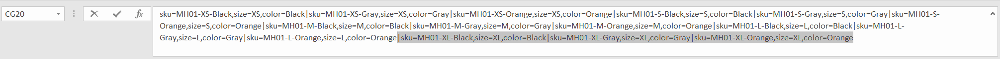

# 匯入可設定的產品

要瞭解可設定產品資料的結構方式，最佳方式是匯出可設定產品及其變數，並在試算表中檢查資料。

在以下範例中，您會針對每種顏色的新尺寸，新增一組產品變體。 首先，匯出可配置產品並檢查資料結構。 然後，您更新資料並將其匯入回目錄。 如果您不想進行匯出資料的練習，則可以下載範例中使用的CSV檔案。

{width="700" zoomable="yes"}

## 步驟1：驗證屬性設定和值

1. 開始之前，請確定用於產品變數的屬性具有必要的屬性設定。

   - [**[!UICONTROL Scope]**](../getting-started/websites-stores-views.md#scope-settings) - `Global`
   - [**[!UICONTROL Catalog Input Type for Store Owner]**](data-attributes-product.md) — 用於產品變數的任何屬性的輸入型別必須是下列其中一項：

      - `Dropdown`
      - `Visual Swatch`
      - `Text Swatch`
      - `Multi-Select`

   - **[!UICONTROL Values Required]** - `Yes`

1. 如果您要新增大小或顏色，或對現有屬性進行任何其他變更，請務必以新值更新屬性。

1. 在&#x200B;_管理員_&#x200B;側邊欄上，移至&#x200B;**[!UICONTROL Stores]** > _[!UICONTROL Attributes]_>**[!UICONTROL Product]**。

1. 在清單中尋找屬性，並以編輯模式開啟。

1. 將新值新增至屬性。

   在下列範例中，新大小會新增至「文字色票」。

   {width="500" zoomable="yes"}

1. 完成時，按一下&#x200B;**[!UICONTROL Save Attribute]**。

1. 如果您正在新增屬性，請在開始之前，依照指示[建立屬性](../catalog/attribute-product-create.md)。

## 步驟2：匯出可設定的產品

1. 在&#x200B;_管理員_&#x200B;側邊欄上，移至&#x200B;**[!UICONTROL Catalog]** > **[!UICONTROL Products]**。

1. 尋找要匯出的可設定產品：

   - 按一下&#x200B;**[!UICONTROL Filters]**。
   - 將&#x200B;**[!UICONTROL Type]**&#x200B;設為`Configurable Product`並按一下&#x200B;**[!UICONTROL Apply Filters]**。
   - 選擇要用於測試匯出的可設定產品，並記下&#x200B;**[!UICONTROL SKU]**。

1. 在&#x200B;_管理員_&#x200B;側邊欄上，移至&#x200B;**[!UICONTROL System]** > _[!UICONTROL Data Transfer]_>**[!UICONTROL Export]**。

   {width="600" zoomable="yes"}

1. 在&#x200B;_[!UICONTROL Export Setting]s_&#x200B;下，執行下列動作：

   - 將&#x200B;**[!UICONTROL Entity Type]**&#x200B;設為`Products`。

   - 將&#x200B;**[!UICONTROL Export File Format]**&#x200B;設為`CSV`。

1. 在&#x200B;_[!UICONTROL Entity Attributes]_&#x200B;底下，向下捲動或使用屬性標籤篩選來尋找&#x200B;**[!UICONTROL SKU]**&#x200B;屬性，並執行下列動作：

   - 輸入您選擇要匯出的可設定產品的SKU，然後按一下&#x200B;**[!UICONTROL Continue]**。

     {width="600" zoomable="yes"}

   - 在網頁瀏覽器的下載位置中尋找檔案，並以試算表形式開啟。

     CSV檔案針對每個簡單產品變數都有個別的列，而可設定產品則有一列。 `product_type column`會顯示與一個可設定產品相關的多個簡單產品變數。

     {width="600" zoomable="yes"}

   - 捲動至工作表的最右側，以尋找下列欄。

      - `configurable_variations` — 定義可設定產品記錄與每個變數之間的一對多關係。
      - `configurable_variation_labels` — 定義識別每個變數的標籤。

     在此範例中，資料可以在CG和CH欄中找到。 根據變異數，`configurable_variations`欄中的資料字串可能會很長。 資料會用作關聯產品變數的索引，其結構如下：

     ```text
     sku={{SKU_VALUE}},attribute1={{VALUE}},attribute2={{VALUE}}| sku={{SKU_VALUE}},attribute1={{VALUE}},attribute2={{VALUE}}
     ```

     每個SKU都以縱線符號(|)分隔，屬性則以逗號分隔。 每個屬性的值都由屬性代碼表示，而不是由屬性標籤表示。 實際資料的顯示方式如下：

     ```text
     sku=MH01-XS-Black,size=XS,color=Black|sku=MH01-XS-Gray,size=XS,color=Gray|sku=MH01-XS-Orange,size=XS,color=Orange</pre>
     ```

1. 當您瞭解可設定產品資料的結構時，您可以編輯資料或直接將新變數新增到CSV檔案。

   若要進一步瞭解，請參閱[複雜資料](data-attributes-product.md#complex-product-data-attributes)。

## 步驟3：編輯資料

在下列範例中，XL大小集會被複製並貼到工作表中，以針對每種顏色的新大小建立一組產品變體。

1. 複製您想用作新產品範本的產品變體集。

   {width="600" zoomable="yes"}

1. 將複製的資料列記錄插入工作表。

   您現在有兩組相同的簡單產品變體。

   {width="600" zoomable="yes"}

1. 視需要更新下列新變數欄中的資料。

   - `sku`
   - `name`
   - `url_key`
   - `additional_attributes`

   在此範例中，所有`XL`參考都變更為`XXL`。

1. 更新可設定產品記錄的`product_variations`欄中的資訊，以便新變數包含在可設定產品中。

   在可設定產品記錄的列上，按一下包含`product_variations`資料的儲存格。 然後在公式列中，複製最後一組引數，從管路符號開始。

   {width="600" zoomable="yes"}

1. 將引數貼上至資料的結尾，並視需要編輯新變數。

   在此範例中，`sku`和`size`引數會更新為新的XXL大小。

1. 在將資料匯入回目錄之前，請刪除所有尚未變更的列。

   在此範例中，只有新大小的三個新變體以及具有已更新可設定產品的列會匯入回目錄中。 可以從CSV檔案中刪除其他列。 不過，請確定不要刪除含有欄標籤的標頭列。

   {width="600" zoomable="yes"}

1. **[!UICONTROL Save]** CSV檔案。

   資料已準備好匯入目錄中。

   >[!NOTE]
   >
   >匯入檔案的大小不能大於2 MB。

## 步驟4：匯入更新的資料

1. 在&#x200B;_管理員_&#x200B;側邊欄上，移至&#x200B;**[!UICONTROL System]** > _[!UICONTROL Data Transfer]_>**[!UICONTROL Import]**。

1. 在&#x200B;_[!UICONTROL Import Settings]_&#x200B;底下，將&#x200B;**[!UICONTROL Entity Type]**&#x200B;設定為`Products`。

1. 在&#x200B;_[!UICONTROL Import Behavior]_&#x200B;底下，將&#x200B;**[!UICONTROL Import Behavior]**&#x200B;設定為`Add/Update`。

   {width="600" zoomable="yes"}

1. 在&#x200B;_[!UICONTROL File to Import]_&#x200B;下，按一下&#x200B;**[!UICONTROL Choose File]**&#x200B;並導覽至您準備匯入的CSV檔案，然後選擇該檔案。

   {width="600" zoomable="yes"}

1. 按一下右上角的&#x200B;**[!UICONTROL Check Data]**。

1. 如果檔案有效，請按一下&#x200B;**[!UICONTROL Import]**。

   否則，請更正資料中找到的任何問題，然後再試一次。

   {width="600" zoomable="yes"}

1. 匯入完成時，請按一下頁面頂端訊息中的&#x200B;**[!UICONTROL Cache Management]**，並重新整理所有無效的快取。

   新產品變化現在可從管理員的目錄和店面取得。 在此範例中，現在所有顏色都可使用XXL大小的連帽上衣。
