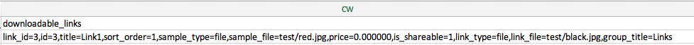

# 匯入可下載的產品

匯入可下載產品的流程與[套件組合產品](data-transfer-bundle-products.md)或[可配置產品](data-transfer-configurable-products.md)相同。 不同之處在於，可下載的產品有[個可下載連結](../catalog/product-create-downloadable.md)和[個可下載的範例](../catalog/product-create-downloadable.md)及其影像。

可下載連結和範例的預設根目錄為`<Magento-root-folder>/pub/media/import`。 如果已啟用遠端儲存模組，可下載連結和範例的預設根目錄為`<remote-storage-root-folder>/media/import`目錄。

CSV檔案有`downloadable_links`和`downloadable_samples`的個別資料行。

- **可下載的連結影像** — 在下列範例中，可下載的連結影像（`red.jpg`和`black.jpg`）位於`<Magento-root-folder>/pub/media/import/test`資料夾中。 如果已啟用遠端儲存，則這些影像位於`<remote-storage-root-folder>/media/import/test`資料夾中。

  {width="600" zoomable="yes"}

- **可下載的範例影像** — 在下列範例中，可下載的範例影像(`white.jpg`)位於`<Magento-root-folder>/pub/media/import/test`資料夾中。 如果已啟用遠端儲存，則此影像在`<remote-storage-root-folder>/media/import/test`資料夾中。

  {width="400" zoomable="yes"}

如需有關啟用及管理遠端儲存模組的詳細資訊，請參閱&#x200B;_設定指南_&#x200B;中的[設定遠端儲存](https://experienceleague.adobe.com/docs/commerce-operations/configuration-guide/storage/remote-storage/remote-storage.html?lang=zh-Hant)。
