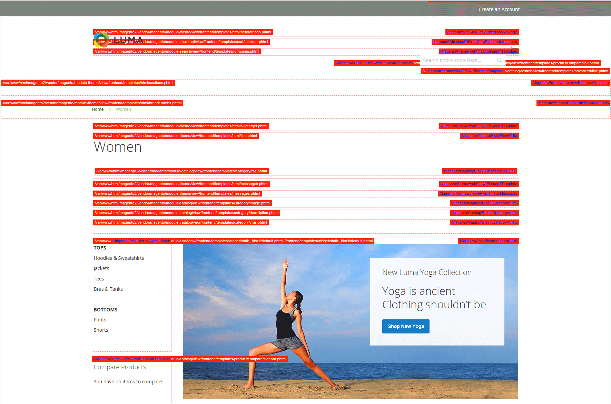
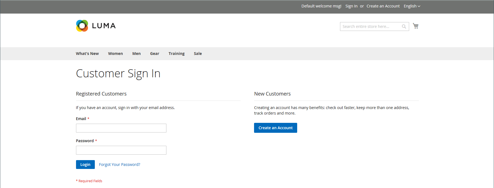

# 開發人員工具

使用進階開發人員工具在前端開發期間決定編譯模式、建立IP位址允許清單及顯示範本路徑提示。 此外也有工具可讓您輕鬆對店面和管理員介面中的文字進行特別變更。

- [動作記錄檔](action-log.md)  (僅限Adobe Commerce)
- [前端開發工作流程](#frontend-development-workflow)
- [使用靜態檔案簽章](#static-file-signatures)
- [資源檔案最佳化](#optimizing-resource-files)
- [開發人員使用者端限制](#client-restrictions)
- [範本路徑提示](#template-path-hints)
- [翻譯內嵌](#translate-inline)

## 操作模式

您可以部署您的Adobe Commerce或Magento Open Source執行個體，以在 _生產_ 或 _開發人員模式_. 專門為開發人員設計的工具和組態設定，只有當存放區在中執行時才能存取 _開發人員模式_.

只有具有適當許可權的使用者才能從伺服器的命令列變更操作模式。 另請參閱 [設定作業模式](https://experienceleague.adobe.com/docs/commerce-operations/configuration-guide/cli/set-mode.html) 在 _設定指南_ 以取得詳細資訊。

商家檔案中的大部分主題適用於在生產模式中執行的Commerce執行個體。 不過，下列組態設定和工具僅可在安裝以開發人員模式執行時使用。

## 前端開發工作流程

前端開發工作流程型別決定在開發期間使用者端或伺服器端上發生的編譯較少。 較少是CSS的擴充功能，具有其他功能和慣例，並可產生精簡的程式碼。 建議在主題開發中使用使用者端較少的編譯。 伺服器端編譯是預設模式。 生產模式下的存放區無法使用開發工作流程選項。
另請參閱 [使用者端LESS編譯與伺服器端](https://developer.adobe.com/commerce/frontend-core/guide/css/quickstart/compilation-mode/)Commerce開發人員檔案中的{：target=&quot;_blank&quot;}。

>[!NOTE]
>
>前端開發工作流程設定可在 [開發人員模式](../systems/developer-tools.md#operation-modes) 僅限。

{width="600" zoomable="yes"}

1. 在 _管理員_ 側欄，前往 **[!UICONTROL Stores]** > _[!UICONTROL Settings]_>**[!UICONTROL Configuration]**.

1. 在左側面板中，展開 **[!UICONTROL Advanced]** 並選擇 **[!UICONTROL Developer]**.

1. 展開  此 **[!UICONTROL Front-end Development Workflow]** 區段。

1. 設定 **[!UICONTROL Workflow Type]** 變更為下列其中一項：

   - `Client side less compilation`  — 使用原生程式碼在瀏覽器中編譯 `less.js` 資料庫。
   - `Server side less compilation`  — 使用Less PHP程式庫在伺服器上進行編譯。 這是生產的預設模式。

1. 完成後，按一下 **[!UICONTROL Save Config]**.

## 靜態檔案簽章

將數位簽章新增至靜態檔案的URL，讓瀏覽器可偵測何時有較新版本的檔案可用。 可使用數位簽名追蹤的靜態檔案包括JavaScript、CSS、影像和字型。 簽章會直接附加至基底URL之後的路徑。 如果檔案的簽章與瀏覽器快取中儲存的簽章不同，則會使用較新版本的檔案。

另請參閱 [靜態內容簽署](https://experienceleague.adobe.com/docs/commerce-operations/configuration-guide/cache/static-content-signing.html)Commerce開發人員檔案中的{：target=&quot;_blank&quot;}。

>[!NOTE]
>
>「靜態檔案設定」組態僅在工作時可用 [開發人員模式](../systems/developer-tools.md#operation-modes).

{width="600" zoomable="yes"}

如需組態設定的詳細清單，請參閱 [_靜態檔案設定_](../configuration-reference/advanced/developer.md) 在 _設定參考_.

**_若要啟用已簽署的靜態檔案：_**

1. 在 _管理員_ 側欄，前往 **[!UICONTROL Stores]** > _[!UICONTROL Settings]_>**[!UICONTROL Configuration]**.

1. 在左側面板中，展開 **[!UICONTROL Advanced]** 並選擇 **[!UICONTROL Developer]**.

1. 展開  此 **[!UICONTROL Static Files Settings]** 區段。

1. 設定 **[!UICONTROL Sign Static Files]** 至 `Yes`.

1. 完成後，按一下 **[!UICONTROL Save Config]**.

## 資源檔案最佳化

透過合併和捆綁檔案以及最小化程式碼，可以減少載入資源檔案所需的時間。

- 合併會將相同型別的不同檔案合併為單一檔案。
- 套件組合是將個別檔案分組的技術，以減少載入頁面所需的HTTP請求數。
- 縮制會移除空格、分行符號和註解，但不會影響程式碼的功能。 由於無法編輯最小化的檔案，因此只有在您準備好進入生產階段時，才應套用程式。

依預設，Adobe Commerce和Magento Open Source不會合併、捆綁或最小化檔案，而專案開發人員應決定應使用哪些檔案最佳化方法。

另請參閱 [效能最佳實務](https://experienceleague.adobe.com/docs/commerce-operations/performance-best-practices/overview.html) 以取得詳細資訊。

>[!NOTE]
>
>CSS和JavaScript檔案可以在以下位置最佳化： [開發人員模式](../systems/developer-tools.md#operation-modes) 僅限。

| 檔案型別 | 支援的作業 |
| --------------- | -------------------- |
| CSS檔案 | `MergeMinify` |
| JavaScript檔案 | `MergeBundleMinify` |
| 範本檔案 | `Minify` |

{style="table-layout:auto"}

**_若要最佳化資源檔案：_**

1. 在 _管理員_ 側欄，前往 **[!UICONTROL Stores]** > _[!UICONTROL Settings]_>**[!UICONTROL Configuration]**.

1. 在左側面板中，展開 **[!UICONTROL Advanced]** 並選擇 **[!UICONTROL Developer]**.

1. 若要最佳化CSS檔案，請展開  此 **[!UICONTROL CSS Settings]** 並執行下列動作：

   - 設定 **[!UICONTROL Merge CSS Files]** 至 `Yes`.
   - 設定 **[!UICONTROL Minify CSS Files]** 至 `Yes`.

   {width="600" zoomable="yes"}

[CSS設定(_C)_](../configuration-reference/advanced/developer.md)

1. 若要最佳化JavaScript檔案，請展開  此 **[!UICONTROL JavaScript Settings]** 並執行下列動作：

   - 設定 **[!UICONTROL Merge JavaScript Files]** 至 `Yes`.
   - 設定 **[!UICONTROL Minify JavaScript Files]** 至 `Yes`.

   {width="600" zoomable="yes"}

1. 若要縮制PHTML範本檔案，請展開  此 **[!UICONTROL Template Settings]** 部分與集合 **[!UICONTROL Minify Html]** 至 `Yes`.

   {width="600" zoomable="yes"}

1. 完成後，按一下 **[!UICONTROL Save Config]**.

## 使用者端限制

在使用工具(例如 [範本路徑提示](#template-path-hints)，請務必將IP位址新增至「開發人員使用者端限制」允許清單，以避免中斷商店客戶的購物體驗。 如果您不知道您的IP位址，可以線上搜尋。

>[!NOTE]
>
>開發人員使用者端限制可設定於 [開發人員模式](../systems/developer-tools.md#operation-modes) 僅限。

如需技術資訊，請參閱 [允許要求的自訂VCL](https://experienceleague.adobe.com/docs/commerce-cloud-service/user-guide/cdn/custom-vcl-snippets/fastly-vcl-allowlist.html) 在 _雲端基礎結構上的Commerce指南_.

**_若要將您的IP位址新增至允許清單：_**

1. 在 _管理員_ 側欄，前往 **[!UICONTROL Stores]** > _[!UICONTROL Settings]_>**[!UICONTROL Configuration]**.

1. 在左側面板中，展開 **[!UICONTROL Advanced]** 並選擇 **[!UICONTROL Developer]**.

1. 展開  此 **[!UICONTROL Developer Client Restrictions]** 區段。

   {width="600" zoomable="yes"}

1. 的 **[!UICONTROL Allow IPs]**，請輸入您的IP位址。

   如果需要從多個IP位址進行存取，請以逗號分隔每個IP位址。

1. 完成後，按一下 **[!UICONTROL Save Config]**.

1. 出現提示時，請重新整理任何無效的快取。

## 範本路徑提示

範本路徑提示是一種診斷工具，可在頁面上使用的每個範本中加入標籤與路徑。 可以為店面或管理員啟用範本路徑提示。

>[!NOTE]
>
>範本路徑提示可在下列位置編輯： [開發人員模式](../systems/developer-tools.md#operation-modes) 僅限。

另請參閱 [尋找範本、版面配置及樣式](https://developer.adobe.com/commerce/frontend-core/guide/themes/debug/)Commerce開發人員檔案中的{：target=&quot;_blank&quot;}。

{width="700" zoomable="yes"}

### 步驟1：將您的IP位址新增至允許清單

在使用範本路徑提示之前，請將您的IP位址新增到 [允許清單](#client-restrictions) 以免干擾在商店購物的客戶。 完成後，請務必清除Commerce快取，以從存放區移除所有提示。

{width="600" zoomable="yes"}

### 步驟2：啟用範本路徑提示

1. 在 _管理員_ 側欄，前往 **[!UICONTROL Stores]** > _[!UICONTROL Settings]_>**[!UICONTROL Configuration]**.

1. 在左側面板中，展開 **[!UICONTROL Advanced]** 並選擇 **[!UICONTROL Developer]**.

1. 展開  此 **[!UICONTROL Debug]** 並執行下列動作：

   {width="600" zoomable="yes"}

   - 若要啟動存放區的範本路徑提示，請設定 **[!UICONTROL Enabled Template Path Hints for Storefront]** 至 `Yes`.

   - 只有在URL包含 `templatehints` 引數，設定 **使用URL引數啟用店面的提示** 至 `Yes`. 然後視需要設定引數的值。 預設值為 `magento`，但您可使用自訂值。 例如，如果您將值變更為 `lorem`，您會使用 `mymagento.com?templatehints=lorem` 以顯示範本提示。

   - 若要為管理員啟用範本路徑提示，請設定 **[!UICONTROL Enabled Template Path Hints for Admin]** 至 `Yes`.

   - 若要包含區塊名稱，請設定 **[!UICONTROL Add Block Class Type to Hints]** 至 `Yes`.

1. 完成後，按一下 **[!UICONTROL Save Config]**.

### 步驟3：清除快取

1. 在 _管理員_ 側欄，前往 **[!UICONTROL System]** > _[!UICONTROL Tools]_>**[!UICONTROL Cache Management]**.

1. 在右上角，按一下 **[!UICONTROL Flush Magento Cache]**.

## 翻譯內嵌

您可以使用中的「平移內嵌」工具 [開發人員模式](../systems/developer-tools.md#operation-modes) 修飾介面中的文字，以反映您的聲音和品牌。 啟動「翻譯內嵌」模式時，頁面上可編輯的任何文字都會以紅色外框。 編輯店面和管理程式中顯示的欄位標籤、訊息和其他文字相當容易。 例如，許多主題都使用術語，例如 _我的帳戶_， _我的願望清單_、和 _我的儀表板_，協助客戶尋找解決方法。 不過，您可能偏好直接使用下列文字 _帳戶_， _願望清單_、和 _儀表板_.

>[!NOTE]
>
>「平移內嵌」工具只有在以下情況下才可使用： [開發人員模式](../systems/developer-tools.md#operation-modes).

另請參閱 [翻譯概觀](https://developer.adobe.com/commerce/frontend-core/guide/translations/) （位於Commerce開發人員檔案中）。

{width="700" zoomable="yes"}

如果您的商店提供多種語言版本，您可以針對地區設定對翻譯文字進行微調。 在伺服器上，介面文字會保留在每個輸出區塊的個別CSV檔案中，並依地區設定組織。 作為替代方法，而不是使用 _翻譯內嵌_ 工具中，您也可以直接在伺服器上編輯CSV檔案。 翻譯檔案儲存在 `app/code/Magento/<module_name>/i18n/<language_locale>.csv`.

>[!NOTE]
>
>若要使用「翻譯內嵌」工具，您的瀏覽器必須允許快顯視窗。

### 步驟1：停用輸出快取

1. 在 _管理員_ 側欄，前往 **[!UICONTROL System]** > _[!UICONTROL Tools]_>**[!UICONTROL Cache Management]**.

1. 選取下列核取方塊：

   - `Blocks HTML output`
   - `Page Cache`
   - `Translations`

1. 設定 **[!UICONTROL Actions]** 控制項至 `Disable` 並按一下 **[!UICONTROL Submit]**.

### 步驟2：啟用翻譯內嵌工具

1. 在 _管理員_ 側欄，前往 **[!UICONTROL Stores]** > _[!UICONTROL Settings]_>**[!UICONTROL Configuration]**.

1. 若要使用特定商店檢視，請設定 **[!UICONTROL Store View]** 即將更新。

1. 在左側面板中，展開 **[!UICONTROL Advanced]** 並選擇 **[!UICONTROL Developer]**.

1. 展開  此 **[!UICONTROL Translate Inline]** 區段。

   清除 **[!UICONTROL Use Website]** 核取方塊，以修改這些設定。

   此 _[!UICONTROL Enabled for Admin]_編輯特定存放區檢視時，選項無法使用。

   {width="600" zoomable="yes"}

1. 設定 **[!UICONTROL Enabled for Storefront]** 至 `Yes`.

1. 完成後，按一下 **[!UICONTROL Save Config]**.

1. 出現提示時，請重新整理無效的快取，但暫時保留停用的快取。

### 步驟3：更新文字

1. 在瀏覽器中開啟您的店面，然後移至您要編輯的頁面。

   如有必要，請使用語言選擇器來變更存放區檢視。 每個可翻譯的文字字串都會以紅色外框。 當您將滑鼠指標暫留在任何文字方塊上時，書本圖示(  )顯示。

1. 按一下書本圖示以開啟 _Translate_ 視窗並執行下列動作：

   - 如果變更是針對特定商店檢視，請選取 **[!UICONTROL Store View Specific]** 核取方塊。

   - 輸入新的 **[!UICONTROL Custom]** 文字。

1. 完成後，按一下 **[!UICONTROL Submit]**.

   {width="700" zoomable="yes"}

1. 若要在存放區中檢視變更，請重新整理瀏覽器。

1. 對存放區中要變更的任何元素重複此程式。

### 步驟4：還原原始設定

1. 返回您商店的管理員。

1. 在 _管理員_ 側欄，前往 **[!UICONTROL Stores]** > _[!UICONTROL Settings]_>**[!UICONTROL Configuration]**.

1. 設定 **[!UICONTROL Store View]** 至已編輯的特定檢視。

1. 在左側面板中，展開 **[!UICONTROL Advanced]** 並選擇 **[!UICONTROL Developer]**.

1. 展開  此 **[!UICONTROL Translate Inline]** 區段。

1. 設定 **[!UICONTROL Enabled for Frontend]** 至 `No`.

1. 完成後，按一下 **[!UICONTROL Save Config]**.

1. 在 _管理員_ 側欄，前往 **[!UICONTROL System]** > _[!UICONTROL Tools]_>**[!UICONTROL Cache Management]**.

1. 選取下列先前已停用之輸出快取的核取方塊：

   - `Blocks HTML output`
   - `Page Cache`
   - `Translations`

1. 設定 **[!UICONTROL Actions]** 控制項至 `Enable` 並按一下 **[!UICONTROL Submit]**.

1. 出現提示時，請重新整理任何無效的快取。

### 步驟5：驗證存放區中的變更

前往您的店面，檢查每個已更新的頁面，確定變更正確。 在此範例中， `Customer Login` 已變更為 `Customer Sign In`. 如果對特定檢視進行了變更，請使用「語言選擇器」切換到正確的檢視。

{width="700" zoomable="yes"}
