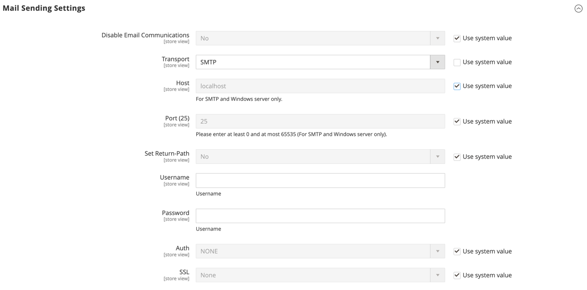

# 設定電子郵件通訊

此 _郵件傳送設定_ 可讓您將傳回的電子郵件或電子郵件回覆路由至特定地址。 如果您的商店是在SMTP或Windows伺服器上執行，您可以驗證主機和連線埠設定。

>[!IMPORTANT]
>
>**安全性通知** 所有商戶都應立即設定其郵件傳送設定，以防範最近發現的潛在遠端程式碼執行攻擊。 在此問題解決之前，強烈建議您避免使用 [!DNL Sendmail] 用於電子郵件通訊。 在 _[!UICONTROL Mail Sending Settings]_，請確定_[!UICONTROL Set Return Path]_ 設為 `No`.

如需組態設定的詳細清單，請參閱 [_[!UICONTROL Mail Sending Settings]_](../configuration-reference/advanced/system.md) 在 _設定參考_.

## 設定電子郵件通訊

1. 在 _管理員_ 側欄，前往 **[!UICONTROL Stores]** > _[!UICONTROL Settings]_>**[!UICONTROL Configuration]**.

1. 在左側面板中，展開 **[!UICONTROL Advanced]** 並選擇 **[!UICONTROL System]**.

1. 展開  此 **[!UICONTROL Mail Sending Settings]** 並執行下列動作：

   {width="600" zoomable="yes"}

   - 如有必要，請設定 **[!UICONTROL Disable Email Communications]** 至 `No`.

   - 的 **[!UICONTROL Transport]**，從市集選擇電子郵件通訊的傳輸型別： `Sendmail` 或 `SMTP`

   - 如果是在SMTP或Windows伺服器上執行，請確認下列設定：

      - **[!UICONTROL Host]** - `localhost` 或其他

      - **[!UICONTROL Port (25)]** - `25` 或其他

   - 的 **[!UICONTROL Set Return Path]**，選擇下列其中一個選項：

      - `No` - （建議的安全性措施）將傳回的電子郵件路由至預設商店電子郵件地址。
      - `Yes`  — 將傳回的電子郵件路由至預設商店電子郵件地址。
      - `Specified`  — 將傳回的電子郵件路由至中指定的電子郵件地址 **[!UICONTROL Return Path Email]**.

   - 如果在SMTP伺服器上執行，請設定連線：

      - **[!UICONTROL Username]**  — 輸入SMTP伺服器的登入使用者名稱。
      - **[!UICONTROL Password]**  — 輸入SMTP伺服器登入的密碼。
      - **[!UICONTROL Auth]**  — 選擇SMTP伺服器連線的驗證型別： `NONE` ， `PLAIN`，或 `LOGIN`
      - **[!UICONTROL SSL]**  — 選擇伺服器安全性憑證的驗證型別： `SSL` 或 `TLS`

     {width="600" zoomable="yes"}

1. 在左側面板中，展開 **[!UICONTROL Sales]** 並選擇 **[!UICONTROL Sales Emails]**.

1. 展開  此 **[!UICONTROL General Settings]** 區段。

1. 設定 **[!UICONTROL Asynchronous sending]** 至 `Enable`.

   {width="600" zoomable="yes"}

   如需組態設定的詳細清單，請參閱 [_一般設定_](../configuration-reference/sales/sales-emails.md) 在 _設定參考_.

1. 完成後，按一下 **[!UICONTROL Save Config]**.
