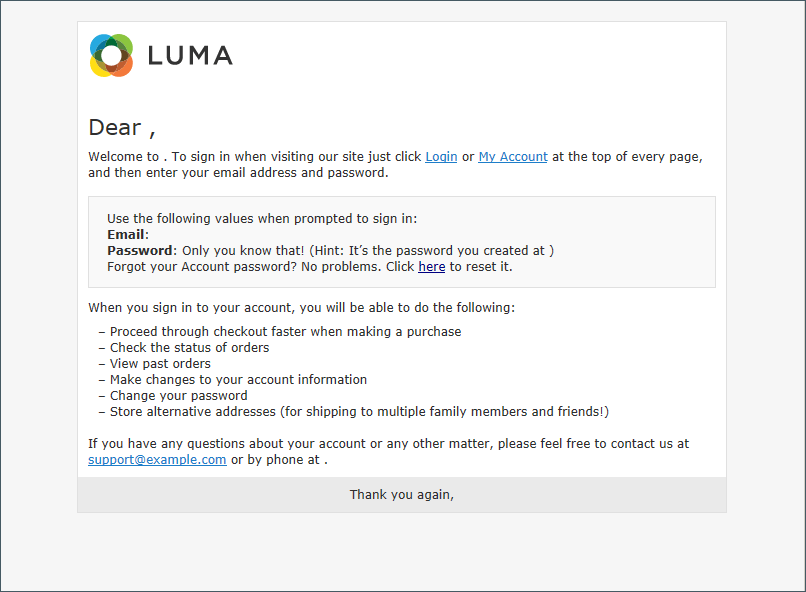
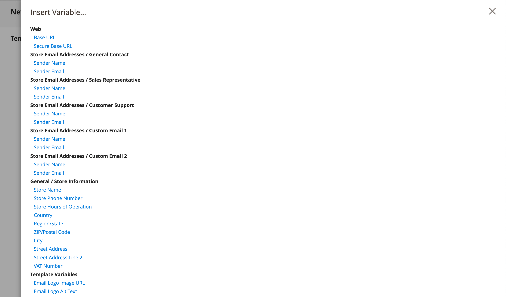
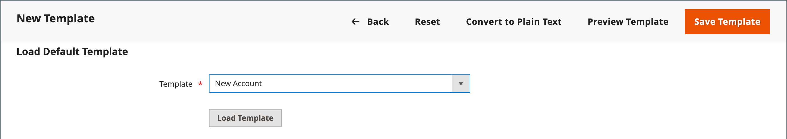
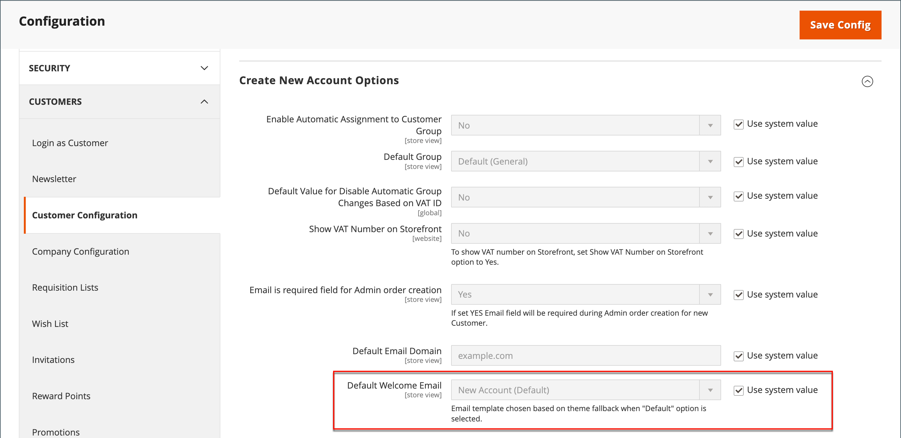

# 自訂電子郵件範本

Commerce包含系統所傳送之每則訊息的正文區段的預設電子郵件範本。 內文內容的範本會與頁首和頁尾範本結合，以建立完整的訊息。 內容使用HTML和CSS格式化，可以透過新增[變數](variables-predefined.md)和[介面工具](../content-design/widgets.md)輕鬆編輯和自訂。 您可以為每個網站、商店或商店檢視自訂電子郵件範本。 如果使用自訂範本，請務必更新[系統組態](email-templates.md#configure-email-templates)，以確保使用正確的範本。

{width="500" zoomable="yes"}

預設範本包含您的標誌和商店資訊，且不需進一步自訂即可使用。 然而，最佳實務是檢視每個範本，並在傳送給客戶之前進行任何必要的變更。

- [頁首範本](email-template-custom.md#header-template)
- [頁尾範本](email-template-custom.md#footer-template)
- [訊息範本](email-template-custom.md#message-templates)

{width="700" zoomable="yes"}

## 範本資訊

| 欄位 | 說明 |
| ----- | ----------- |
| [!UICONTROL Template Name] | 自訂範本的名稱。 |
| [!UICONTROL Insert Variable] | 在範本的游標位置插入變數。 |
| [!UICONTROL Template Subject] | 範本主旨會顯示在「主旨」欄中，可用來排序和篩選清單中的範本。 |
| [!UICONTROL Template Content] | HTML中的範本內容。 |
| [!UICONTROL Template Styles] | 可在&#x200B;_[!UICONTROL Template Styles]_方塊中輸入格式化範本所需的任何CSS樣式宣告。 |

{style="table-layout:auto"}

## 頁首範本

完成[設定](email-templates.md#configure-email-templates)後，電子郵件標題範本會包含連結至商店的標誌。 如果您具備HTML的基本知識，就可以輕鬆地使用[預先定義的變數](variables-predefined.md)，將商店聯絡資訊新增到標題中。

### 步驟1. 載入預設範本

1. 在&#x200B;_管理員_&#x200B;側邊欄上，移至&#x200B;**[!UICONTROL Marketing]** > _[!UICONTROL Communications]_>**[!UICONTROL Email Templates]**。

1. 按一下&#x200B;**[!UICONTROL Add New Template]**。

1. 在&#x200B;**[!UICONTROL Load default template]**&#x200B;區段中，按一下&#x200B;**[!UICONTROL Template]**&#x200B;選取器並選擇`Magento_Email` > `Header`。

   {width="600" zoomable="yes"}

1. 按一下&#x200B;**[!UICONTROL Load Template]**。

   範本中的HTML程式碼和變數會顯示在表單中。

### 步驟2. 自訂範本

1. 輸入自訂標頭的&#x200B;**[!UICONTROL Template Name]**。

1. 輸入&#x200B;**[!UICONTROL Template Subject]**&#x200B;以協助組織範本。

   在網格中，範本清單可依&#x200B;_[!UICONTROL Subject]_欄排序和篩選。

   {width="600" zoomable="yes"}

1. 在&#x200B;**[!UICONTROL Template Content]**&#x200B;方塊中，視需要修改HTML。

   >[!NOTE]
   >
   >在範本程式碼中工作時，請注意不要覆寫任何以雙大括弧括住的內容。

1. 若要插入[變數](variables-reference.md)，請將游標置於您要放置變數的程式碼中，然後按一下&#x200B;**[!UICONTROL Insert Variable]**。

1. 選擇要插入的變數。

   {width="600" zoomable="yes"}

   選取變數時，會在程式碼中插入變數的[標籤標籤](markup-tags.md)。

   雖然商店電子郵件地址變數是最常包含在標題中的變數，但您可以直接在範本中輸入任何系統或[自訂變數](variables-custom.md)的程式碼。

1. 如果您需要做任何CSS宣告，請在&#x200B;**[!UICONTROL Template Styles]**&#x200B;方塊中輸入樣式。

1. 當您準備好檢閱您的工作時，請按一下&#x200B;**[!UICONTROL Preview Template]**。

   對範本進行任何必要的變更。

1. 完成時，按一下&#x200B;**[!UICONTROL Save Template]**。

   您的自訂標題現在會顯示在可用電子郵件範本的清單中。

### 步驟3. 更新設定

1. 在&#x200B;_管理員_&#x200B;側邊欄上，移至&#x200B;**[!UICONTROL Content]** > _[!UICONTROL Design]_>**[!UICONTROL Configuration]**。

1. 在網格中，尋找您要設定的存放區檢視，然後按一下&#x200B;_[!UICONTROL Action]_欄中的&#x200B;**[!UICONTROL Edit]**。

1. 向下捲動並展開 **[!UICONTROL Transactional Emails]**&#x200B;區段。

1. 選擇用作電子郵件通知預設值的&#x200B;**[!UICONTROL Header Template]**。

1. 完成時，按一下&#x200B;**[!UICONTROL Save Config]**。

{width="600" zoomable="yes"}

## 頁尾範本

電子郵件範本頁尾包含電子郵件訊息的結尾和簽名行。 您可以變更結案以符合您的風格，並新增其他資訊，例如公司名稱和地址在您的名稱下方。

### 步驟1. 載入預設範本

1. 在&#x200B;_管理員_&#x200B;側邊欄上，移至&#x200B;**[!UICONTROL Marketing]** > _[!UICONTROL Communications]_>**[!UICONTROL Email Templates]**。

1. 按一下&#x200B;**[!UICONTROL Add New Template]**。

1. 在&#x200B;**[!UICONTROL Load default template]**&#x200B;區段中，按一下&#x200B;**[!UICONTROL Template]**&#x200B;選取器並選擇`Magento_Email` > `Footer`。

1. 按一下&#x200B;**[!UICONTROL Load Template]**。

   範本中的HTML程式碼和變數會顯示在表單中。

### 步驟2. 自訂和預覽範本

1. 輸入自訂頁尾的&#x200B;**[!UICONTROL Template Name]**。

1. 輸入&#x200B;**[!UICONTROL Template Subject]**&#x200B;以協助組織範本。

   在格線中，範本可依&#x200B;_[!UICONTROL Subject]_欄進行排序和篩選。

   {width="600" zoomable="yes"}

1. 在&#x200B;**[!UICONTROL Template Content]**&#x200B;方塊中，視需要修改HTML。

   >[!NOTE]
   >
   >在範本程式碼中工作時，請注意不要覆寫任何以雙大括弧括住的內容。

1. 若要插入[變數](variables-reference.md)，請將游標置於您要放置變數的程式碼中，然後按一下&#x200B;**[!UICONTROL Insert Variable]**。

1. 選擇要插入的變數。

   選取變數時，會在程式碼中插入變數的[標籤標籤](markup-tags.md)。

   雖然「商店連絡人」變數是最常包含在頁尾中的變數，但您可以直接在範本中輸入任何系統或[自訂變數](variables-custom.md)的程式碼。

1. 如果您需要做任何CSS宣告，請在&#x200B;**[!UICONTROL Template Styles]**&#x200B;方塊中輸入樣式。

### 步驟3. 更新設定

1. 在&#x200B;_管理員_&#x200B;側邊欄上，移至&#x200B;**[!UICONTROL Content]** > _[!UICONTROL Design]_>**[!UICONTROL Configuration]**。

1. 在網格中，尋找您要設定的存放區檢視，然後按一下&#x200B;_[!UICONTROL Action]_欄中的&#x200B;**[!UICONTROL Edit]**。

1. 向下捲動並展開 **[!UICONTROL Transactional Emails]**&#x200B;區段。

1. 選擇用作電子郵件通知中預設頁尾的&#x200B;**[!UICONTROL Footer Template]**。

1. 完成時，按一下&#x200B;**[!UICONTROL Save Config]**。

{width="600" zoomable="yes"}

## 訊息範本

自訂每則訊息本文的程式與自訂頁首或頁尾的程式相同。 唯一的差異在於每個觸發通知的活動或事件的訊息範本。 您可以照原樣使用範本，或自訂範本以符合您的聲音和品牌。 除了範本文字之外，還有大量允許的[預先定義](variables-predefined.md)變數和[自訂](variables-custom.md)變數可供您建立並合併至範本。

### 步驟1. 載入預設範本

1. 在&#x200B;_管理員_&#x200B;側邊欄上，移至&#x200B;**[!UICONTROL Marketing]** > _[!UICONTROL Communications]_>**[!UICONTROL Email Templates]**。

1. 按一下&#x200B;**[!UICONTROL Add New Template]**。

   {width="600" zoomable="yes"}

1. 執行下列動作：

   - 在&#x200B;**[!UICONTROL Load default template]**&#x200B;底下，選擇要自訂的&#x200B;**[!UICONTROL Template]**。

   - 按一下&#x200B;**[!UICONTROL Load Template]**。

### 步驟2. 自訂範本

1. 針對&#x200B;**[!UICONTROL Template Name]**，輸入自訂範本的名稱。

1. 如有需要，請變更&#x200B;**[!UICONTROL Template Subject]**。

   這是訊息的第一行，預設為問候語。 您可以保持原樣，也可以輸入更清楚描述的內容。

1. 記下範本的&#x200B;**[!UICONTROL Currently Used For]**&#x200B;路徑，這是用來更新設定的路徑。

   {width="600" zoomable="yes"}

1. 在&#x200B;**[!UICONTROL Template Content]**&#x200B;方塊中，視需要修改HTML。

   內容包含HTML標籤、CSS指示、變數和文字的組合。

   >[!NOTE]
   >
   >在範本程式碼中工作時，請注意不要意外在程式碼中輸入雙大括弧。

1. 若要插入變數，請將游標置於您要該變數出現的程式碼中。

   變數的選取範圍會依範本而異，並包含允許的[預先定義](variables-predefined.md)和[自訂](variables-custom.md)變數（如果有的話）。

1. 按一下&#x200B;**[!UICONTROL Insert Variable]**&#x200B;並選擇要插入的變數。

   插入變數的命令會以大括弧括住，並新增至游標位置的程式碼中。 例如：

   `customVar code=my_custom_variable`

1. 若要進行CSS宣告，請在&#x200B;**[!UICONTROL Template Styles]**&#x200B;中輸入樣式。

   {width="600" zoomable="yes"}

   >[!NOTE]
   >
   >只有在&#x200B;_[!UICONTROL Template Styles]_中有`{{template config_path="design/email/header_template"}}`時，才會將自訂樣式套用至電子郵件。 若要在沒有預設頁首範本的情況下使用自訂CSS，您必須在`<style>`HTML標籤中在此處提供它們。

### 步驟3. 更新設定

_[!UICONTROL Currently Used For]_階層連結軌跡會顯示範本的使用位置。 在此範例中，範本設定位於_[!UICONTROL Customer Configuration]_&#x200B;頁面、_[!UICONTROL Create New Account Options]_區段和_[!UICONTROL Default Welcome Email]_&#x200B;欄位中。

- 頁面 — [!UICONTROL Customer Configuration]
- 區段 — [!UICONTROL Create New Account Options]
- 欄位 — [!UICONTROL Default Welcome Email]

1. 在&#x200B;**[!UICONTROL Currently Used For]**&#x200B;階層連結追蹤中，按一下連結以開啟範本設定頁面。

   {width="600" zoomable="yes"}

1. 展開區段，並尋找您自訂之電子郵件範本的欄位。

1. 清除「**[!UICONTROL Use system value]**」核取方塊，然後按一下自訂範本的名稱。

   {width="600" zoomable="yes"}

1. 完成時，按一下&#x200B;**[!UICONTROL Save Config]**。

1. 在工作區頂端的郵件中，按一下&#x200B;**[!UICONTROL Cache Management]**&#x200B;並清除任何無效的快取。

### 步驟4. 預覽並儲存範本

1. 當您準備好檢閱您的工作時，請按一下&#x200B;**[!UICONTROL Preview Template]**。

1. 視需要更新範本。

1. 完成時，按一下&#x200B;**[!UICONTROL Save Template]**。

   您的自訂範本現在可在電子郵件範本清單中使用。
