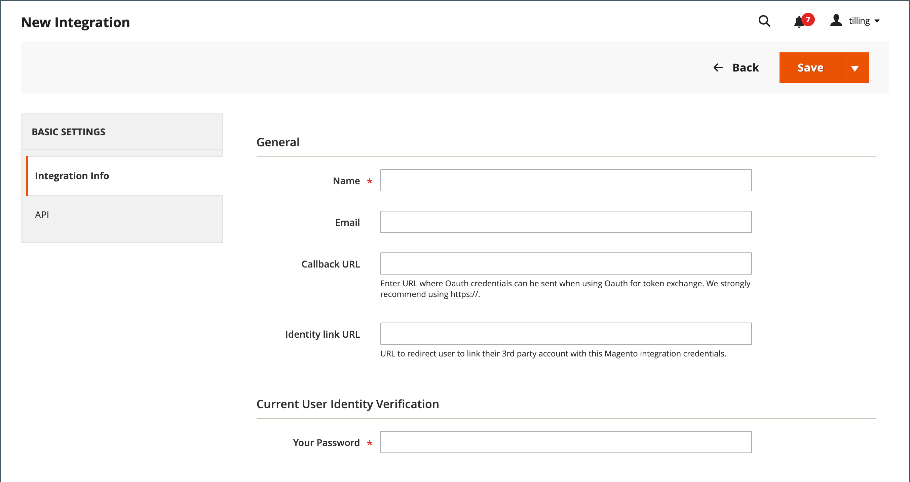

# 整合

在商務管理員中定義整合，會建立OAuth憑證的位置和重新導向URL以供第三方整合，並識別整合所需的可用API資源。 如需整合註冊程式的詳細資訊，請參閱 [OAuth型驗證](https://developer.adobe.com/commerce/webapi/get-started/authentication/gs-authentication-oauth/) （位於Commerce開發人員檔案中）。

{width="700" zoomable="yes"}

## 入門工作流程

1. **授權整合**  — 前往 **[!UICONTROL System]** > _[!UICONTROL Extensions]_>**[!UICONTROL Integrations]**頁面、尋找相關的整合併授權。
1. **驗證及建立登入**  — 出現提示時，接受要求的存取權。 如果重新導向至協力廠商，請登入系統或建立帳戶。 成功登入後，您會返回整合頁面。
1. **接收授權整合的確認**  — 系統會傳送通知，告知整合已成功獲得授權。 設定整合併接收認證後，就不再需要呼叫存取或請求權杖。

## 新增整合

1. 在 _管理員_ 側欄，前往 **[!UICONTROL System]** > _[!UICONTROL Extensions]_>**[!UICONTROL Integrations]**.

   {width="600" zoomable="yes"}

1. 輸入下列整合資訊：

   - 輸入 **[!UICONTROL Name]** 與聯絡人的聯絡 **[!UICONTROL Email]** 位址。

   - 輸入 **[!UICONTROL Callback URL]** 其中當使用OAuth進行權杖交換時，可以傳送OAuth認證。 使用 `https://` 強烈建議。

   - 輸入 **[!UICONTROL Identity Link URL]** 若要將使用者重新導向至具有這些Adobe Commerce或Magento Open Source整合憑證的第三方帳戶。

   >[!NOTE]
   >
   > 此 `Integration not secure` 警告標籤會顯示在上的每個整合名稱附近 [!UICONTROL Integrations] 格線提醒，直到HTTPS URL儲存到中 [!UICONTROL Callback URL] 和 [!UICONTROL Identity Link URL] 欄位。

   - 出現提示時，請輸入您的密碼以確認您的身分。

1. 在左側面板中，選擇 **[!UICONTROL API]** 並執行下列動作：

   - 設定 **[!UICONTROL Resource Access]** 變更為下列其中一項：

      - `All`
      - `Custom`

   - 對於自訂存取，請選取每個所需資源的核取方塊。

     {width="600" zoomable="yes"}

1. 完成後，按一下 **[!UICONTROL Save]**.

## 啟用整合

依預設，已儲存的整合專案會顯示在網格上，其中包含 `Inactive` 狀態。 若要啟用此功能，請完成下列步驟：

1. 在 _管理員_ 側欄，前往 **[!UICONTROL System]** > _[!UICONTROL Extensions]_>**[!UICONTROL Integrations]**.

1. 尋找新建立的整合，然後按一下 **[!UICONTROL Activate]** 連結。

1. 在右上角，按一下 **[!UICONTROL Allow]**.

   此動作會顯示擴充功能的整合權杖。 將此資訊複製到安全的加密位置，以便與您的整合搭配使用。

   {width="600" zoomable="yes"}

1. 在右上角，按一下 **[!UICONTROL Done]**.

## 重新授權整合

若要產生新的整合存取權杖和存取權杖密碼，請從管理員重新授權整合：

1. 在 _管理員_ 側欄，前往 **[!UICONTROL System]** > _[!UICONTROL Extensions]_>**[!UICONTROL Integrations]**.

1. 尋找與的整合 **[!UICONTROL Active]** 狀態。

1. 在 _[!UICONTROL Activate]_欄，按一下&#x200B;**[!UICONTROL Reauthorize]**.

1. 按一下 **[!UICONTROL Reauthorize]** 以核准對API資源的存取權。

1. 儲存擴充功能的新整合權杖，然後按一下 **[!UICONTROL Done]**.

## 變更API訪客存取安全性設定

依預設，系統不允許匿名訪客存取CMS、目錄和其他存放區資源。 如果您必須變更設定，請執行下列動作：

1. 在 _管理員_ 側欄，前往 **[!UICONTROL Stores]** > _[!UICONTROL Settings]_>**[!UICONTROL Configuration]**.

1. 在左側面板中，展開 **[!UICONTROL Services]** 並選擇 **[!UICONTROL Magento Web API]**.

1. 展開  此 **[!UICONTROL Web API Security Setting]** 區段。

   {width="600" zoomable="yes"}

1. 設定 **[!UICONTROL Allow Anonymous Guest Access]** 至 `Yes`.

1. 完成後，按一下 **[!UICONTROL Save Config]**.

如需詳細資訊，請參閱 [限制對匿名網頁API的存取](https://developer.adobe.com/commerce/webapi/rest/use-rest/anonymous-api-security/) （位於Commerce開發人員檔案中）。

## 刪除整合

1. 在 _管理員_ 側欄，前往 **[!UICONTROL System]** > _[!UICONTROL Extensions]_>**[!UICONTROL Integrations]**.

1. 尋找現有的整合，然後按一下圖示(  )中 **[!UICONTROL Delete]** 欄。

1. 若要確認您的動作，請按一下 **[!UICONTROL OK]**.
