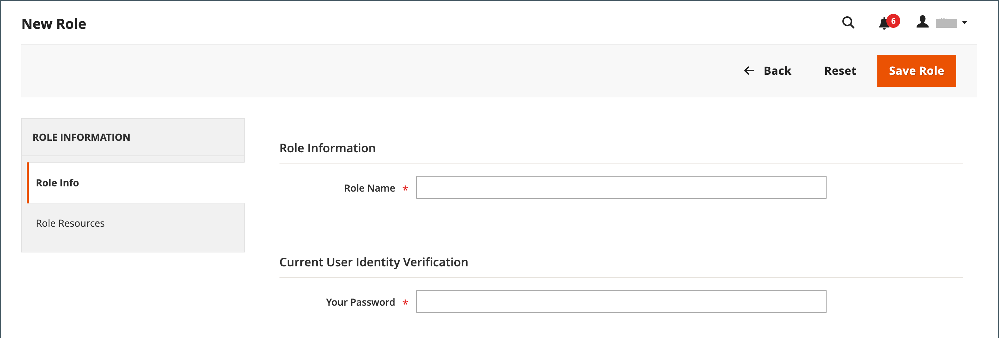
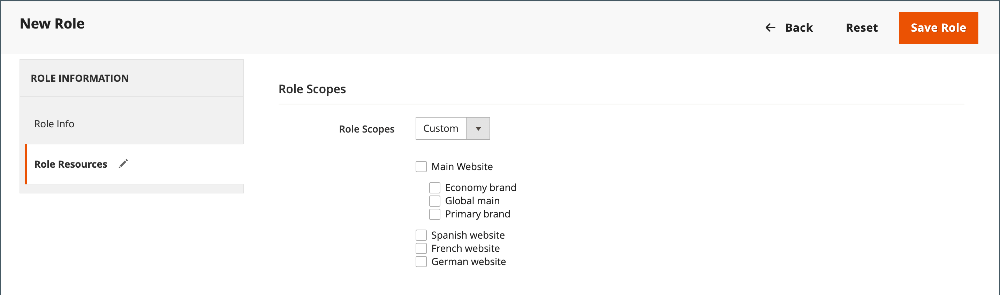
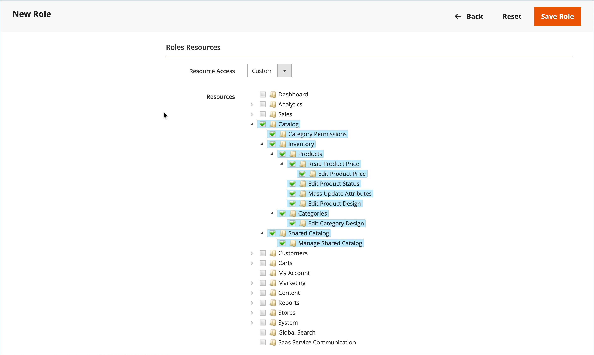

# 使用者角色

若要將受限存取權授予某人，第一步是建立具有適當許可權等級的角色。 儲存角色後，您可以新增使用者並指派受限制角色，以授予他們管理員受限制的存取權。

{width="600" zoomable="yes"}

## 定義角色

1. 在&#x200B;_管理員_&#x200B;側邊欄上，移至&#x200B;**[!UICONTROL System]** > _[!UICONTROL Permissions]_>**[!UICONTROL User Roles]**。

1. 按一下右上角的&#x200B;**[!UICONTROL Add New Role]**。

1. 完成步驟以定義角色：

### 步驟1：新增角色名稱

1. 在&#x200B;_[!UICONTROL Role Information]_&#x200B;底下，輸入描述性&#x200B;**[!UICONTROL Role Name]**。

1. 在&#x200B;_[!UICONTROL Current User Identity Verification]_&#x200B;下，輸入您的密碼。

   {width="600" zoomable="yes"}

### 步驟2：指派資源

>[!IMPORTANT]
>
>指派資源時，如果您限制指定角色的存取權，請務必停用許可權工具的存取權。 否則，使用者可以修改自己的許可權。

1. 將&#x200B;**[!UICONTROL Role Scopes]**&#x200B;設定為下列其中一項：

   - `All`
   - `Custom`

   如果針對多站台安裝設定為`Custom`，請選取要使用角色的網站和商店的核取方塊。

   {width="600" zoomable="yes"}

   >[!NOTE]
   >
   >當具有`Custom`角色範圍的使用者被指派至受限制的存放區時，無法建立網站和類別、將產品指派至類別或編輯位於&#x200B;_[!UICONTROL All Store Views]_&#x200B;範圍中的產品。 這些使用者也無法執行其他_&#x200B;全域&#x200B;_動作，這些動作會影響他們無權存取的領域。

1. 在&#x200B;_[!UICONTROL Roles Resources]_&#x200B;底下，將&#x200B;**[!UICONTROL Resource Access]**&#x200B;設定為`Custom`。

   >[!NOTE]
   >
   >如果需要雙因素驗證(2FA)才能登入管理員，請確定您已為此角色啟用資源`Permissions` > `Two Factor Auth`。 否則，新建立的具有此`Custom`角色範圍的使用者在第一次存取管理員時無法設定2FA。

1. 在&#x200B;**[!UICONTROL Resource]**&#x200B;樹狀結構中，選取角色可存取之每個管理員功能的核取方塊。

   若要建立可存取稅捐設定的「管理員」角色，請選擇「銷售/稅捐」與「系統/稅捐」資源。 如果為不同於您預設[送貨地點](../stores-purchase/shipping-settings.md#point-of-origin)的區域設定網站，您必須允許存取角色的系統/送貨資源。 出貨設定會決定用於型錄價格的商店稅率。

   {width="600" zoomable="yes"}

   可用許可權清單可能包含套件和已安裝擴充功能的其他選項。 選取每個功能的最上層許可權，您即可指派所有使用者可用的許可權。

   >[!NOTE]
   >
   >系統管理員使用者必須對其角色範圍具有&#x200B;**[!UICONTROL Sales / Archive]**&#x200B;許可權，才能檢視&#x200B;_[!UICONTROL Invoices]_、_[!UICONTROL Credit Memos]_&#x200B;和&#x200B;_[!UICONTROL Shipments]_&#x200B;順序[索引標籤](../stores-purchase/order-processing.md)。

1. 完成時，按一下&#x200B;**[!UICONTROL Save Role]**。

   角色現在會顯示在網格中，並可指派給使用者帳戶。

## 指派角色給使用者

1. 從&#x200B;_[!UICONTROL Roles]_&#x200B;格線，以編輯模式開啟記錄。

1. 在&#x200B;_[!UICONTROL Current User Identity Verification]_&#x200B;下，輸入您的使用者帳戶密碼。

1. 在左側面板中選擇&#x200B;**[!UICONTROL Role Users]**。

   _[!UICONTROL Role Users]_&#x200B;選項只有在儲存新角色之後才會出現。

   {width="600" zoomable="yes"}

1. 若要搜尋特定使用者記錄，請執行下列動作：

   - 在欄頂端的搜尋篩選中輸入值，然後按&#x200B;**Enter**。

   - 當您準備好返回完整清單時，請按一下&#x200B;**[!UICONTROL Reset Filter]**。

1. 選取要指派給角色的任何使用者的核取方塊。

1. 按一下&#x200B;**[!UICONTROL Save Role]**。

## 編輯角色

1. 在&#x200B;_管理員_&#x200B;側邊欄上，移至&#x200B;**[!UICONTROL System]** > _[!UICONTROL Permissions]_>**[!UICONTROL User Roles]**。

1. 使用格線上方的篩選條件來找出角色，然後按一下角色名稱。

1. 進行必要的變更。

   檢閱建立使用者角色的步驟，以取得角色設定的相關資訊。

1. 出現提示時，請輸入您的密碼以確認您的身分。

1. 按一下&#x200B;**[!UICONTROL Save Role]**。

## 刪除角色

1. 在&#x200B;_管理員_&#x200B;側邊欄上，移至&#x200B;**[!UICONTROL System]** > _[!UICONTROL Permissions]_>**[!UICONTROL User Roles]**。

1. 使用格線上方的篩選條件來找出角色，並在編輯模式下開啟。

1. 按一下右上角的&#x200B;**[!UICONTROL Delete Role]**。

1. 若要確認動作，請按一下&#x200B;**[!UICONTROL OK]**。

## 使用者角色示範

觀看此影片以瞭解管理使用者角色的相關資訊：

>[!VIDEO](https://video.tv.adobe.com/v/343654?quality=12&learn=on)

## 角色資源

可將下列資源的存取權指派給自訂角色。 請參閱連結的頁面，以進一步瞭解與每個資源相關聯的功能。

 — 僅限Adobe Commerce

 — 僅適用於Adobe Commerce B2B

| 資源 |   |   |
| --- | --- | --- |
| [`Dashboard`](../getting-started/admin-dashboard.md) |  |  |
| [`Sales`](../stores-purchase/sales-menu.md) | [`Operations`](../stores-purchase/orders.md) |  |
|  | [`Quotes`](../b2b/quotes.md)   [`Orders`](../stores-purchase/orders.md) [`Invoices`](../stores-purchase/invoices.md) [`Shipments`](../stores-purchase/shipments.md) [`Credit Memos`](../stores-purchase/credit-memos.md) [`Billing Agreements`](../stores-purchase/paypal-billing-agreements.md) [`Returns`](../stores-purchase/returns.md)  [`Transactions`](../stores-purchase/transactions.md) |
|  | [`Archive`](action-log-archive.md)![Adobe Commerce] |  |
|  | [`Shopping Cart Management`](../stores-purchase/cart.md) |  |
| [`Catalog`](../catalog/catalog-menu.md) | [`Category Permissions`](../catalog/categories.md)  |  |
|  | [`Inventory`](../inventory-management/introduction.md) | [`Products`](../catalog/products-list.md) [`Categories`](../catalog/categories.md) |
|  | [`Shared Catalog`](../b2b/catalog-shared-create.md)  | [`Manage Shared Catalog`](../b2b/catalog-shared-manage.md) |
| [`Customers`](../customers/guide-overview.md) | [`All Customers`](../customers/customers-all.md) [`Now Online`](../customers/now-online.md) [`Customer Groups`](../customers/customer-groups.md) [`Segments`](../customers/customer-segments.md)  |  |
|  | [`Login as Customer`](../customers/login-as-customer.md) | `Allow Login as Customer Button` `View Login as Customer Log`  |
|  | [`Companies`](../b2b/account-companies.md)  | [`Manage Companies`](../b2b/account-company-manage.md)  `Add New Company`  `Delete Company`  `Reimburse Balance` |
| [`Carts`](../stores-purchase/shopping-assisted-cart-manage.md) | [`Manage carts`](../stores-purchase/shopping-assisted-cart-manage.md) |  |
| [`My Account`](../customers/account-dashboard-my-account.md) |  |  |
| [`Marketing`](../merchandising-promotions/marketing-menu.md) | [`Promotions`](../merchandising-promotions/marketing-menu.md#uicontrol-promotions) | [`Catalog Price Rule`](../merchandising-promotions/price-rules-catalog.md)  [`Cart Price Rules`](../merchandising-promotions/price-rules-cart.md)  [`Related Products Rules`](../merchandising-promotions/product-related-rules.md) [`Gift Card Accounts`](../stores-purchase/product-gift-card-accounts.md)  |
|  | [`Private Sales`](../merchandising-promotions/events-private-sales.md)  | [`Events`](../merchandising-promotions/event-create.md)  [`Invitations`](../merchandising-promotions/invitations.md) |
|  | `Communications` | [`Email Templates`](email-templates.md)  [`Newsletter Template`](../merchandising-promotions/newsletter-template.md)  [`Newsletter Queue`](../merchandising-promotions/newsletter-queue.md)  [`Newsletter Subscribers`](../merchandising-promotions/newsletter-subscribers.md)  [`Email Reminders`](../merchandising-promotions/email-reminder-rules.md) |
|  | `Sales Channel` | [`Amazon Sales Channel`](https://experienceleague.adobe.com/docs/commerce-channels/amazon/overview.html) |
|  | [`SEO & Search`](../merchandising-promotions/marketing-menu.md#uicontrol-seo--search) | [`Search Terms`](../catalog/search-terms.md)  [`Search Synonyms`](../catalog/search-terms.md#search-synonyms)  [`URL Rewrites`](../merchandising-promotions/url-rewrite-custom.md)  [`Site Map`](../merchandising-promotions/sitemap-xml.md) |
|  | [`User Content`](../merchandising-promotions/product-reviews-moderate.md) | [`All Reviews`](../merchandising-promotions/product-reviews.md)  [`Pending Reviews`](../merchandising-promotions/product-reviews-moderate.md)   |  |
| [`Content`](../content-design/content-menu.md) | [`Elements`](../content-design/content-menu.md#uicontrol-elements)) | [`Pages`](../content-design/pages.md) [`Hierarchy`](../content-design/page-hierarchy.md)  [`Blocks`](../content-design/blocks.md) [`Dynamic Blocks`](../content-design/dynamic-blocks.md)  [`Widgets`](../content-design/widgets.md) [`Media Gallery`](../content-design/media-gallery.md) |  |
|  | [`Design`](../content-design/introduction.md#design) | [`Themes`](../content-design/themes.md) [`Schedule`](../content-design/schedule.md) |  |
|  | [正在暫存內容](../content-design/content-staging.md)   |  |
| [`Reports`](../getting-started/reports-menu.md) | [`Marketing`](../getting-started/marketing-reports.md) | `Shopping Cart` [`Search Terms`](../catalog/search-terms.md#search-terms-report) `Newsletter Problem Reports` |  |
|  | [`Reviews`](../getting-started/review-reports.md)  |  |
|  | [`Sales`](../getting-started/sales-reports.md) |  |
|  | `System Insights`  | [`Site-Wide Analysis Tool`](https://experienceleague.adobe.com/docs/commerce-operations/tools/site-wide-analysis-tool/access.html) |
|  | [`Customers`](../getting-started/customer-reports.md) [`Products`](../getting-started/product-reports.md) [`Private Sales`](../getting-started/private-sales-reports.md)  [`Statistics`](../getting-started/reports-menu.md#uicontrol-statistics) [`Business Intelligence`](../getting-started/business-intelligence.md) |  |
| [`Stores`](../stores-purchase/stores.md) | [`Settings`](../stores-purchase/stores-menu.md) | [`All Stores`](../stores-purchase/stores.md) [`Configuration`](../configuration-reference/guide-overview.md) [`Terms and Conditions`](../stores-purchase/terms-and-conditions.md) [`Order Status`](../stores-purchase/order-status.md) |  |
|  | [`Inventory`](../inventory-management/sources-stocks.md) | [`Sources`](../inventory-management/sources-manage.md) [`Stocks`](../inventory-management/stocks-manage.md) |  |
|  | [`Taxes`](../stores-purchase/taxes.md) |  |  |
|  | [`Currency`](../stores-purchase/currency.md) | [`Currency Rates`](../stores-purchase/currency-update.md) [`Currency Symbols`](../stores-purchase/currency-configuration.md#step-5-customize-currency-symbols-optional) |  |
|  | [`Attributes`](../catalog/product-attributes.md) | [`Product`](../catalog/attribute-product-create.md) [`Update Attributes`](../catalog/attribute-product-create.md) [`Attribute Set`](../catalog/attribute-sets.md) [`Ratings`](../merchandising-promotions/product-reviews.md#create-custom-ratings) |
|  | [`Other Settings`](../stores-purchase/stores-menu.md) | [`Customer Groups`](../customers/customer-groups.md) |
| [`System`](system-menu.md) | [`Data Transfer`](data-transfer.md) | [`Import`](data-import.md) [`Export`](data-export.md) [`Import/Export Tax Rates`](data-transfer-tax-rates.md) [`Import History`](data-import.md#import-history) |  |
|  | [`Magento Connect`](../getting-started/commerce-marketplace.md) | `Connect Manager` `Package Extensions` |  |
|  | [`Tools`](system-menu.md#tools) | [`Cache Management`](cache-management.md) [`Backups`](backups.md) [`Index Management`](index-management.md) [`Change Indexer Mode`](index-management.md) |  |
|  | [`Permissions`](permissions.md) | [`All Users`](permissions-users-all.md) [`Locked Users`](permissions-users-all.md#locked-users) [`User Roles`](permissions-user-roles.md) |
| [`Action Log`](action-log.md) | [`Report`](action-log.md) [`Archive`](action-log-archive.md) |
|  | [`Other Settings`](system-menu.md) | [`Notifications`](notifications.md) [`Custom Variables`](variables-custom.md) [`Manage Encryption Key`](encryption-key.md) |  |
| [`Global Search`](../getting-started/admin-workspace.md#workspace-search) |  |  |

{style="table-layout:auto"}
