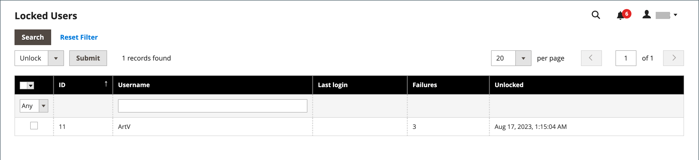

# 管理管理員使用者帳戶

第一次安裝您的存放區時，會使用可為您提供完整管理存取權的登入憑證建立預設的Admin帳戶。 作為最佳實務，您應該建立另一個具有完整管理員存取權的使用者帳戶。 如此一來，您就可以將一個帳戶用於日常管理活動，並將另一個帳戶保留為「超級管理員」帳戶。 如果您忘記了一般的認證，或是認證變得無法使用，這會很有幫助。

如果其他團隊成員或服務提供者需要存取權，您可以為其建立個別使用者帳戶，並根據其特定業務需求指派受限制的存取權。 若要限制使用者在Admin中可以存取的網站或商店，您必須先[建立具有有限範圍且僅選取必要資源的角色](permissions-user-roles.md)。 然後，您可以將角色指派給特定使用者帳戶。 管理員使用者若被指派受限角色，只能看見和變更與該角色相關聯之網站或商店的資料，但無法變更任何全域設定或資料。

>[!NOTE]
>
>擁有Adobe ID且想要簡化登入Adobe Commerce和Adobe業務產品的Adobe Commerce商家可整合Commerce驗證與Adobe IMS驗證工作流程。 為您的Commerce商店啟用此整合後，每個管理員使用者都必須使用其Adobe憑證(而非其Commerce憑證)才能登入。 請參閱[Adobe Identity Management Service (IMS)整合總覽](https://experienceleague.adobe.com/docs/commerce-admin/start/admin/ims/adobe-ims-integration-overview.html)。

對於暫時的使用者或角色，您也可以設定使用者帳戶的到期日。

<!--  update this to a better info-graphic  -->

## 建立使用者

1. 在&#x200B;_管理員_&#x200B;側邊欄上，移至&#x200B;**[!UICONTROL System]** > _[!UICONTROL Permissions]_>**[!UICONTROL All Users]**。

1. 按一下右上角的&#x200B;**[!UICONTROL Add New User]**。

   若要編輯現有使用者，請按一下網格中的使用者名稱。 您可以視需要修改&#x200B;_[!UICONTROL User Info]_和_[!UICONTROL User Role]_&#x200B;區段。

1. 在&#x200B;_[!UICONTROL Account Information]_區段中，執行下列動作：

   {width="600" zoomable="yes"}

   - 輸入帳戶的&#x200B;**[!UICONTROL User Name]**。

     使用者名稱應該容易記憶。 不區分大小寫。 例如，如果使用者名稱是`John`，他們也可以以`john`身分登入。

   - 完成下列資訊：

      - **[!UICONTROL First Name]**
      - **[!UICONTROL Last Name]**
      - **[!UICONTROL Email address]**

     每個使用者帳戶都必須有唯一的電子郵件地址。

   - 輸入帳戶的&#x200B;**[!UICONTROL Password]**。

     >[!NOTE]
     >
     >管理員密碼的長度必須是7個或7個以上的字元，且包含字母和數字。 如需其他密碼選項，請參閱[設定管理員安全性](security-admin.md)。

   - 對於&#x200B;**[!UICONTROL Password Confirmation]**，請重新輸入密碼以確保輸入正確。

   - 如果您的商店有多種語言，請將&#x200B;**[!UICONTROL Interface Locale]**&#x200B;設為管理介面使用的語言。

1. 將&#x200B;**[!UICONTROL This Account is]**&#x200B;設為`Active`。

1. 按一下行事曆圖示以設定使用者帳戶的&#x200B;**[!UICONTROL Expiration Date]**。

   若使用者或角色為暫時性，則定義到期日會很有幫助。 到期日之後，使用者帳戶狀態會變更為`Inactive`，如有需要可更新。

1. 在&#x200B;_[!UICONTROL Current User Identity Verification]_下，輸入您的使用者帳戶密碼。

>[!IMPORTANT]
>
>_[!UICONTROL Account Information]_區段完成後，您可以儲存使用者。 新使用者會顯示在_[!UICONTROL Users]_&#x200B;格線中，但使用者名稱必須在指派角色後才能登入。

## 指派使用者角色

1. 在左側面板中，按一下&#x200B;**[!UICONTROL User Role]**。

   網格會列出所有現有的使用者角色。 對於新存放區，_[!UICONTROL Administrators]_是唯一可用的角色。

   {width="600" zoomable="yes"}

1. 在&#x200B;_[!UICONTROL Assigned]_欄中，選取使用者角色。

   您可以[檢視現有或定義其他使用者角色](permissions-user-roles.md)。 定義角色後，您必須編輯使用者帳戶以指派新角色。

## 驗證或重設2FA提供者

1. 開啟Admin使用者帳戶。

1. 在左側面板中，按一下&#x200B;**[!UICONTROL 2FA]**。

   {width="600" zoomable="yes"}

1. 驗證&#x200B;_管理員_&#x200B;使用者可用的2FA解決方案，並建議每個使用者在登入前先安裝他們想要使用的解決方案。

   只需要一個2FA解決方案驗證，即可登入&#x200B;_Admin_。

1. 如果使用者需要重新安裝2FA解決方案，您可以重設目前的2FA設定。

   使用者必須重複設定程式，才能再次登入。 例如，使用者可能有一部新的智慧型手機，需要重新安裝Google Authenticator。 若要清除使用者目前的2FA設定，請按一下您要清除的每個解決方案的&#x200B;**[!UICONTROL Reset (Provider)]**。 出現提示時，按一下&#x200B;**[!UICONTROL OK]**&#x200B;確認。

   使用者會收到包含[設定2FA](security-two-factor-authentication.md)連結的電子郵件。 此連結只能使用一次。 如果使用者嘗試登入多次，則會在每次嘗試後傳送新連結。

1. 按一下&#x200B;**[!UICONTROL Save User]**。

1. 出現提示時，請輸入您的密碼以確認您的身分，然後再次按一下&#x200B;**[!UICONTROL Save User]**。

   _[!UICONTROL Users]_格線會開啟並列出所有使用者。

## 刪除管理員使用者

1. 在&#x200B;_管理員_&#x200B;側邊欄上，移至&#x200B;**[!UICONTROL System]** > _[!UICONTROL Permissions]_>**[!UICONTROL All Users]**。

1. 使用格線上方的篩選器來找出使用者帳戶，然後按一下使用者名稱。

1. 出現提示時，請輸入您的密碼以確認您的身分。

1. 按一下右上角的&#x200B;**[!UICONTROL Delete User]**。

1. 若要確認動作，請按一下&#x200B;**[!UICONTROL OK]**。

## 忘記密碼並重設電子郵件

管理員電子郵件範本設定可決定在使用者忘記並重設密碼時傳送的電子郵件。 此設定會指定顯示為訊息寄件者的商店連絡人，以及密碼復原連結保持有效的時間。

**_設定管理員電子郵件範本：_**

1. 在&#x200B;_管理員_&#x200B;側邊欄上，移至&#x200B;**[!UICONTROL Stores]** > _[!UICONTROL Setting]_>**[!UICONTROL Configuration]**。

1. 在左側面板中，展開&#x200B;**[!UICONTROL Advanced]**&#x200B;並選擇&#x200B;**[!UICONTROL Admin]**。

1. 展開 **[!UICONTROL Admin User Emails]**&#x200B;區段。

   {width="600" zoomable="yes"}

1. 將&#x200B;**[!UICONTROL Forgot Password Email Template]**&#x200B;設定為當管理員使用者忘記密碼時傳送的範本。

1. 將&#x200B;**[!UICONTROL Forgot and Reset Email Sender]**&#x200B;設為顯示為郵件寄件者的商店連絡人。

1. 將&#x200B;**[!UICONTROL User Notification Template]**&#x200B;設定為用作管理員通知預設值的電子郵件範本。

1. 完成時，按一下&#x200B;**[!UICONTROL Save Config]**。

## 鎖定的使用者

為了您企業的安全，使用者帳戶在六次嘗試登入[管理員](../getting-started/admin-signin.md)失敗後預設為鎖定。 目前鎖定的任何使用者帳戶都會顯示在「鎖定的使用者」網格中。 擁有完整管理員許可權的任何其他使用者都可以解除鎖定帳戶。

可在[進階管理員](../configuration-reference/advanced/admin.md#security)設定中實作其他密碼保全措施。 請參閱[管理安全性](security-admin.md)。

{width="300"}

**_若要解除鎖定Admin帳戶：_**

1. 在&#x200B;_管理員_&#x200B;側邊欄上，移至&#x200B;**[!UICONTROL System]** > _[!UICONTROL Permissions]_>**[!UICONTROL Locked Users]**。

1. 在網格中，選取鎖定帳戶的核取方塊。

   {width="600" zoomable="yes"}

1. 在左上角，將&#x200B;**[!UICONTROL Actions]**&#x200B;設為`Unlock`。

1. 按一下&#x200B;**[!UICONTROL Submit]**&#x200B;以解除鎖定帳戶。
