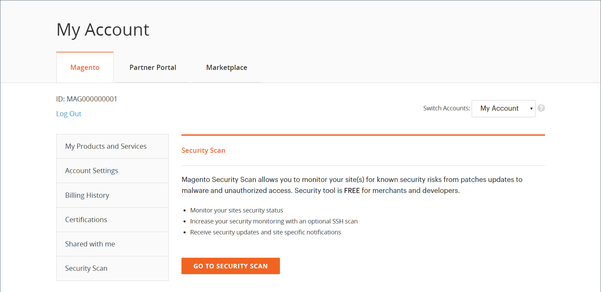
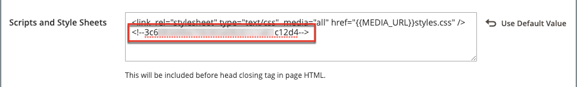
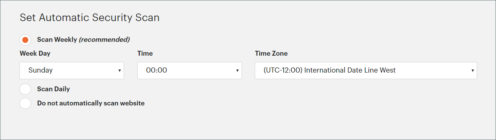
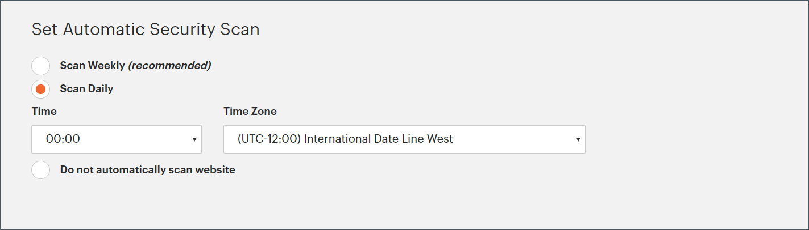
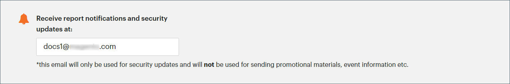

# 安全性掃描

Adobe Commerce安全性掃描工具可免費監控Adobe Commerce和Magento Open Source網站的安全性。 此工具是以網頁為基礎的服務，您可以透過您的線上Adobe Commerce帳戶（位於[account.magento.com](https://account.magento.com/customer/account/login)）來存取。

{width="600" zoomable="yes"}

>[!NOTE]
>
>Adobe免費提供此服務，不過商家必須接受條款，限制Adobe根據掃描結果和網站設定所應負的責任。

>[!NOTE]
>
>Adobe建議使用安全性掃描工具，而不使用其他協力廠商工具，以便在調查結果期間確保最佳服務品質。

## 掃描涵蓋範圍

安全掃描工具會透過HTTP和HTTPS通訊協定運作，以偵測惡意軟體、識別安全漏洞，並協助您維持存放區的安全狀態。 此工具可供所有商家、開發人員和負責網站安全性的指定人員使用。

安全掃描工具提供全方位的安全監控功能，協助您維護安全的存放區環境：

- 讓insight瞭解存放區的即時安全性狀態。
- 根據最佳實務接收建議，以協助解決問題。
- 排程每週、每日或依需求執行安全性掃描。
- 執行超過21,000項安全性測試，協助識別潛在的惡意軟體。
- 存取追蹤及監控網站進度的歷史安全性報告。
- 存取顯示成功和失敗檢查的掃描報告，並附上任何建議的動作。

>[!NOTE]
>
>您無法排除執行中的特定安全性測試，但您可以將失敗的檢查移至&#x200B;**[!UICONTROL Ignored Results]**&#x200B;類別。 如需詳細資訊，請參閱[管理掃描失敗](#manage-scan-failures)。

## 存取

安全性掃描工具會維持嚴格的存取控制，以保護您的網站資訊。 只有您可以掃描您的網站，因為此工具需要透過您的Adobe Commerce帳戶驗證網域擁有權。 每個網站都會透過唯一的Token連線至您的帳戶，以防止第三方進行未經授權的掃描。

此工具特別針對Adobe Commerce網域及其安全漏洞。 雖然您的網站商店可能包含其他平台的頁面，但安全性掃描工具應該僅掃描Adobe Commerce產生的內容，以確保可靠的結果。 掃描非Adobe Commerce頁面可能會產生不可靠的弱點評估。


## 存取掃描結果

只有最初設定掃描的使用者才能存取掃描結果。 若要與其他人分享結果，原始使用者必須手動散發PDF報表。 或者，商店擁有者可以使用&#x200B;[**[!UICONTROL Shared Access]**](https://experienceleague.adobe.com/en/docs/commerce-admin/start/commerce-account/commerce-account-share)功能與其他MAGEID共用提交內容。 其他個人也可以使用自己的帳戶啟動掃描。 在掃描設定期間，可以指定逗號分隔的電子郵件地址清單，以接收已完成掃描和評估風險等級的通知。


>[!NOTE]
>
>安全性掃描工具會使用以下公用IP位址：
>
>```text
>52.87.98.44
>34.196.167.176
>3.218.25.102
>```
>
>將這些IP位址新增至網路防火牆規則的允許清單，以允許工具掃描您的網站。 工具僅將要求張貼至連線埠`80`和`443`。


## 執行掃描

掃描程式會針對已知安全性問題檢查您的網站，並識別可能使您的存放區易受攻擊的遺失Adobe Commerce修補程式和更新。

>[!TIP]
>
>對於雲端基礎結構專案上的Commerce，請參閱[設定安全性掃描工具](https://experienceleague.adobe.com/en/docs/commerce-on-cloud/user-guide/launch/overview#set-up-the-security-scan-tool)。

若要執行掃描：

1. 從Commerce首頁，登入您的[Commerce/Magento帳戶](../getting-started/commerce-account-create.md)。

1. 檢閱並接受使用安全性掃描工具的條款。

   1. 在左側面板中選擇&#x200B;**[!UICONTROL Security Scan]**。
   1. 按一下&#x200B;**[!UICONTROL Go to Security Scan]**。
   1. 讀取&#x200B;**[!UICONTROL Terms and Conditions]**。
   1. 按一下&#x200B;**[!UICONTROL Agree]**&#x200B;以繼續。

1. 在&#x200B;_[!UICONTROL Monitored Websites]_頁面上，按一下&#x200B;**[!UICONTROL +Add Site]**。

   如果您有多個網站具有不同的網域，請為每個網域設定個別的掃描。

   {width="600" zoomable="yes"}

1. 若要透過新增確認代碼來驗證您對網站網域的所有權，請執行下列任一項作業：

   **Commerce店面**：

   1. 輸入&#x200B;**[!UICONTROL Site URL]**&#x200B;和&#x200B;**[!UICONTROL Site Name]**。
   1. 按一下&#x200B;**[!UICONTROL Generate Confirmation Code]**。
   1. 按一下&#x200B;**複製**，將確認代碼複製到剪貼簿。

      {width="400" zoomable="yes"}

   1. 以具有完整管理員許可權的使用者身分登入您商店的管理員，並執行下列動作：

      1. 在&#x200B;_管理員_&#x200B;側邊欄中，移至&#x200B;**[!UICONTROL Content]** > _[!UICONTROL Design]_>**[!UICONTROL Configuration]**。
      1. 在清單中尋找您的網站，然後按一下&#x200B;**[!UICONTROL Edit]**。
      1. 展開&#x200B;**[!UICONTROL HTML Head]**&#x200B;區段的。
      1. 向下捲動至&#x200B;**[!UICONTROL Scripts and Style Sheets]**，然後按一下任何現有程式碼結尾的文字方塊。 將確認代碼貼入文字方塊。

         {width="600" zoomable="yes"}

      1. 完成時，按一下&#x200B;**[!UICONTROL Save Configuration]**。

   **PWA店面**：

   1. 輸入&#x200B;**[!UICONTROL Site URL]**&#x200B;和&#x200B;**[!UICONTROL Site Name]**。

   1. 針對&#x200B;**[!UICONTROL Confirmation Code]**，請選擇`META Tag`選項，然後按一下&#x200B;**[!UICONTROL Generate Code]**。

   1. 按一下&#x200B;**[!UICONTROL Copy]**&#x200B;將產生的確認代碼META標籤複製到剪貼簿。

      {width="400" zoomable="yes"}

   1. 前往PWA Studio storefront專案目錄，並執行下列動作：

      1. 在PWA Studio專案目錄下，移至`packages > venia-concept > template.html`。
      1. 將複製的確認代碼（產生的META標籤）新增到HTML標題並儲存變更。

         {width="600" zoomable="yes"}

      1. 返回PWA Studio CLI，使用Wyar安裝專案相依性並執行專案建置命令。

         ```sh
         yarn install &&
         yarn build
         ```

      1. *在您的雲端專案*&#x200B;中，建立`pwa`資料夾，並將內容複製到店面專案的`dist`資料夾中。

         ```sh
         mkdir pwa && cp -r <path to your storefront project>/dist/* pwa
         ```

      1. 使用Git CLI工具來暫存、提交這些變更，並將其推播至您的雲端專案。

         ```sh
         git add . &&
         git commit -m "Added storefront file bundles" &&
         git push origin
         ```

         建置流程完成後，變更將會部署至您的PWA商店前面。

1. 返回Commerce帳戶中的&#x200B;_[!UICONTROL Security Scan]_頁面，然後按一下&#x200B;**[!UICONTROL Verify Confirmation Code]**以建立網域的所有權。

1. 成功確認後，為下列其中一種型別設定&#x200B;**[!UICONTROL Set Automatic Security Scan]**&#x200B;選項：

   **每週掃描（建議）**：

   選擇每週要執行掃描的&#x200B;**[!UICONTROL Week Day]**、**[!UICONTROL Time]**&#x200B;和&#x200B;**[!UICONTROL Time Zone]**。

   根據預設，掃描會排程每週的星期六午夜(UTC)開始，並持續到星期日凌晨。

   {width="500" zoomable="yes"}

   **每日掃描**：

   選擇每天要執行掃描的&#x200B;**[!UICONTROL Time]**&#x200B;和&#x200B;**[!UICONTROL Time Zone]**。

   根據預設，掃描會排程在每天的午夜UTC開始。

   {width="500" zoomable="yes"}

1. 輸入您想要接收已完成掃描和安全更新通知的&#x200B;**[!UICONTROL Email Address]**。

   {width="400" zoomable="yes"}

1. 完成時，按一下&#x200B;**[!UICONTROL Submit]**。

   在驗證網域的所有權後，網站會顯示在您的Commerce帳戶的「受監控網站」清單中。

1. 如果您有多個網站具有不同的網域，請重複此程式，為每個網站設定安全性掃描。

## 管理掃描失敗

安全掃描工具可讓您直接從報表檢視管理掃描失敗。 您可以將特定的掃描失敗標示為誤判，並將它們從風險分數中排除。

### 管理掃描失敗的好處

管理掃描失敗有助於您透過以下方式維護更精確的存放區安全性概觀：

- 減少安全性報表中的誤判。
- 著重於需要注意的相關安全性問題。
- 維持更清楚的檢視畫面來瞭解商店的真實安全性狀態。
- 消除需聯絡支援人員以得知已知誤判的情況。
- 自行管理您已調查的掃描失敗以節省時間。

### 忽略掃描失敗的有效案例範例

- 當您已套用掃描工具未偵測到的安全性修補程式時。
- 當偵測到的問題不適用於您的特定商店設定（例如自訂使用者登入和註冊頁面）時。
- 當您已實作可解決此問題的替代安全性措施（例如Web應用程式防火牆）時。
- 當掃描失敗是根據您刻意為業務需求設定的設定時。
- 當您刻意使用因程式碼模糊化及/或編碼而造成檢查失敗的第三方JavaScript程式碼時。


### 忽略掃描失敗

若要管理已識別為誤判的掃描失敗，請遵循下列步驟：

1. 從&#x200B;_[!UICONTROL Monitored Websites]_頁面，按一下您要管理之網站的&#x200B;**[!UICONTROL View Report]**。

1. 在報表檢視中，找出要標籤為誤判的失敗掃描。

1. 按一下&#x200B;**[!UICONTROL Ignore]**&#x200B;以取得特定的掃描失敗。

   {width="600" zoomable="yes"}

1. 按一下&#x200B;**[!UICONTROL Apply Changes]**&#x200B;儲存您的選擇。

略過的掃描失敗會移至&#x200B;_[!UICONTROL Ignored Results]_區段，並從您的風險分數中排除。

### 停止忽略掃描失敗

如果您需要將先前忽略的掃描失敗還原到使用中監視，請遵循下列步驟：

1. 在報表檢視中，捲動至&#x200B;_[!UICONTROL Ignored Results]_區段。

1. 按一下&#x200B;**[!UICONTROL Stop Ignoring]**&#x200B;以取得您要還原的掃描失敗。

   {width="600" zoomable="yes"}

1. 按一下&#x200B;**[!UICONTROL Apply Changes]**&#x200B;儲存您的選擇。

掃描失敗會移回&#x200B;_[!UICONTROL Failed Scans]_區段，並包含在您的風險分數中。

### 檢視略過的掃描失敗

忽略的結果會出現在報表的個別區段中，而風險分數會自動更新，以僅反映作用中的掃描失敗。 您可以在套用變更之前選取多個專案，一次管理多個掃描失敗。

{width="600" zoomable="yes"}
