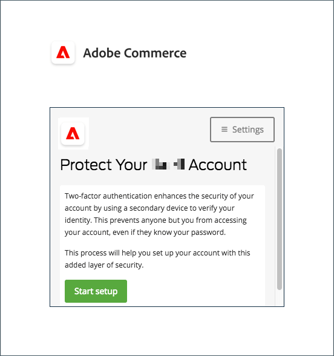
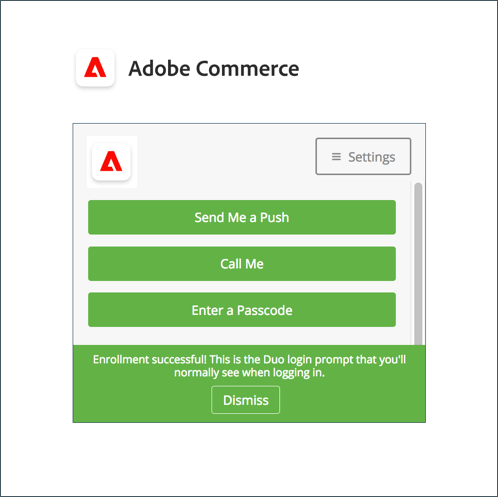

# 使用者帳戶的雙因素驗證設定

這些指示顯示如何在您首次登入Adobe Commerce或Magento Open Source期間設定雙因素驗證，以及如何使用下列應用程式和裝置驗證您的身分。

如需完整的指示，請參閱 [管理員登入](../getting-started/admin-signin.md).

>[!NOTE]
>
>已啟用的存放區 [!DNL Adobe Identity Management Services] (IMS)驗證已停用原生Adobe Commerce和Magento Open Source 2FA。 使用Adobe憑證登入其Commerce執行個體的管理員使用者不需要重新驗證許多管理員工作。 當管理員使用者登入目前的工作階段時，驗證會由Adobe IMS處理。 另請參閱 [[!DNL Adobe Identity Management Service] (IMS)整合概述](../getting-started/adobe-ims-integration-overview.md).

## [!DNL Google Authenticator]

### 步驟1：設定 [!DNL Google Authenticator]

1. 輸入您的帳戶認證並登入 _管理員_. 會出現一個包含QR碼的新驗證器畫面。

1. 開啟 **[!UICONTROL Google Authenticator]** 行動裝置上的應用程式。

1. 按一下加號( **+** )以新增專案，並將紅色方塊與二維碼對齊，以便使用智慧型手機上的相機進行掃描。

1. 當您的電話辨識QR碼並新增專案時，請在 _管理員_ **[!UICONTROL Authenticator code]** 欄位。

1. 完成後，按一下 **[!UICONTROL Confirm]**.

   {width="300"}

### 步驟2：登入 [!DNL Google Authenticator]

1. 輸入您的帳戶認證並登入Commerce _管理員_.

   {width="300"}

1. 開啟 [!DNL Google Authenticator] 在您的行動裝置上。

1. 出現提示時，請輸入六位數的驗證代碼。

1. 若要儲存驗證以供日後登入使用，請選取 **[!UICONTROL Trust this device, do not ask again]** 核取方塊。

1. 完成後，按一下 **[!UICONTROL Confirm]**.

## [!DNL Duo Security]

[!DNL Duo] 提供免費試用版，並根據帳戶相關聯的使用者人數收費。 關注其 [設定帳戶和下載應用程式的指示](https://duo.com/product/multi-factor-authentication-mfa/duo-mobile-app).

### 步驟1：設定 [!DNL Duo Security]

1. 輸入您的帳戶認證並登入 _管理員_.

1. 當 [!DNL Duo] 設定頁面就會顯示，請按一下 **[!UICONTROL Start setup]** 並執行下列動作：

   {width="300"}

1. 選取您的裝置。

1. 出現提示時，輸入您的電話號碼，然後按一下 **[!UICONTROL Continue]**.

   此範例會要求您輸入電話號碼，因為我們正在使用行動裝置。

1. 提示安裝時 [!DNL Duo Mobile] 針對您的電話型別，按一下 **[!UICONTROL I have Duo Mobile]**.

1. 開啟 [!DNL Duo Mobile] 並掃描二維碼，以將驗證器與Adobe Commerce同步。 啟動完成後，會出現核取記號。

1. 若要設定裝置的設定，請選擇登入時要執行的動作。

   - `Ask me to choose an authenticator method`  — 允許使用者在登入及驗證時選取 _管理員_.
   - `Automatically send this device a Duo Push`  — 傳送訊息給您的裝置，以接受或拒絕存取。
   - `Automatically call this device`  — 呼叫並提供要輸入以進行存取的密碼。

   {width="300"}

### 步驟2：登入 [!DNL Duo Security]

以下範例顯示適用於的選項 `Ask me to choose an authenticator method`：

1. 出現提示時，輸入您的 _管理員_ 登入的認證。

   {width="300"}

1. 選擇您要用來驗證的方法：

   - `Send Me a Push`  — 按一下以接收推播通知 [!DNL Duo Mobile]. 接受以進行驗證。
   - `Call Me`  — 按一下此選項，接聽含有代碼的電話，然後輸入密碼。
   - `Enter a Passcode`  — 按一下此選項以接收並輸入密碼。

1. 完成推送或程式碼以完全登入 _管理員_.

## [!DNL Authy]

[!DNL Authy] 免費為使用者提供應用程式和服務。 按照他們的指示，下載並設定您裝置或瀏覽器的應用程式。 若要進一步瞭解，請參閱 [[!DNL Authy] 檔案](https://authy.com/features/setup/).

### 步驟1：設定Authy

1. 輸入您的帳戶認證並登入 _管理員_.

   ![[!DNL Authy] 註冊](./assets/storefront-2fa-authy-auth.png){width="300"}

1. 當系統提示您向Authy註冊時，請執行下列動作：

   - 選取您的國家/地區。

   - 輸入您的電話號碼。

   - 選取 **[!UICONTROL Verification method]**： `SMS` 或 `Call Me`

   按一下 **[!UICONTROL Continue]**. 訊息會透過簡訊或電話傳送至您的電話。

1. 輸入您收到的驗證碼，然後按一下 **[!UICONTROL Verify]**.

1. 完成後，按一下 **[!UICONTROL Confirm]**.

   ![[!DNL Authy] 驗證碼](./assets/storefront-2fa-authy-verify.png){width="300"}

### 步驟2：登入 [!DNL Authy]

1. 輸入您的帳戶認證並登入 _管理員_.

   ![[!DNL Authy]  — 登入](./assets/storefront-2fa-authy-access.png){width="300"}

1. 選擇下列其中一種驗證方法：

   - `Use one touch`  — 傳送警報給您的 [!DNL Authy] 應用程式。 在應用程式中，接受存取。
   - `Use authy token`  — 提示您輸入您的程式碼 [!DNL Authy] 應用程式。

1. 如果您無法登入，請選擇您要用來接收程式碼的方法。 然後，輸入您收到的存取代碼 _管理員_.

   應用程式包含這些額外的緊急方法。

   - `Send me a code via SMS`  — 文字SMS訊息會傳送至已設定的行動裝置。
   - `Send me a code via phone call`  — 使用者接聽包含程式碼的電話。

   您的帳戶已驗證並開啟。

## U2F ([!DNL Yubikey] 和其他裝置)

依照解決方案提供者的指示，設定您的U2F裝置。 如需詳細資訊，請參閱廠商檔案，例如 [[!DNL YubiKey]](https://support.yubico.com/hc/en-us/articles/360013790339-Getting-Started-with-Your-YubiKey) 作者： [!UICONTROL Yubico].

1. 輸入您的帳戶認證並登入 _管理員_.

   {width="300"}

1. 按下按鍵上的按鈕。

   驗證會立即觸發並開啟 _管理員_.

1. 插入 **[!UICONTROL U2F key]** 插入電腦的USB連線埠。
