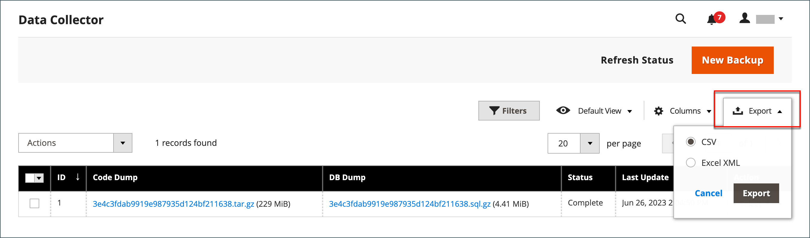
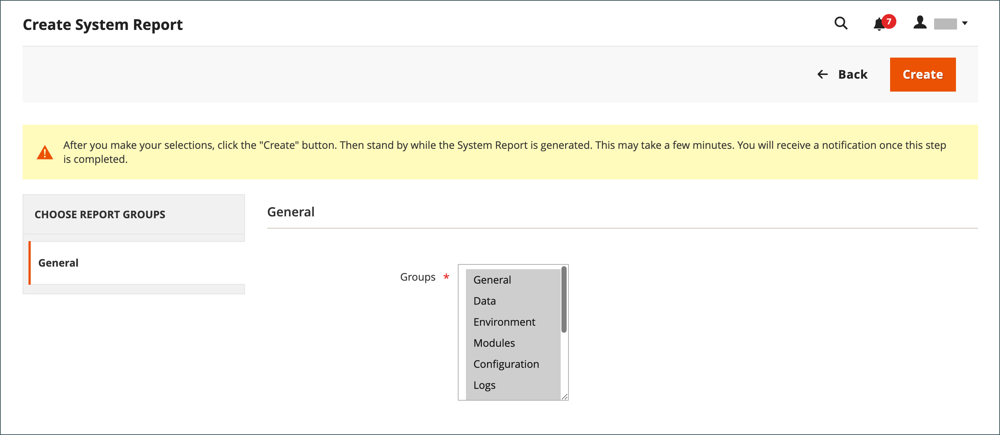
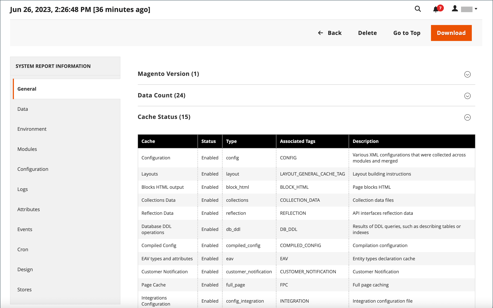

# 支援工具

{{ee-feature}}

支援工具旨在識別您系統中的已知問題。 它們可在開發和最佳化過程中作為資源，並作為診斷工具，協助我們的支援團隊識別和解決問題。

## 資料收集器

資料收集器會收集系統相關資訊，供我們的支援團隊針對Adobe Commerce安裝問題進行疑難排解。 建立的備份需要幾分鐘才能完成，而且包含程式碼和資料庫傾印。 資料可匯出為CSV或Excel XML檔案。

{width="600" zoomable="yes"}

### 執行資料收集器

1. 在&#x200B;_管理員_&#x200B;側邊欄上，移至&#x200B;**[!UICONTROL System]** > _[!UICONTROL Support]_>**[!UICONTROL Data Collector]**。

1. 按一下右上角的&#x200B;**[!UICONTROL New Backup]**。

   產生備份需要幾分鐘的時間。 您可以按一下&#x200B;**[!UICONTROL Refresh Status]**&#x200B;來監視處理結果。 完成時，備份會顯示在&#x200B;_[!UICONTROL Data Collector]_&#x200B;格線中。

1. 若要檢視含有備份詳細資訊的記錄檔，請執行下列動作：

   - 在&#x200B;_[!UICONTROL Action]_&#x200B;欄中，選取&#x200B;**[!UICONTROL Show Log]**。

   - 按一下&#x200B;**[!UICONTROL Back]**&#x200B;返回格線。

   {width="600" zoomable="yes"}

### 匯出備份資料

1. 在第一欄中，選取要匯出之備份的核取方塊。

1. 使用&#x200B;**[!UICONTROL Export]**&#x200B;功能表選擇匯出資料的格式。

   {width="600" zoomable="yes"}

1. 從網頁瀏覽器下載位置存取檔案，並&#x200B;**[!UICONTROL Save]**&#x200B;它。

### 下載備份資料

產生備份後，您可以下載程式碼和資料庫資料的復本。

1. 在格線中尋找所需的備份實體。

1. 請確定它具有`Complete`狀態。

1. 按一下&#x200B;_[!UICONTROL Code Dump]_&#x200B;或_[!UICONTROL DB Dump]_&#x200B;欄中的實體名稱。

下載程式應該會自動啟動。

## 刪除備份資料

1. 在&#x200B;_管理員_&#x200B;側邊欄上，移至&#x200B;**[!UICONTROL System]** > _[!UICONTROL Support]_>**[!UICONTROL Data Collector]**。

1. 尋找並選取要刪除的備份資料。

1. 在&#x200B;_[!UICONTROL Action]_&#x200B;欄中按一下&#x200B;**[!UICONTROL Delete]**。

1. 若要確認動作，請按一下&#x200B;**[!UICONTROL OK]**。

## 系統報表

系統報告工具可讓您定期取得系統的完整或部分快照，並儲存以供日後參考。 您可以比較程式碼開發週期之前和之後的效能設定，或伺服器設定的變更。 系統報告工具可大幅減少準備和提交「支援」開始調查所需資訊的時間。

從「系統報表」格線中，您可以檢視及下載現有報表、刪除報表及建立報表。

### 存取系統報告

在&#x200B;_管理員_&#x200B;側邊欄上，移至&#x200B;**[!UICONTROL System]** > _[!UICONTROL Support]_>**[!UICONTROL System Report]**。

{width="600" zoomable="yes"}

### 產生報表

1. 按一下&#x200B;**[!UICONTROL New Report]**。

1. 在&#x200B;**[!UICONTROL Groups]**&#x200B;清單中，選取要納入報告中的每一組資訊。 預設會選取所有群組。

   {width="600" zoomable="yes"}

1. 按一下右上角的&#x200B;**[!UICONTROL Create]**。

   視選取的報表型別數目而定，報表可能需要幾分鐘的時間才能產生。 報表準備就緒後，會顯示於網格頂端，並產生日期和時間。

### 檢視模組資訊

您可以找到有關已安裝模組的實用資訊。

**_若要檢視每個已安裝模組的報表資訊：_**

1. 在&#x200B;_管理員_&#x200B;側邊欄上，移至&#x200B;**[!UICONTROL System]** > _[!UICONTROL Support]_>**[!UICONTROL System Report]**。
1. 按一下&#x200B;**[!UICONTROL New Report]**。
1. 從&#x200B;**[!UICONTROL Groups]**&#x200B;清單中選取`Modules`。
1. 按一下&#x200B;**[!UICONTROL Create]**。
1. 報表產生後，按一下&#x200B;**[!UICONTROL Select]**，然後按&#x200B;**[!UICONTROL View]**&#x200B;檢視所有模組版本。
1. 按一下&#x200B;**[!UICONTROL Download]**&#x200B;下載報表。

### 管理系統報表

在網格的&#x200B;**[!UICONTROL Action]**&#x200B;欄中，選取下列其中一項：

- `View` — 使用此函式來檢視報告的詳細資料。
- `Delete` — 使用此函式從清單中刪除產生的報告。
- `Download` — 使用此函式將報表儲存為HTML檔案。

### 檢視系統報告詳細資訊

1. 對於您需要的報表，請在&#x200B;_[!UICONTROL Actions]_&#x200B;欄中選取&#x200B;**[!UICONTROL View]**。

1. 在左側面板中，展開報表的每個區段以檢視詳細資料。

   {width="600" zoomable="yes"}

### 可用的系統報告

| 報表群組 | 包含的資訊 |
| ------------ | -------------------- |
| [!UICONTROL General] | Adobe Commerce版本 資料計數 快取狀態 索引狀態 |
| [!UICONTROL Environment] | 環境資訊 MySQL狀態 |
| [!UICONTROL Data] | 依URL索引鍵重複類別 依URL索引鍵重複產品 依SKU重複產品 依遞增識別碼重複訂單 依電子郵件重複使用者 損毀的類別資料 |
| [!UICONTROL Modules] | 自訂模組清單 已停用的模組清單 所有模組清單 |
| [!UICONTROL Configuration] | 設定 來自`app/etc/env.php` 送貨方法 付款方法 付款功能對照表的資料 |
| [!UICONTROL Logs] | 記錄檔 常用系統訊息 今天常用系統訊息 常用偵錯訊息 今天常用偵錯訊息 常用例外訊息 今天常用例外訊息 |
| [!UICONTROL Attributes] | 使用者定義的EAV屬性 新的EAV屬性 實體型別 所有EAV屬性 類別EAV屬性 產品EAV屬性 客戶EAV屬性 客戶地址EAV屬性 RMA專案EAV屬性 |
| [!UICONTROL Events] | 自訂全域事件 自訂管理員事件 自訂前端事件 自訂檔案事件 自訂Crontab事件 自訂REST事件 自訂SOAP事件 核心全域事件 核心管理員事件 核心前端事件 核心檔案事件 核心Crontab事件 核心REST事件 核心SOAP事件 所有全域事件 所有管理員事件 所有前端事件 所有Doc事件 所有REST事件 所有SOAP事件 所有Crontab事件 |
| [!UICONTROL Cron] | 依狀態碼的Cron排程 依工作碼的Cron排程 Cron排程佇列中的錯誤 Cron排程清單 自訂全域Cron工作 可自訂設定的Cron工作 核心全域Cron工作 可設定的核心Cron工作 所有全域Cron工作 所有可設定的Cron工作 |
| [!UICONTROL Design] | Adminhtml主題清單 前端主題清單 |
| [!UICONTROL Stores] | 網站樹狀結構 網站清單 存放區清單 存放區檢視清單 |
| OMS聯結器&#x200B; _（與OMS整合一起顯示）_ | 聯結器版本 聯結器監視 訊息處理結果 |

{style="table-layout:auto"}
