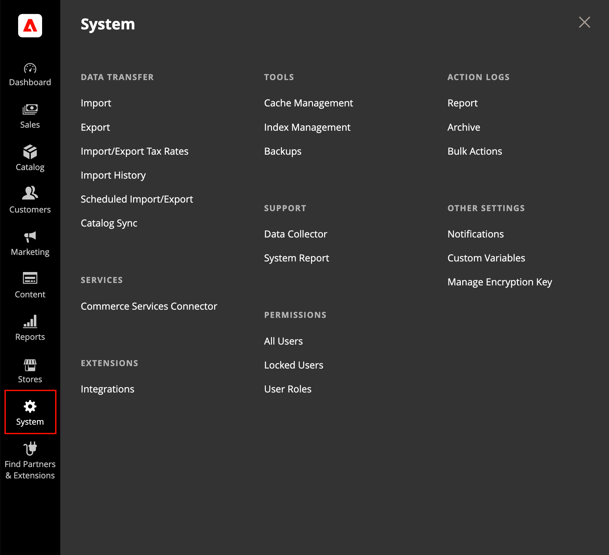

# [!UICONTROL System]功能表

[!UICONTROL System]功能表包含匯入及匯出資料、管理系統快取與索引、管理許可權、備份、系統通知及自訂變數的工具。

>[!BEGINTABS]

>[!TAB Adobe Commerce]

僅[!BADGE 個PaaS]{type=Informative url="https://experienceleague.adobe.com/zh-hant/docs/commerce/user-guides/product-solutions" tooltip="僅適用於雲端專案(Adobe管理的PaaS基礎結構)和內部部署專案的Adobe Commerce 。"}

{width="600" zoomable="yes"}

>[!TAB Adobe Commerce as a Cloud Service]

僅[!BADGE SaaS]{type=Positive url="https://experienceleague.adobe.com/zh-hant/docs/commerce/user-guides/product-solutions" tooltip="僅適用於Adobe Commerce as a Cloud Service和Adobe Commerce Optimizer專案(Adobe管理的SaaS基礎結構)。"}

{width="600" zoomable="yes"}

>[!ENDTABS]

**_若要顯示[!UICONTROL System]功能表：_**

在&#x200B;_管理員_&#x200B;側邊欄上，按一下&#x200B;**[!UICONTROL System]**。

## [!UICONTROL Data Transfer]

這些[工具](data-transfer.md)可讓您在單一作業中管理多個記錄。 您可以匯入新專案，也可以更新、取代和刪除現有產品和稅率。

## [!UICONTROL Extensions]

僅[!BADGE 個PaaS]{type=Informative url="https://experienceleague.adobe.com/zh-hant/docs/commerce/user-guides/product-solutions" tooltip="僅適用於雲端專案(Adobe管理的PaaS基礎結構)和內部部署專案的Adobe Commerce 。"}

管理您商店的[協力廠商整合](integrations.md)和擴充功能。

## [!UICONTROL Tools]

僅[!BADGE 個PaaS]{type=Informative url="https://experienceleague.adobe.com/zh-hant/docs/commerce/user-guides/product-solutions" tooltip="僅適用於雲端專案(Adobe管理的PaaS基礎結構)和內部部署專案的Adobe Commerce 。"}

使用此工具集合來管理您的系統資源，包括[快取](cache-management.md)和[索引](index-management.md)管理、[備份](backups.md)以及安裝設定。

## [!UICONTROL Support]

僅[!BADGE 個PaaS]{type=Informative url="https://experienceleague.adobe.com/zh-hant/docs/commerce/user-guides/product-solutions" tooltip="僅適用於雲端專案(Adobe管理的PaaS基礎結構)和內部部署專案的Adobe Commerce 。"}

 (僅限Adobe Commerce)

[支援工具](support.md)可在開發和最佳化程式期間作為資源，並作為診斷工具，協助我們的支援團隊識別並解決您系統的問題。

## [!UICONTROL Permissions]

Adobe Commerce和Magento Open Source使用[角色和許可權](permissions.md)為管理員使用者建立不同的存取層級。 這些工具可讓管理員根據您的網站工作的人員&#x200B;_需要知道_&#x200B;授予許可權。

## [!UICONTROL Action Log]

 (僅限Adobe Commerce)

[動作記錄](action-log.md)會追蹤在您商店中工作的系統管理員的活動。 對於大多數事件，可用的資訊包括動作、使用者名稱（無論是成功還是失敗），以及作為動作目標的物件ID。 「管理動作」封存會列出伺服器上儲存的CSV記錄檔。

## [!UICONTROL Other Settings]

管理收件匣中的[通知](notifications.md)、建立[自訂變數](variables-custom.md)，並產生新的[加密金鑰](encryption-key.md)。
