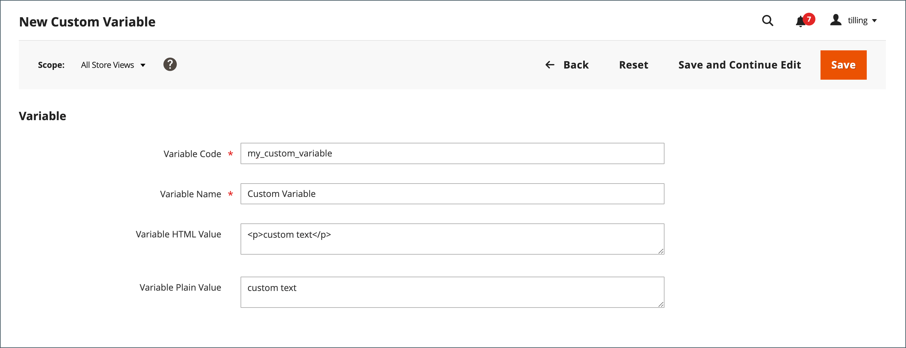
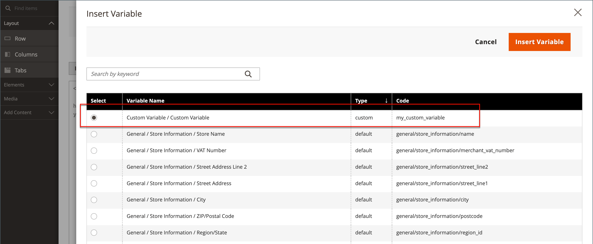

# 新增自訂變數

為了滿足您企業的特定需求，您可以建立自訂變數，並將其插入到[頁面](../content-design/pages.md)、[區塊](../content-design/blocks.md)和[電子郵件範本](email-templates.md)中。 按一下&#x200B;_插入變數_&#x200B;按鈕時出現的允許變數清單包含[預先定義的](variables-predefined.md)和自訂變數。 特定電子郵件範本的可用變數清單取決於與範本相關聯的資料。 請參閱[變數參考資料](variables-reference.md)，以取得常用電子郵件範本及其相關變數的清單。

{width="600" zoomable="yes"}

>[!NOTE]
>
>只有允許的預定義或自訂變數才能用於電子郵件和電子報範本。

## 步驟1：建立自訂變數

1. 在&#x200B;_管理員_&#x200B;側邊欄上，移至&#x200B;**[!UICONTROL System]** > _[!UICONTROL Other Settings]_>**[!UICONTROL Custom Variables]**。

1. 按一下&#x200B;**[!UICONTROL Add New Variable]**。

1. 輸入&#x200B;**[!UICONTROL Variable Code]**&#x200B;的識別碼，使用不含空格的所有小寫字元。

   如有需要，您可以使用底線字元或連字型大小來代表空格。 例如： `my_custom_variable`

1. 輸入用於內部參考的&#x200B;**[!UICONTROL Variable Name]**。 例如： `My Custom Variable`

1. 若要輸入與變數相關聯的值，請執行下列任一項作業：

   - 針對&#x200B;**[!UICONTROL Variable HTML Value]**，輸入以簡單HTML標籤格式化的變數值。 例如：

     `<b>This formatted content appears in place of the variable.</b>`

   - 針對&#x200B;**[!UICONTROL Variable Plain Value]**，以純文字格式輸入變數值，但不設定格式。 例如：

     `This unformatted content appears in place of the variable.`

   >[!TIP]
   >
   >如果您需要更多空間，請拖曳文字方塊的右下角。

   {width="600" zoomable="yes"}

1. 完成時，按一下&#x200B;**[!UICONTROL Save]**。

## 步驟2：在內容中插入自訂變數

使用[!DNL Page Builder]插入自訂變數。

1. 開啟您要新增變數至內容的頁面、區塊、類別或產品。

1. 展開&#x200B;**[!UICONTROL Content]**&#x200B;區段的。

1. 按一下&#x200B;**[!UICONTROL Edit with Page Builder]**。

1. 在左側面板中，按一下&#x200B;**[!UICONTROL Elements]**&#x200B;並執行下列任一項作業：

   - 在要插入變數的現有文字區域中按一下。

   - 將新的&#x200B;**[!UICONTROL Text]**&#x200B;物件拖曳到舞台。

1. 在編輯器工具列的最右側，按一下（ ）以插入變數。

   ![[!DNL Page Builder]階段和面板](./assets/variable-custom-pagebuilder-stage.png){width="600" zoomable="yes"}

1. 在清單中，選取您要插入的自訂變數，然後按一下&#x200B;**[!UICONTROL Insert Variable]**。

   {width="600" zoomable="yes"}

   變數識別碼會在編輯器中顯示為預留位置。

   ![[!DNL Page Builder]階段 — 變數預留位置](./assets/pagebuilder-variable-inserted.png){width="600" zoomable="yes"}

1. 完成時，按一下&#x200B;**[!UICONTROL Save]**。
