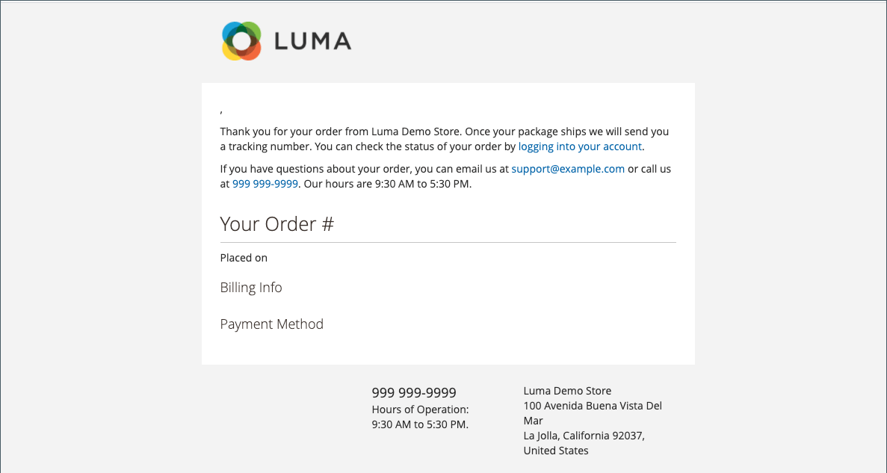

# 使用預先定義的變數

[預先定義的](variables-predefined.md)變數可讓您輕鬆個人化[電子郵件](email-templates.md)和[電子報](../merchandising-promotions/newsletters.md)範本，以及其他型別的內容。 當您按一下[插入變數]按鈕時，允許的[預先定義](variables-predefined.md)變數清單就會顯示。 如下圖所示，特定電子郵件範本的可用變數清單取決於與範本相關聯的資料。 請參閱[變數參考資料](variables-reference.md)，以取得常用電子郵件範本及其相關變數的清單。

{width="700" zoomable="yes"}

## 將變數新增至電子郵件範本

1. 在&#x200B;_管理員_&#x200B;側邊欄上，移至&#x200B;**[!UICONTROL Marketing]** > _[!UICONTROL Communications]_>**[!UICONTROL Email Templates]**。

1. 執行下列任一項作業：

   - 若要將變數新增至現有範本，請按一下清單中的範本，以編輯模式開啟。

   - 若要在新範本中使用變數，請按一下&#x200B;**[!UICONTROL Add New Template]**&#x200B;並自訂預設範本程式碼。 檢視[訊息範本](email-template-custom.md#message-templates)。

1. 在&#x200B;_[!UICONTROL Load default template]_&#x200B;底下，選擇要自訂的&#x200B;**[!UICONTROL Template]**。

1. 若要套用範本，請按一下&#x200B;**[!UICONTROL Load Template]**。

   _[!UICONTROL Currently used for]_&#x200B;欄位會顯示範本的設定路徑。_[!UICONTROL Template Subject]_&#x200B;和&#x200B;_[!UICONTROL Template Content]_&#x200B;是相對於所選範本自動產生的。

   - **[!UICONTROL Template Subject]** — 此文字會顯示在電子郵件的主旨列中。

   - **[!UICONTROL Template Content]** — 此文字會顯示在已傳送電子郵件的完整內容中。

   {width="600" zoomable="yes"}

1. 輸入&#x200B;**[!UICONTROL Template Name]**。

1. 如需可與此電子郵件範本搭配使用的[預先定義](variables-predefined.md)變數清單，請按一下&#x200B;**[!UICONTROL Insert Variable]**。

   決定您要插入範本中的變數。 然後，按一下右上角的&#x200B;_關閉_ (X)。 （您稍後會回到此頁面。）

1. 若要檢視範本模型，請按一下按鈕列中的&#x200B;**[!UICONTROL Preview Template]**。

   當預覽在新標籤中開啟時，請決定要將變數相對於其他內容放置的位置。 然後返回原始標籤以繼續。

   {width="600" zoomable="yes"}

1. 在&#x200B;**[!UICONTROL Template Content]**&#x200B;方塊中，將插入點放置在要變數出現的位置，然後按一下&#x200B;**[!UICONTROL Insert Variable...]**。

1. 在可用變數清單中，按一下您要插入範本中的變數。

1. 完成時，按一下&#x200B;**[!UICONTROL Save Template]**。

## 將範本轉換為純文字

1. 在編輯模式中開啟範本。

1. 按一下頁面頂端的&#x200B;**[!UICONTROL Convert to Plain Text]**。

1. 提示移除標籤時，請按一下&#x200B;**[!UICONTROL OK]**。

1. 若要儲存純文字版本，請按一下&#x200B;**[!UICONTROL Save Template]**。

## 還原HTML版本

1. 按一下頁面頂端的&#x200B;**[!UICONTROL Return HTML Version]**。

1. 若要儲存範本的HTML版本，請按一下&#x200B;**[!UICONTROL Save Template]**。
